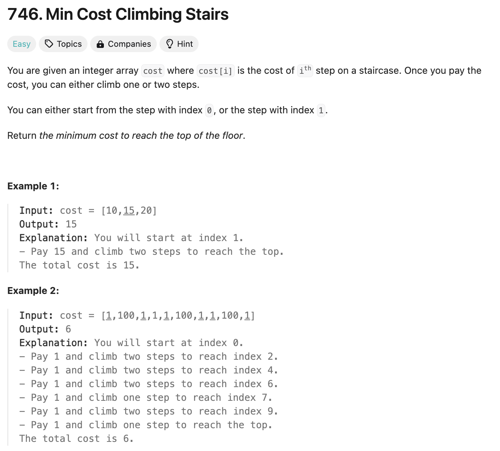

# 문제 설명
이 문제는 계단을 오르는데 필요한 최소 비용을 계산하는 문제이다. 계단만큼의 배열이 주어지며, 배열의 값은 계단을 오르는데 필요한 비용이다. 계단을 오르는데는 한번에 한 계단 또는 두 계단을 오를 수 있으며, 마지막 계단에 도착하면 된다. 마지막 계단에 도착하기 위한 최소 비용을 계산하라.

또한, 처음에 0번째 계단 또는 1번째 계단에서 시작할 수 있다.



## 시도 1
처음에는 이 문제를 그리디하게 풀려고 했으나, 첫번째에서 시작할지 두번째에서 시작할지 두 번을 다 구해봐야 해서 풀 수가 없었다. 따라서 DP로 해봐야한다는 생각이 들었다.


## 시도 2
DP로 해도 바로 되지는 않았다. 특히, 가장 문제가 됐던건 순서대로 풀려고 했던 점이다. 이 문제는 역순으로 풀어야 한다.


## 풀이 및 해설


## 풀이
```python
class Solution:
    def minCostClimbingStairs(self, cost: List[int]) -> int:
        # length of cost
        n = len(cost)

        # append top step
        cost.append(0)

        # start from the third from last step
        for i in range(n-2, -1, -1):
            # cost of this step is its own cost plus the min of
            # the next two steps.
            cost[i] = cost[i] + min(cost[i+1], cost[i+2])
        
        # min value between first and second is the min cost required
        return min(cost[0], cost[1])
```

- 계단의 길이를 n으로 설정한다.
- 마지막 계단에 도착하면 0이므로, 마지막 계단에 0을 추가한다.
- 뒤에서부터 시작해서, 현재 계단의 비용은 현재 계단의 비용과 다음 두 계단 중 작은 비용을 더한다.
- 이때, 주의할 점은 뒤에서부터 시작할때 (n-2, -1, -1)로 시작해야 한다. 마지막으로부터 3번째 계단부터 시작하는 이유는 그 다음 두개의 계단을 비교해야 하기 때문이다.
- 마지막으로, 첫번째 계단과 두번째 계단 중 작은 값을 반환한다.

## Complexity Analysis


### 시간 복잡도
- O(n), 여기서 n은 계단의 수(cost 배열의 길이).
- for 루프가 배열을 한 번 순회하며, 각 단계에서 상수 시간 연산만 수행한다.
- 배열의 끝에 0을 추가하는 작업과 마지막에 최소값을 찾는 작업도 상수 시간에 수행된다.
- 따라서 전체 시간 복잡도는 O(n)


### 공간 복잡도
O(1), 즉 상수 공간 복잡도.
따라서 입력 크기와 무관하게 일정한 추가 공간만을 사용한다.

### Constraint Analysis
```
Constraints:
2 <= cost.length <= 1000
0 <= cost[i] <= 999
```

계단의 수가 최소 2개에서 최대 1000개로 제한되어 있어, O(n) 시간 복잡도의 알고리즘은 효율적으로 동작할 수 있다.

각 계단의 비용이 0에서 999 사이로 제한되어 있어, 정수 오버플로우 문제 없이 계산이 가능하다.

현재 프로그램은 동적 프로그래밍 접근법을 사용하여 최적화되어 있다. 배열을 한 번만 순회하며 각 단계에서 최적의 선택을 계산한다. 또한, 추가 배열을 생성하지 않고 입력 배열을 직접 수정하여 공간을 절약한다.

# References
- [746. Min Cost Climbing Stairs](https://leetcode.com/problems/min-cost-climbing-stairs/)