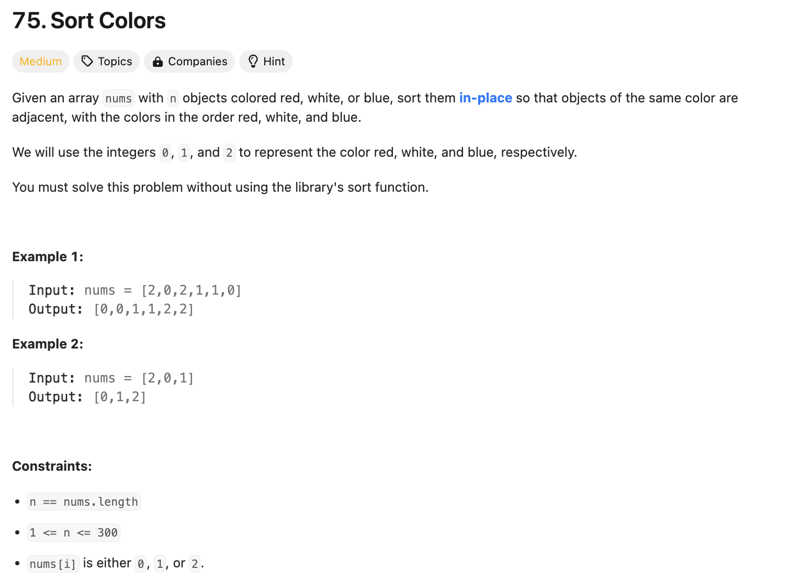

## 문제 설명
0,1,2를 색갈으로 표현되는 배열을 0, 1, 2 순서로 정렬하는 문제다. 다만, sort 함수를 사용하면 안된다.



## 풀이 및 해설
이런 문제도 나온다는게 신기하다. 평소에 정렬 알고리즘을 외워야 하는 필요성을 다시 한번 상기 시켜준다. 이 문제는 0, 1, 2의 숫자만 있으므로, 각 숫자의 갯수를 세서, 그 갯수만큼 배열에 넣어주면 된다. 상대적으로 쉽다.

- 배열을 순회하면서 0, 1, 2의 갯수를 센다.
- 0, 1, 2의 갯수만큼 배열에 넣어준다.

**핵심**: Count 변수를 사용해서 각 숫자의 갯수를 세고, 그 갯수만큼 배열에 넣어줄 때마다 다시 줄이면 된다. 주의해야 할 점으로는 같은 nums 변수를 사용해도 새로운 변수로 선언해서 사용하면 리턴 값이 None이어야 하기 때문에 문제가 된다.

```python
class Solution:
    def sortColors(self, nums: List[int]) -> None:
        """
        Do not return anything, modify nums in-place instead.
        """

        zero, one, two = 0, 0, 0

        for i in nums:
            if i == 0:
                zero += 1
            elif i ==1:
                one += 1
            else:
                two += 1


        for i in range(len(nums)):
            if zero > 0:
                nums[i] = 0
                zero -= 1
            elif one > 0:
                nums[i] = 1
                one -= 1
            else:
                nums[i] = 2

        print(nums)
        return nums
```


### 시간복잡도
`O(N)` ; N은 nums 배열의 길이

### 공간복잡도
`O(1)` ; zero, one, two 변수만 사용

## Constraint Analysis
```
Constraints:

n == nums.length
1 <= n <= 300
nums[i] is either 0, 1, or 2.
```

# References
- [LeetCode](https://leetcode.com/problems/sort-colors)

