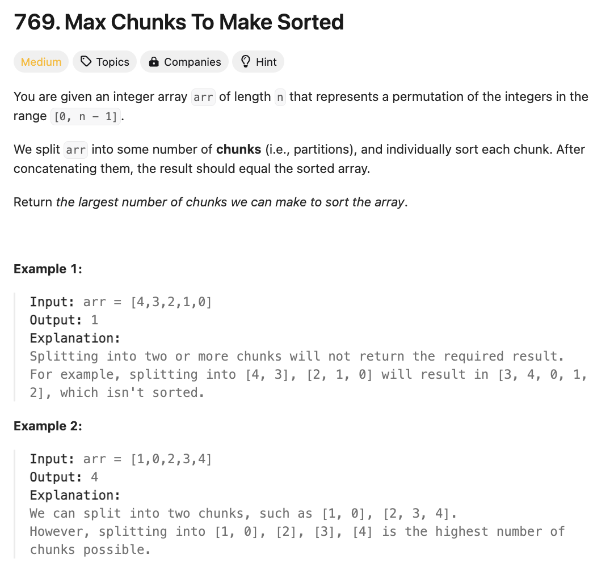

# 문제 설명
이 문제는 주어진 배열을 여러 조각으로 나누어 정렬된 배열을 만들 수 있는 최대 조각의 수를 구하는 문제이다.




## 풀이 및 해설

## 풀이
```python
class Solution:
    def maxChunksToSorted(self, arr: List[int]) -> int:
        max_so_far = 0
        chunks = 0
        
        for i,num in enumerate(arr):
            max_so_far = max(max_so_far, num)
            if max_so_far == i:
                chunks += 1
        
        return chunks
```

## Complexity Analysis


### 시간 복잡도
- O(N)

### 공간 복잡도
- O(1)

## Constraint Analysis
```
Constraints:
n == arr.length
1 <= n <= 10
0 <= arr[i] < n
All the elements of arr are unique.
```

# References
- [769. Max Chunks To Make Sorted](https://leetcode.com/problems/max-chunks-to-make-sorted/)