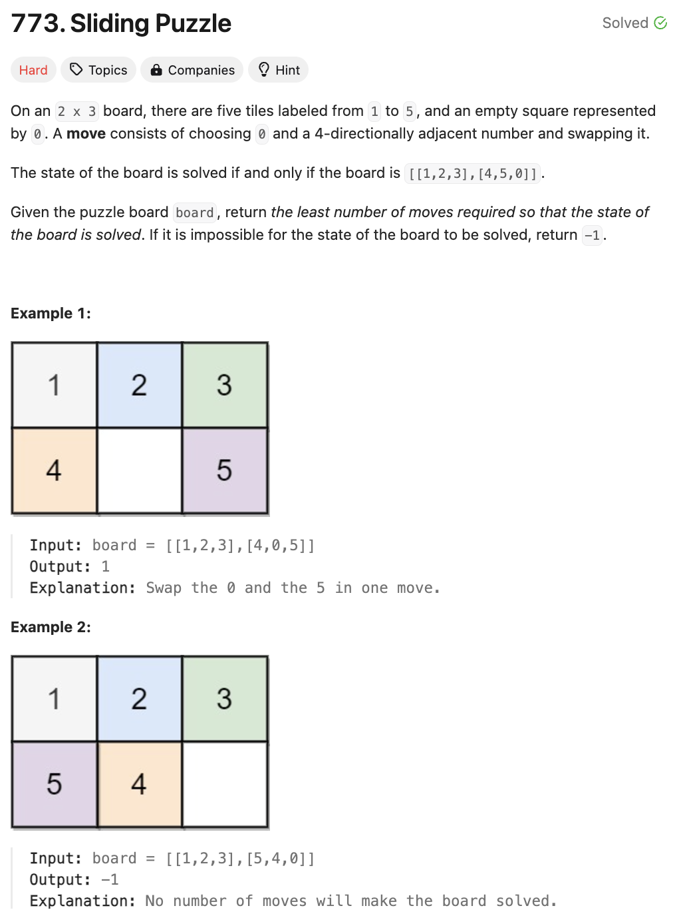

# 문제 설명
이 문제는 6개의 숫자가 2x3 퍼즐판에 적혀있을 때, 이를 [[123], [456]]로 만들기 위한 최소한의 이동 횟수를 구하는 문제이다.




## 풀이 및 해설

## 풀이
```python
class Solution:
    # direction map
    directions = [
        [1,3], 
        [0,2,4],
        [1,5],
        [0,4],
        [3,5,1],
        [4,2]
    ]
    
    def slidingPuzzle(self, board: List[List[int]]) -> int:
        # helper method to swap characters at indices at indices i and j in the string
        def _swap(s,i,j):
            s = list(s)
            s[i], s[j] = s[j], s[i]
            return "".join(s)
        
        # convert 2d board into string representation
        start_state = "".join(str(num) for row in board for num in row)

        # dictionary to store the min moves for each visited state
        visited = {}

        def _dfs(state, zero_pos, moves):
            # skip if state has been visited with fewer or equal moves
            if state in visited and visited[state] <= moves:
                return
            visited[state] = moves

            # try moving zero to each possible adjacent position
            for next_pos in self.directions[zero_pos]:
                new_state = _swap(
                    state, zero_pos, next_pos
                ) # swap to generate new state
                _dfs(
                    new_state, next_pos, moves+1
                ) # recursive dfs with updated state and move count

        # start dfs traversal from initial state
        _dfs(start_state, start_state.index("0"), 0)

        # return min moves required to reach target state, or -1 if unreachable
        return visited.get("123450", -1)
```
- `directions`는 각 숫자가 이동할 수 있는 방향을 나타내는 리스트이다.
- `_swap`은 문자열에서 두 인덱스의 문자를 바꾸는 메소드이다.
- `start_state`는 2차원 배열을 문자열로 변환한 것이다.
- `visited`는 방문한 상태와 그 상태에 도달하는데 필요한 최소 이동 횟수를 저장하는 딕셔너리이다.
- `_dfs`는 현재 상태, 0의 위치, 이동 횟수를 인자로 받아서, 현재 상태를 방문했는지 확인하고, 방문하지 않았거나 더 적은 이동 횟수로 방문한 경우에만 방문하고, 0의 위치를 변경하면서 다음 상태를 생성하고, 이동 횟수를 증가시키면서 재귀적으로 탐색하는 메소드이다.
- `_dfs`를 시작 상태와 0의 위치, 0으로 이동한 횟수 0으로 호출한다.
- `visited`에서 "123450"에 해당하는 값을 반환한다. 만약 없으면 -1을 반환한다.

## Complexity Analysis


- 일단 editorial을 참고한거라 시간복잡도가 처참하긴 하다.
- m이 행의 개수, n이 열의 개수라고 할 때.

### 시간 복잡도
- O((m*n)! * (m*n)^2)이다.
- 각 상태에서 이동할 수 있는 방향이 2개에서 3개이므로, 최악의 경우에는 (m*n)!개의 상태를 탐색해야 한다.

### 공간 복잡도
- O((m*n)!)이다.
- (m*n)!개의 상태를 저장해야 하기 때문이다.

## Constraint Analysis
```
Constraints:
board.length == 2
board[i].length == 3
0 <= board[i][j] <= 5
Each value board[i][j] is unique.
```

# References
- [773. Sliding Puzzle](https://leetcode.com/problems/sliding-puzzle/)