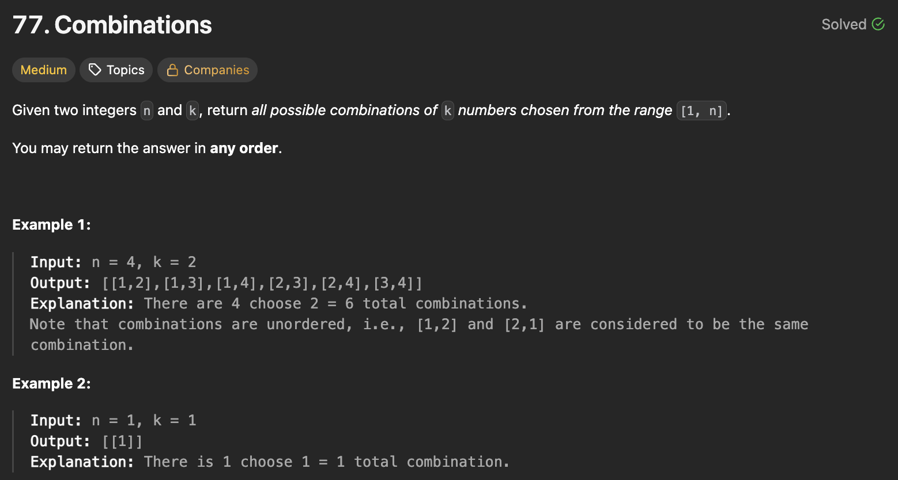

## 문제 설명
n과 k가 주어지면 1부터 n까지 숫자 중에서 k개를 고르는 모든 조합을 반환하는 문제다.



## 풀이 및 해설
이 문제는 백트래킹(Backtracking) 기법을 사용하여 해결할 수 있습니다. 1부터 n까지의 숫자 중에서 k개를 선택하는 모든 조합을 재귀적으로 생성합니다.

- 백트래킹 함수를 정의하여 재귀적으로 가능한 모든 조합을 생성합니다.
- 기본 사례로, 현재 경로의 길이가 k와 같아지면 현재 경로를 결과 리스트에 추가합니다.
- 재귀 단계에서는 현재 숫자부터 n까지 순회하며, 각 숫자를 경로에 추가하고 다음 숫자로 이동합니다.
- 최종적으로 모든 가능한 조합을 반환합니다.

**핵심**: 1부터 시작해서 1과 n+1 사이의 가능한 숫자들을 경로에 추가하면서 재귀적으로 탐색하는 것이다.

```python
class Solution:
    def combine(self, n: int, k: int) -> List[List[int]]:
        res = []

        def backtrack(i,path):
            if len(path)==k:
                res.append(path)
                return
            
            for num in range(i,n+1):
                backtrack(num+1, path+[num])
        
        backtrack(1,[])
        return res
```

## 복잡도


### 시간복잡도
- `O(C(n, k) * k)` ; C(n, k)는 n개 중 k개를 고르는 조합의 수이며, 각 조합을 생성하는 데 k 시간이 걸립니다.

### 공간복잡도
- `O(k)` ; 재귀 호출 스택의 최대 깊이는 k에 비례합니다.

## Constraint Analysis
```
Constraints:
1 <= n <= 20
1 <= k <= n
```

# References
- [77. Combinations - LeetCode](https://leetcode.com/problems/combinations/)