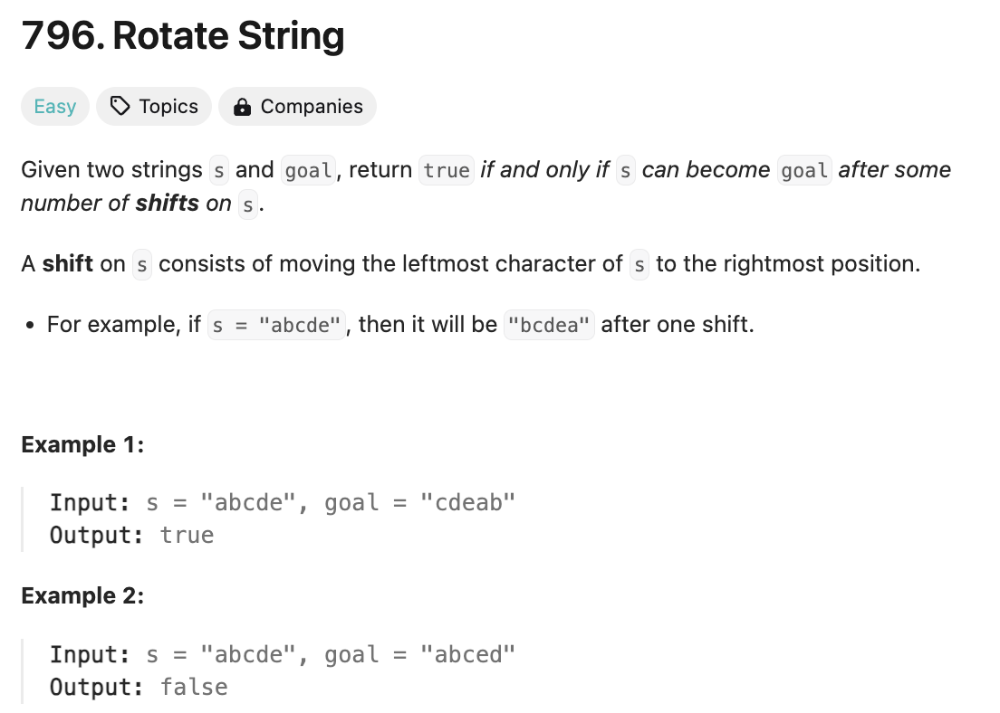
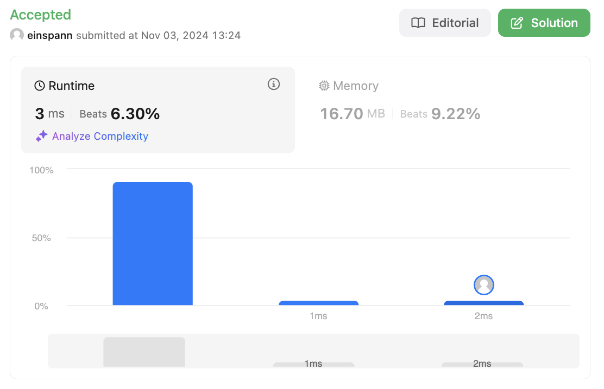
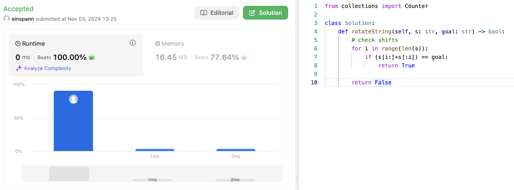

# 문제 설명
이 문제는 두개의 문자열이 주어졌을 때, 한 문자열을 회전시켜 다른 문자열을 만들 수 있는지 여부를 판단하는 문제이다.

이때, 회전은 shift 연산을 통해 이루어진다. 이 연산은 문자열의 첫번째 문자를 마지막으로 이동시키는 것을 의미한다.



## 풀이 및 해설

## 풀이
```python
def rotateString(self, s: str, goal: str) -> bool:
    # check shifts
    for i in range(len(s)):
        if (s[i:]+s[:i]) == goal:
            return True

    return False
```

## Complexity Analysis
1. 일단 모든걸 분석하기 전에 dictionary를 만들어서 비교하면 불필요한 연산을 줄일 수 있지 않을까 했는데, 오히려 이것 때문에 느려졌다.


2. 예상대로 없애버리니까 더 빨라졌다.


### 시간 복잡도
- O(N)

### 공간 복잡도
- O(1)

## Constraint Analysis
```
Constraints:
1 <= s.length, goal.length <= 100
s and goal consist of lowercase English letters.
```

# References
- [796. Rotate String](https://leetcode.com/problems/rotate-string/)