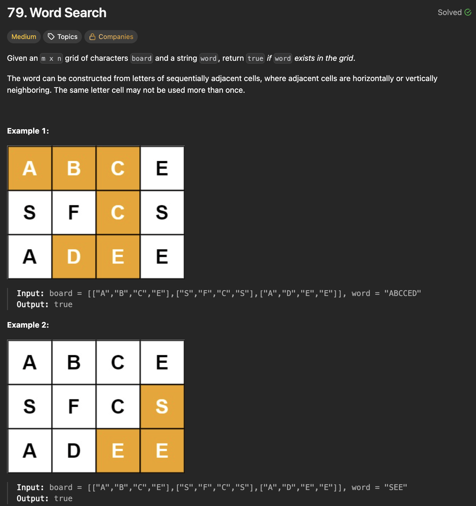
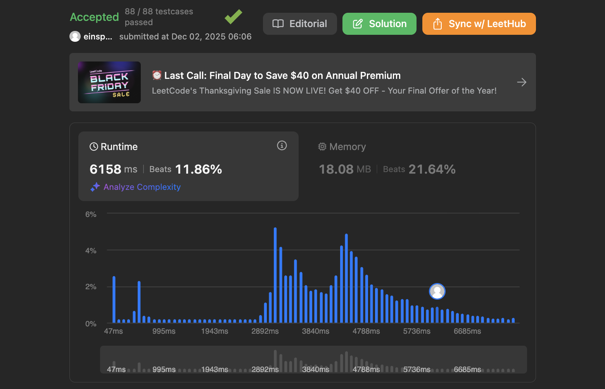

## 문제 설명
2D 그리드와 단어가 주어지면 그 단어가 그리드에 존재하는지 여부를 반환하는 문제다.



## 풀이 및 해설
이 문제는 백트래킹(Backtracking) 기법을 사용하여 해결할 수 있습니다. 그리드에서 단어를 찾기 위해 재귀적으로 탐색합니다.

- 백트래킹 함수를 정의하여 재귀적으로 그리드에서 단어를 찾습니다.
- 기본 사례로, 현재 인덱스가 단어의 길이와 같아지면 단어를 찾았으므로 True를 반환합니다.
- 재귀 단계에서는 현재 위치가 그리드의 경계를 벗어나지 않는지, 그리고 현재 그리드 문자가 단어의 현재 문자와 일치하는지 확인합니다. 일치하면 해당 위치를 방문 처리하고 상하좌우로 이동하여 다음 문자를 찾습니다.
- 최종적으로 단어를 찾았는지 여부를 반환합니다.


**핵심**: 백트래킹을 하면서 지금까지 찾은 문자열이 단어의 접두사(prefix)인지 확인하면서 순회하면 효과적이다. 이를 하기 위해서는 방문한 위치, 좌표, 지금까지 찾은 문자열 등을 기억해야 한다.

```python
class Solution:
    def exist(self, board: List[List[str]], word: str) -> bool:
        def backtrack(x, y, path, visited):
            if path != word[:len(path)]: #DNE
                return False
            
            if path == word: #found word
                return True
            
            for di,dj in [(-1,0),(1,0),(0,-1),(0,1)]: #search for word
                ni,nj = x+di, y+dj

                if 0<=ni<m and 0<=nj<n and (ni,nj) not in visited:
                    visited.add((ni,nj))
                    if backtrack(ni,nj,path+board[ni][nj], visited):
                        return True
                    visited.remove((ni,nj))
            
            return False

        
        m,n = len(board), len(board[0])
        for i in range(m):
            for j in range(n):
                if board[i][j] != word[0]:
                    continue

                found = backtrack(i,j,board[i][j],{(i,j)})
                if found:
                    return True
        
        return False
```

## 복잡도


### 시간복잡도
- `O(M * 3^L)` ; M은 그리드의 셀 개수, L은 단어의 길이입니다. 각 셀에서 시작하여 최대 L 길이의 단어를 찾기 위해 최대 3가지 방향(상하좌우 중 이전 위치 제외)으로 탐색할 수 있습니다.

### 공간복잡도
- `O(L)` ; 재귀 호출 스택과 방문 집합에 사용되는 공간입니다.

## Constraint Analysis
```
Constraints:

m == board.length
n = board[i].length
1 <= m, n <= 6
1 <= word.length <= 15
board and word consists of only lowercase and uppercase English letters.
```

# References
- [79. Word Search - LeetCode](https://leetcode.com/problems/word-search/)