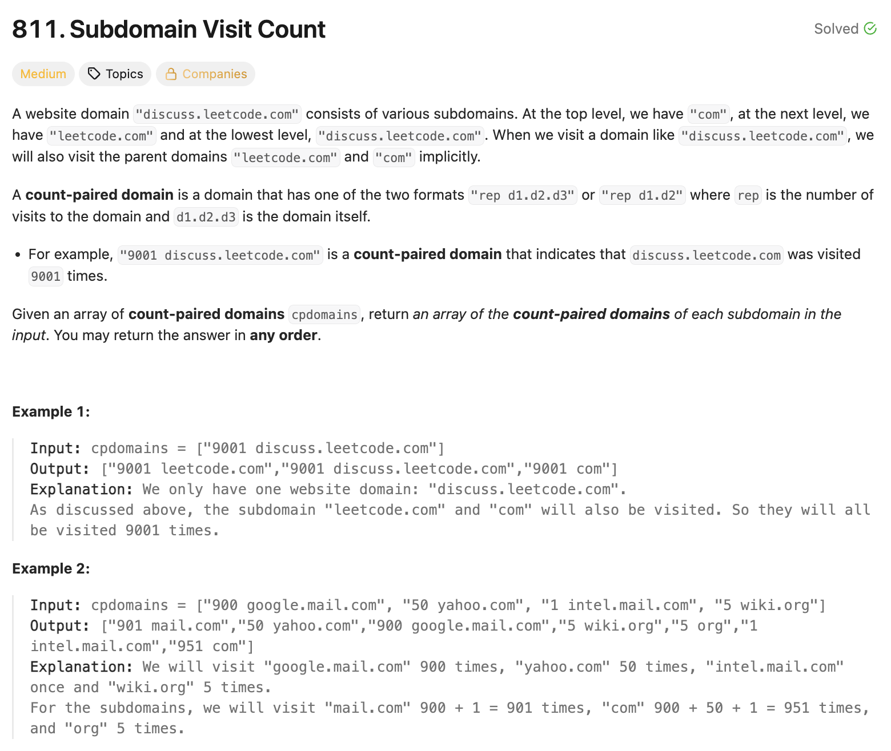

# 문제 설명
해당 문제는 도메인 방문 횟수가 주어졌을 때, 각 서브도메인의 방문 횟수를 구하여 최종적으로 모든 도메인과 서브도메인의 방문 횟수를 반환하는 문제입니다.




## 풀이 및 해설
기본적으로 키-밸류를 저장하는 해시맵을 활용하는 문제입니다.  

1. 각 도메인 방문 횟수를 순회합니다.
2. 도메인을 1차적으로 띄움표로 분리하여 방문 횟수와 도메인을 분리합니다.
3. 도메인을 2차적으로 점(.)으로 분리하여 서브도메인들을 추출합니다.
4. 각 서브도메인에 대해 방문 횟수를 해시맵에 누적합니다.
   4-1. 만약 서브도메인이 해시맵에 존재하지 않으면 새로 추가합니다.
   4-2. 이미 존재하면 기존 값에 방문 횟수를 더합니다.
5. 최종적으로 해시맵의 키-밸류 쌍을 "방문횟수 서브도메인" 형식의 문자열로 변환하여 리스트로 반환합니다.

```python
class Solution:
    def subdomainVisits(self, cpdomains: List[str]) -> List[str]:
        doms = defaultdict(list)
        
        for cpdomain in cpdomains:
            count, domain = cpdomain.split()
            count = int(count)
            subdomains = domain.split(".")
            
            sd_n = len(subdomains)
            parsed_sd = []
            for i in range(sd_n-1, -1, -1):
                parsed = ".".join(subdomains[i:sd_n])
                parsed_sd.append(parsed)

            for subdomain in parsed_sd:
                if subdomain in doms.keys():
                    doms[subdomain] += count
                else:
                    doms[subdomain] = count

        
        ans = []
        for k,v in zip(doms, doms.values()):
            ans.append((str(v) + " " + k))

        return ans
```

풀긴 했으나 다소 지저분하게 코드를 짰기에 개선을 한다면 다음과 같이 해볼 수 있습니다.


## 2차 풀이
**개선사항:**
- `defaultdict`를 활용하고 있기 때문에 키 존재 여부를 확인하는 부분을 제거할 수 있습니다.
- `defaultdict(int)`를 사용하여 list 대신 기본값을 0으로 설정할 수 있습니다.
- `-1`부터 `0`까지 역순으로 순회하는 대신, list 슬라이싱을 활용하여 서브도메인을 생성할 수 있습니다.

이렇게 수정하니까 한결 간결해진 코드가 되었습니다.  

```python
class Solution:
    def subdomainVisits(self, cpdomains: List[str]) -> List[str]:
        doms = defaultdict(int)
        
        for cpdomain in cpdomains:
            count, domain = cpdomain.split()
            count = int(count)
            subdomains = domain.split(".")
            
            for i in range(len(subdomains)):
                subdomain = ".".join(subdomains[i:])
                doms[subdomain] += count
        
        return [f"{count} {domain}" for domain,count in doms.items()]
```

## Complexity Analysis


### 시간 복잡도
**O(n * m)**; n은 `cpdomains` 리스트의 길이, m은 도메인의 최대 길이입니다. 각 도메인에 대해 서브도메인을 생성하고 해시맵에 접근하는 데 걸리는 시간입니다.

### 공간 복잡도
**O(k)**; k는 고유한 서브도메인의 수입니다. 해시맵에 저장되는 도메인과 서브도메인의 수에 비례합니다.

## Constraint Analysis
```
Constraints:
1 <= cpdomain.length <= 100
1 <= cpdomain[i].length <= 100
cpdomain[i] follows either the "repi d1i.d2i.d3i" format or the "repi d1i.d2i" format.
repi is an integer in the range [1, 10^4].
d1i, d2i, and d3i consist of lowercase English letters.
```

# References
- [811. Subdomain Visit Count - LeetCode](https://leetcode.com/problems/subdomain-visit-count/)