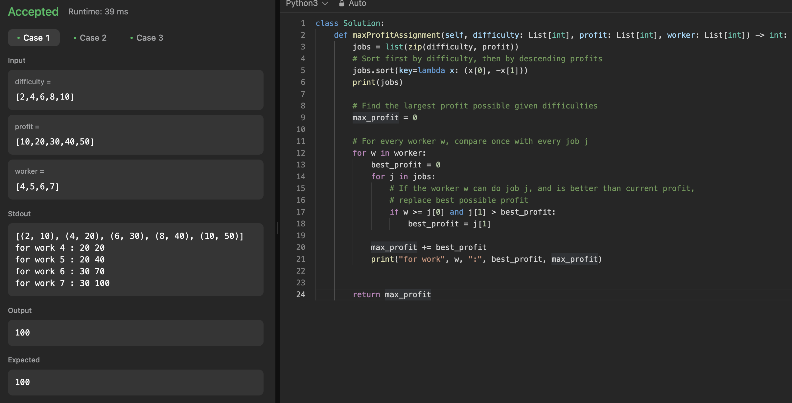

# 문제 설명
3개의 배열이 주어진다. 각 배열은 일의 난이도, 수익, 그리고 노동자의 가능한 난이도다. 이때, 최대 이윤을 구하는 문제다.


## 풀이 및 해설
1. 난이도별로 일을 1차적으로 정리하고, 2차적으로 수익으로 내림ㅊ차순 정렬한다. 같은 난이도라면 수익이 높은것을 먼저 선택하도록 한다.    
2. 주어진 노동자별로 주어진 일들이 가능한지 확인한다. 해당 일의 수익이 현재까지 찾아낸 최대 수익보다 높다면, 최대 수익을 갱신한다.
3. 총 수익에 최대 수익을 더해준다.  


테스트 케이스는 통과했으나, 시간복잡도가 O(N^2)이라서 최적화가 필요하다.


역시 시간초과가 발생한다.  


## 2차 풀이
**개선사항:**
- 지금까지 계산한 가능한 최대 이익을 저장하면 매번 이를 다시 계산할 필요가 없다.
- 이진탐색을 사용해서 더 빨리 찾을 수 있다.

이렇게 수정하니까 더 많이 통과하긴 하는데 아직 실패한다.


## 3차 풀이
- 보니까 일단 현재 난이도보다 높은 난이도의 일까지 굳이 검증을 할 필요가 없다. 그래서 상대적으로 짧고 간단한 투 포인터로도 해결이 된다.

## 풀이
```python
class Solution:
    def maxProfitAssignment(self, difficulty: List[int], profit: List[int], worker: List[int]) -> int:
        jobs = sorted(zip(difficulty, profit))
        worker.sort()

        total_profit = 0
        best_profit = 0
        j = 0

        for w in worker:
            # Move through jobs as long as worker can do the job
            while j < len(jobs) and jobs[j][0] <= w:
                best_profit = max(best_profit, jobs[j][1])
                j += 1            
            total_profit += best_profit

        return total_profit
```

## Complexity Analysis


### 시간 복잡도
**O(NlogN + MlogM + N + M)**  
- **정렬 (jobs)**: O(nlog n); n은 `difficulty` 배열의 길이
- **정렬 (workers)**: O(mlog m); m은 `worker` 배열의 길이
- **작업자 및 작업 탐색**: O(n + m); 각 작업 및 작업자는 한 번씩만 처리됨

결과적으로 O(nlog n + mlog m)입니다.

### 공간 복잡도
**O(n)**; 정렬된 `jobs` 리스트를 위한 공간이 필요하며, n은 작업의 수입니다.

## Constraint Analysis
```
Constraints:

n == difficulty.length
n == profit.length
m == worker.length
1 <= n, m <= 10^4
1 <= difficulty[i], profit[i], worker[i] <= 10^5
```

# References
- [LeetCode](https://leetcode.com/problems/ipo)
- [Python Docs - Zip()](https://docs.python.org/3.3/library/functions.html#zip)
- [Python Docs - Sort()](https://docs.python.org/3.3/library/functions.html#sorted)
- [Python Docs - Lambda](https://docs.python.org/3.3/tutorial/controlflow.html#lambda-expressions)
- [Python Docs - Bisect](https://docs.python.org/3/library/bisect.html)