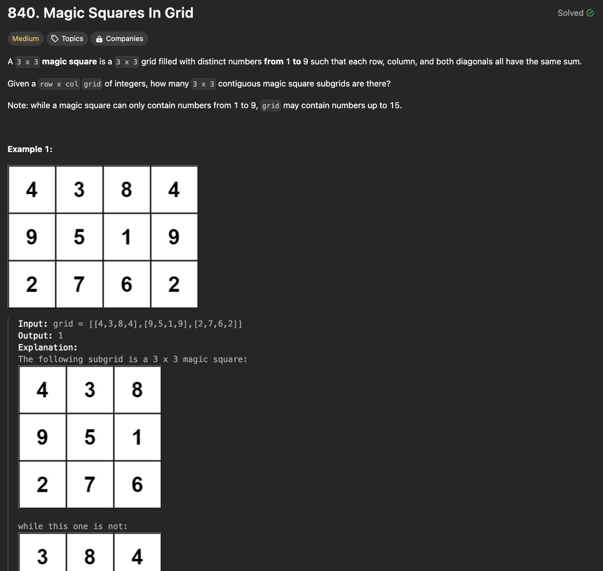
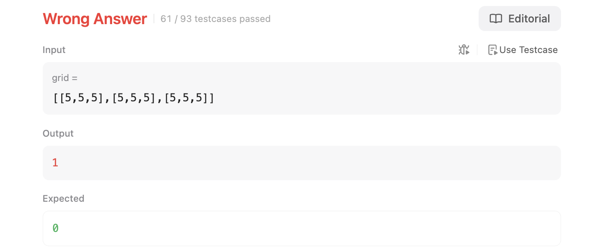
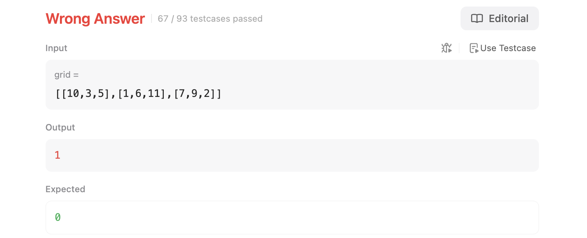
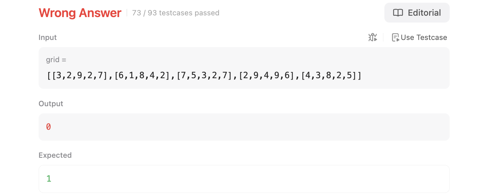

# 문제 설명
Grid가 주어졌을 때 서로 다른 숫자로 이뤄진 3x3 행렬인 마방진이 몇개인지 확인하는 문제다.



## 풀이 및 해설

### 시도1
첫번째 시도에서는 서로 다른 숫자들이란 것을 확인하지 않아서 틀렸다.


이건 다음과 같이 해결할 수 있다.
```python
# check if all values are different
flat_list = [grid[i][j] for i in range(3) for j in range(3)]
if len(set(flat_list)) != 9:
    break
```

### 시도2
그러나 이어서 또다른 오류가 발생했다. 이번에는 숫자들이 1부터 9까지의 숫자로 이뤄진 마방진인지 확인하지 않아서 틀렸다.


이걸 해결하기 위해서는 다음과 같이 풀었다.
```python
# check if all values are different and composed of 1-9
flat_list = [grid[i][j] for i in range(3) for j in range(3)]
if set(flat_list) != set(range(1,10)):
    break
```

### 시도3

해당 테스트케이스는 flatlist를 구할 때, 값 설정을 잘못해서 발생한 오류다. 이를 해결하기 위해서는 다음과 같이 풀었다. 또한, break를 continue로 수정했다. 다음 grid로 넘어가야 하기 때문이다.
```python
# check if all values are different and composed of 1-9
flat_list = [grid[i+x][j+y] for x in range(3) for y in range(3)]
if set(flat_list) != set(range(1,10)):
    continue
```

## 풀이
```python
def numMagicSquaresInside(self, grid: List[List[int]]) -> int:
        # edge cases
        if not grid:
            return 0
        if len(grid) < 3:
            if len(grid[0]) < 3:
                return 0

        magic = 0
        # check for each possible 3x3
        for i in range(len(grid)-2):
            for j in range(len(grid[i])-2):
                # if grid smaller than 3x3
                if i+2 >= len(grid) or j+2 >= len(grid[0]):
                    continue

                # check if all values are different and composed of 1-9
                flat_list = [grid[i+x][j+y] for x in range(3) for y in range(3)]
                if set(flat_list) != set(range(1,10)):
                    continue
                
                # rows
                value = sum(grid[i][j:j+3]) 
                if value != sum(grid[i+1][j:j+3]):
                    continue
                if value != sum(grid[i+2][j:j+3]):
                    continue

                # columns
                col1 = grid[i][j] + grid[i+1][j] + grid[i+2][j]
                col2 = grid[i][j+1] + grid[i+1][j+1] + grid[i+2][j+1]
                col3 = grid[i][j+2] + grid[i+1][j+2] + grid[i+2][j+2]

                if (value != col1) or (value != col2) or (value != col3):
                    continue

                # check diagonals
                diag1 = grid[i][j] + grid[i+1][j+1] + grid[i+2][j+2]
                diag2 = grid[i][j+2] + grid[i+1][j+1] + grid[i+2][j]

                if (value != diag1) or (value != diag2):
                    continue

                magic += 1
        return magic
```
- edge cases를 확인한다.
    - grid가 비어있으면 0을 반환한다.
    - grid의 길이가 3보다 작으면 0을 반환한다.
- magic 변수를 0으로 초기화한다.
- 모든 가능한 3x3을 확인하기 위해 grid의 길이와 넓이에서 2를 뺀 범위를 확인한다.
    - 만약 grid가 3x3보다 작으면 지금 3x3는 넘기고 다음을 확인한다.
    - 모든 값이 다르고 1-9로 이뤄진지 확인한다.
    - 행의 합들이 모두 같은지 확인한다.
    - 열의 합들이 모두 같은지 확인한다.
    - 대각선의 합들이 모두 같은지 확인한다.
    - 만약 모든 조건을 만족하면 magic을 1 증가시킨다.
- magic을 반환한다.

## Complexity Analysis


### 시간 복잡도
- 3중 for문을 사용하므로 시간복잡도는 O(n^3)이다.
- n은 grid의 길이와 넓이이다.
- set을 사용하므로 시간복잡도는 O(1)이다.
- sum을 사용하므로 시간복잡도는 O(n)이다.
- 모든 경우에 대해 확인하기 때문에 시간복잡도는 O(n^3)이다.

### 공간 복잡도
- 공간복잡도는 O(1)이다. 추가적인 공간을 사용하지 않기 때문이다.
- flat_list를 사용했지만, 이는 3x3이기 때문에 상수이다.
- value, col1, col2, col3, diag1, diag2도 상수이다.

## Constraint Analysis
```
Constraints:
row == grid.length
col == grid[i].length
1 <= row, col <= 10
0 <= grid[i][j] <= 15
```

# References
- [LeetCode - Magic Squares in Grid](https://leetcode.com/problems/magic-squares-in-grid/)