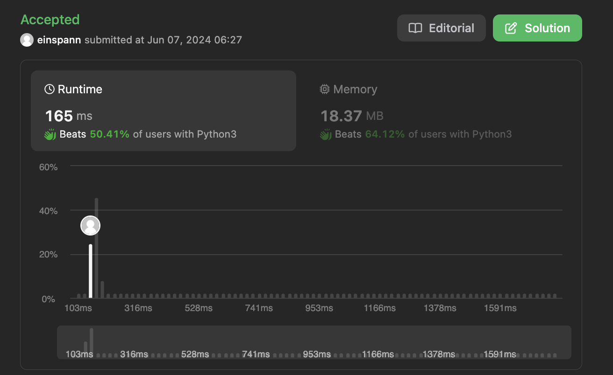

## 문제 설명
배열이 주어졌을 때, 이를 K개의 연속된 숫자로 나눌 수 있는지 판별하는 문제다.


## 1차 시도
배열의 길이를 K만큼 나누었을 때의 나머지가 0이 아니라면, 바로 False를 반환한다. 만약 0일 경우 True를 반환한다. 해당 방법으로 Test Case는 모두 해결해냈다. 이렇게 간단할리가 없는데 어떻게 실패할지 예상이 안돼서 일단 제출해봤다.


## 1차 결과

생각보다 간단한 테케에 막혔서 틀렸다. 이유는 배열을 정렬하지 않았기 때문이다. 따라서, 배열을 정렬한 후 위와 같은 방법으로 풀이하였다.

문제를 다시 읽어보니까, 배열을 정렬할 수 있다면 참을 반환하라는 조건이 있기 때문에, 이미 정렬되어 있는 배열은 다시 정렬할 수 가 없다. 따라서, 정렬이 되어 있는지 한번 검토를 할 필요가 있다.

## 2차 시도
- 배열이 K개로 나눠지지 않는 경우에는 바로 0 반환한다.  
- 이후, 배열이 이미 정렬되어 있는 상태라면 0을 반환한다.

여러 배열이 존재할 경우 성공할지 모르겠어서 긴 배열을 만들어서 테스트해봤다. 일단 모든 테케는 통과했다.

## 2차 실패

보니까 기존에 정렬이 되어 있어도 새로운 방식으로 정렬이 가능해지면 안된다. 예시로, [1, 2, 3, 4, 5, 6]는 이미 정렬되어 있지만, [1,3],[2,4],[5,6]으로 나눌 수 있기 때문이다.

## 3차 시도
- 배열이 K개로 나눠지지 않는 경우에는 바로 0 반환한다. 
- 배열 각각의 원소에 대하여 collections.Counter를 이용하여 각 원소의 개수를 세어준다.
- heapq를 이용하여 각 원소의 개수를 세어준다.
- heapify를 이용하여 정렬된 배열을 만들어준다.
- K만큼 배열을 수행하면서, 연속적인 값이 존재할 경우 원소의 개수를 줄여준다.
- heapq가 모두 소진되면 True를 반환한다.


```
import heapq

heapq.heapify(x)  
Transform list x into a heap, in-place, in linear time.

heapq.heappop(heap)
Pop and return the smallest item from the heap, maintaining the heap invariant. If the heap is empty, IndexError is raised. To access the smallest item without popping it, use heap[0].
```


### 풀이 해설
```
if count[first + i] == 0:
    return False  
count[first + i] -= 1
```
This condition checks if the current card value (first + i) is available in sufficient quantity. If the count of this card is 0, it means we cannot form a group starting with first because there are not enough consecutive cards. In such a case, the function returns False.  

If the card is available, this line decrements its count by 1 because we are using one instance of this card to form the current group.

``` python
# check if count has reached 0
if count[first + i] == 0: 
    # if 0, need to check if it's the smallest val
    if first + i != min_heap[0]: 
        # if it isn't, there's an inconsistency hence false
        return False 
    # if smallest and 0, remove from heap
    heapq.heappop(min_heap) 
```
- Check if the card count is zero after being used to form a group
- Ensure that this card value is the smallest value currently in the heap, else return False as it would be an inconsistency
- If first + i is indeed the smallest value in the heap and its count has reached zero, we remove it from the heap using heapq.heappop(min_heap). 

## 풀이
```python
from collections import Counter
import heapq

class Solution:
    def isNStraightHand(self, hand: List[int], groupSize: int) -> bool:
        # check if hand is in multiples of groupSize
        if (len(hand) % groupSize) != 0:
            return False
        
        # count frequencies
        count = Counter(hand)

        # use a min-heap to process cards in ascending order
        min_heap = list(count.keys())
        heapq.heapify(min_heap)

        while min_heap:
            first = min_heap[0] # get the smallest value
            for i in range(groupSize): # check consecutive values and decrease if exists
                if count[first+i] == 0:
                    return False
                count[first + i] -= 1
                if count[first + i] == 0: # check if count has reached 0
                    if first + i != min_heap[0]: # if 0, need to check if it's the smallest val
                        return False # if it isn't, there's an inconsistency hence false
                    heapq.heappop(min_heap) # if smallest and 0, remove from heap
            
        # heap has been emptied
        return True
```
## Complexity Analysis


### Time Complexity
- Counter(hand)는 O(N) 시간이 소요된다. N은 hand 배열에 있는 카드의 개수이다.
- heapq.heapify(min_heap)은 O(M) 시간이 소요된다. 이때 M은 서로 다른 카드의 개수이다.
- heappop과 heappush는 O(logM) 시간이 소요된다.

모든 카드를 한번씩만 볼 수 있으므로, 전체 시간 복잡도는 O(NlogM)이다.

### Space Complexity
- heap에는 최대 M개의 카드가 들어갈 수 있으므로, O(M) 공간이 필요하다.

## Constraint Analysis
```
Constraints:

1 <= hand.length <= 104
0 <= hand[i] <= 109
1 <= groupSize <= hand.length
```

- 시간복잡도는 O(NlogM)이므로, N은 최대 10^4이고 M은 최대 10^4이다. M은 최악의 경우 N과 같기 때문이다. 따라서 O(10^4log10^4)이다.
- 공간복잡도는 O(M)이다. M은 최대 10^4이다.

# References
- [LeetCode](https://leetcode.com/problems/hand-of-straights/)
- [Heap Queue](https://docs.python.org/3/library/heapq.html)
