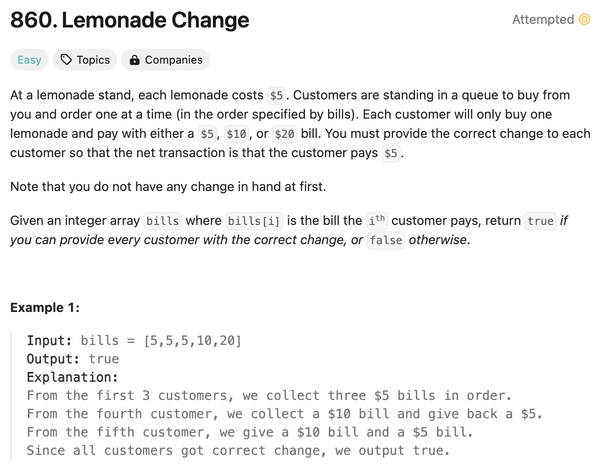
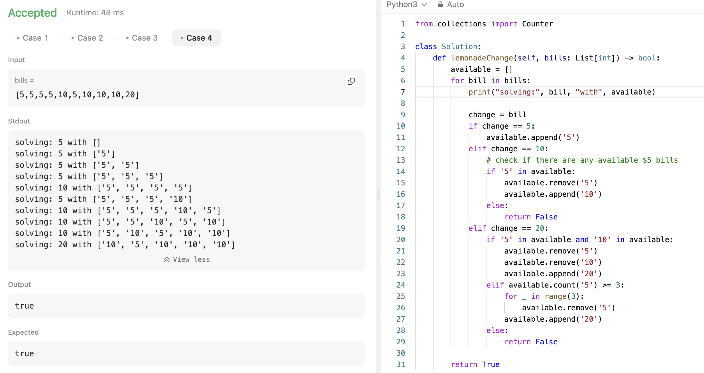
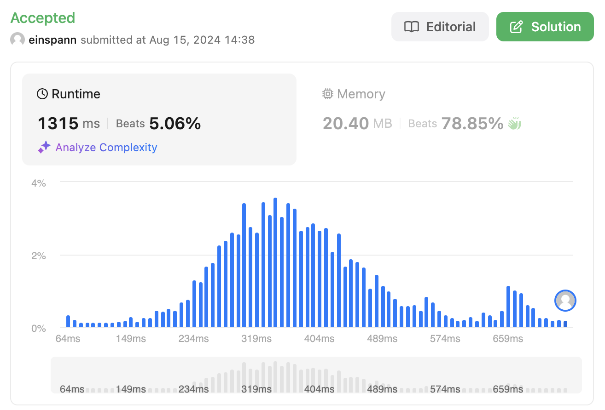
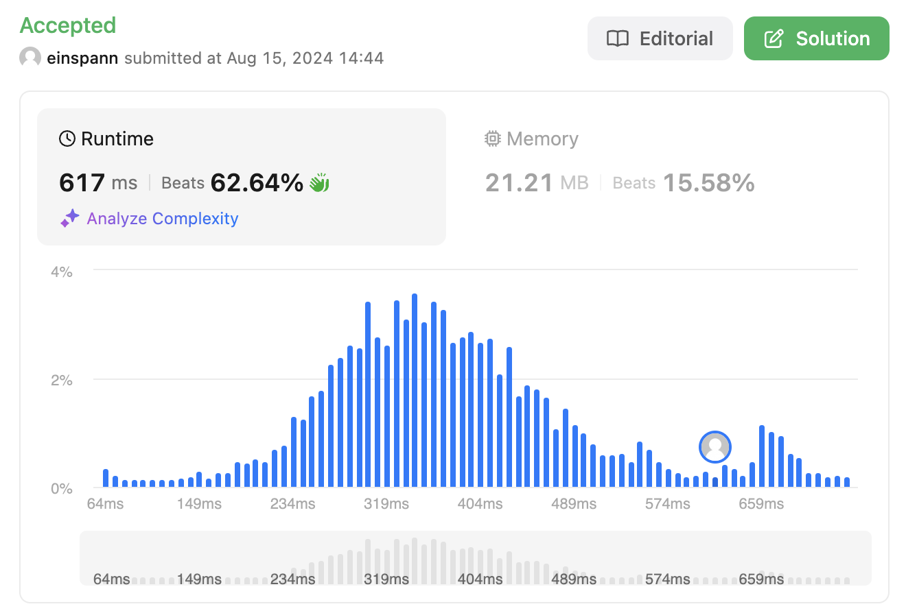
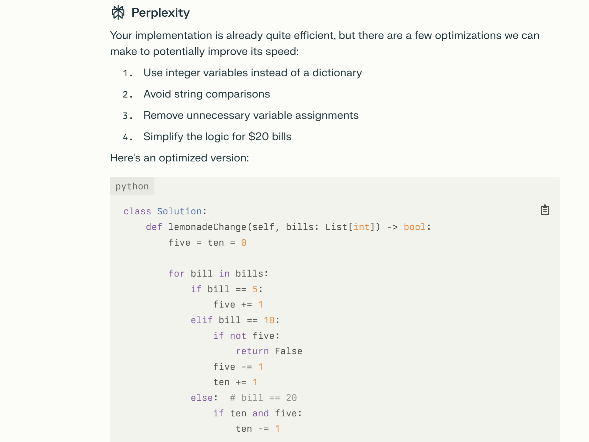
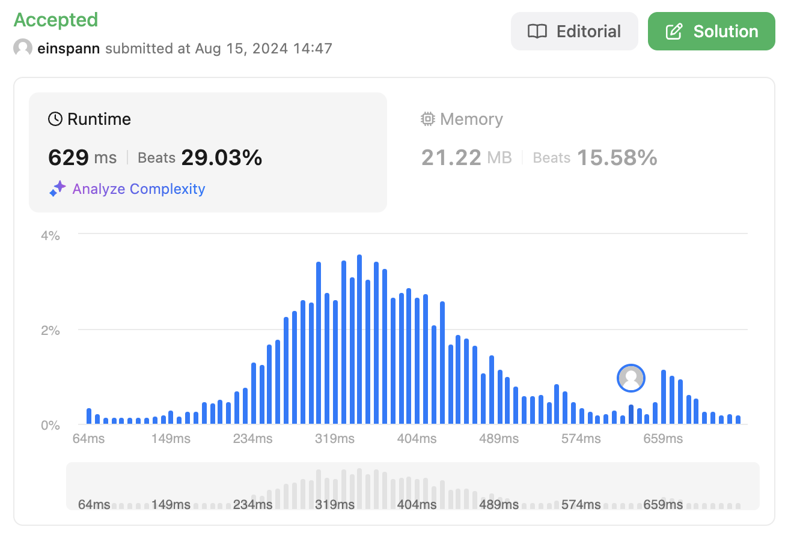

# 문제 설명
$5, $10, $20 단위의 지폐로 거스름돈을 주는 문제입니다.



## 첫 풀이 및 해설


배열을 사용해서 하나씩 거슬러주면서 거스름돈을 줬지만, 다시 생각해보니 dictionary를 쓰는게 더 빠를 것 같아서 다시 풀어보기로 했다.



실제로 실행속도를 보니 처참하다.

## 두번째 풀이 및 해설
## 풀이
```python
def lemonadeChange(self, bills: List[int]) -> bool:
        available = {'5':0, '10':0, '20':0}
        for bill in bills:
            change = bill
            if change == 5:
                available['5'] += 1
            elif change == 10:
                # check if there are any available $5 bills
                if available['5'] > 0:
                    available['5'] -= 1
                    available['10'] += 1
                else:
                    return False
            elif change == 20:
                if available['5'] > 0 and available['10'] > 0:
                    available['5'] -= 1
                    available['10'] -= 1
                    available['20'] += 1
                elif available['5'] >= 3:
                    for _ in range(3):
                        available['5'] -= 1
                    available['20'] += 1
                else:
                    return False
        
        return True
```
- 거스름돈을 줄 수 있는지 확인하기 위해 dictionary를 사용했다.
- 지폐가 5일 경우, 5달러 지폐를 1개 추가한다.
- 지폐가 10일 경우, 5달러 지폐가 있는지 확인하고 있으면 5달러 지폐를 1개 줄이고 10달러 지폐를 1개 추가한다.
- 지폐가 20일 경우, 5달러 지폐와 10달러 지폐가 있는지 확인하고 있으면 5달러 지폐와 10달러 지폐를 줄이고 20달러 지폐를 1개 추가한다. 없으면 5달러 지폐가 3개 이상 있는지 확인하고 있으면 5달러 지폐를 3개 줄이고 20달러 지폐를 1개 추가한다. 없으면 거스름돈을 줄 수 없으므로 False를 반환한다.
- 모든 지폐를 확인했으면 True를 반환한다.

## Complexity Analysis
### Array


### Dictionary


배열을 사용했을 때와 dictionary를 사용했을 때의 실행속도를 비교해보면 dictionary를 사용했을 때가 더 빠르다. 이유는 배열을 사용했을 때는 배열의 길이만큼 반복문을 돌면서 값을 찾아야 하지만 dictionary를 사용했을 때는 key값을 사용해서 바로 값을 찾을 수 있기 때문이다.

### 개선사항: Integer Variables
찾아보니까 dictionary의 키 값을 찾는것보다 파이썬에서는 로컬 변수를 찾는게 더 빠르다고 한다. 그래서 dictionary를 사용하지 않고 변수를 사용해서 풀면 더 빠르다고 하지만, 실제로 제출했을때는 큰 차이는 찾진 못했다.




### 시간 복잡도
- O(N) ; N은 bills의 길이

### 공간 복잡도
- O(1) ; 상수만큼의 공간을 사용한다.

## Constraint Analysis
```
Constraints:
1 <= bills.length <= 10^5
bills[i] is either 5, 10, or 20.
```

# References
- [860. Lemonade Change](https://leetcode.com/problems/lemonade-change/)