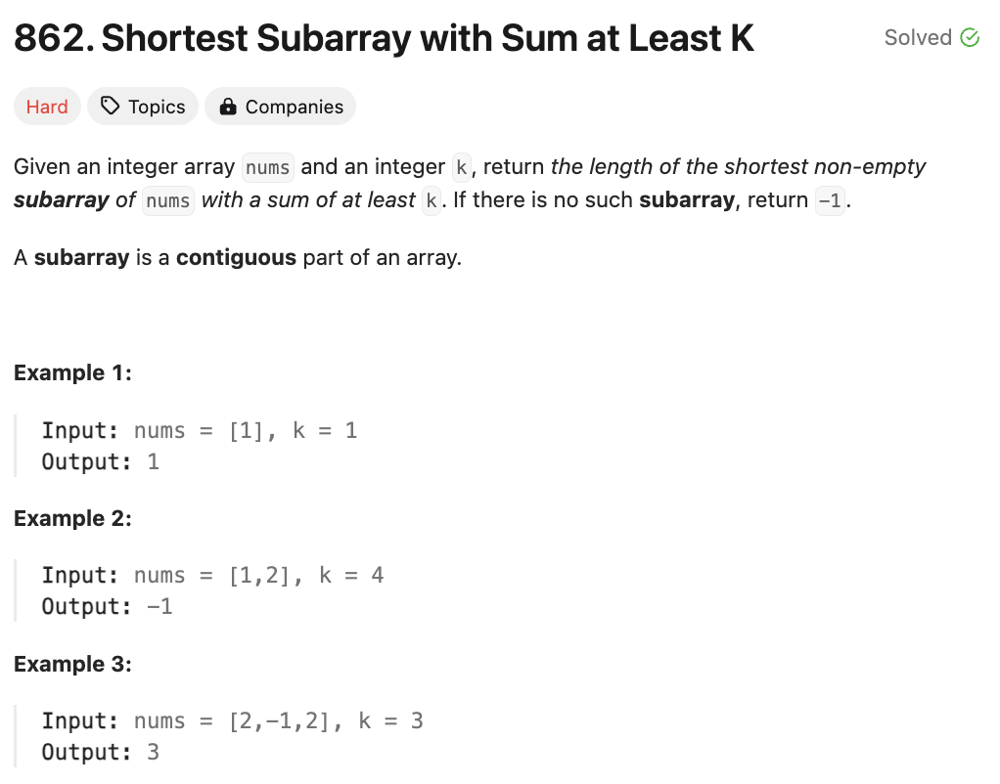
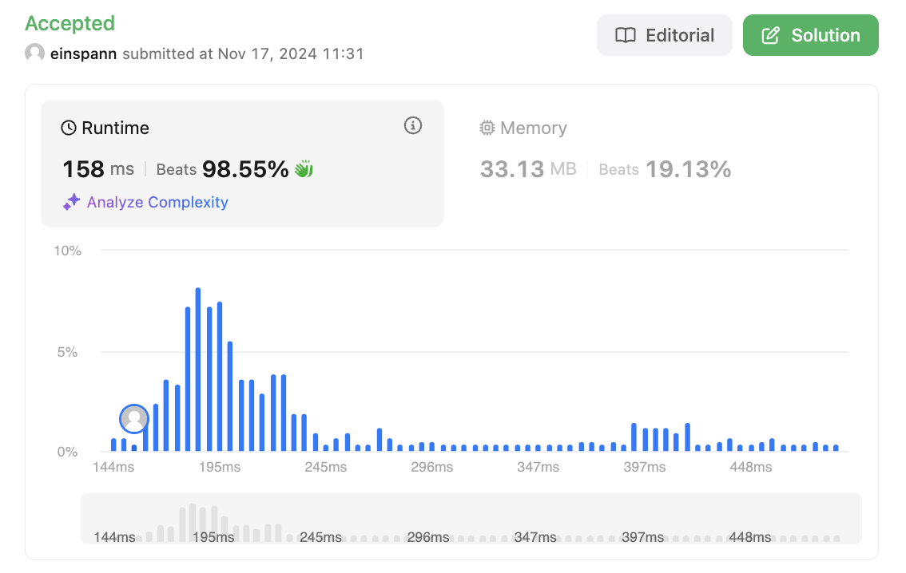

# 문제 설명
이 문제는 주어진 배열에서 합이 k 이상인 가장 짧은 부분 배열의 길이를 찾는 문제이다.




## 풀이 및 해설
- 이 문제는 prefix sum을 이용하여 풀 수 있다.
- 배열의 prefix sum들을 구한 후, deque를 이용하여 부분 배열을 찾는다.
- deque에는 prefix sum의 index를 저장하며, monotonic increasing queue를 유지한다.
- deque의 첫번째 index부터 현재 index까지의 부분 배열의 합이 k 이상이 되는지 확인한다.
- 만약 k 이상이라면, ans를 업데이트하고, deque의 첫번째 index를 pop한다.
- deque의 마지막 index부터 현재 index까지의 부분 배열의 합이 현재 prefix sum보다 크거나 같은지 확인한다.
- 만약 크거나 같다면, deque의 마지막 index를 pop한다.
- 현재 index를 deque에 추가한다.
- 최종적으로 ans가 inf라면, -1을 반환한다.

## 풀이
```python
class Solution:
    def shortestSubarray(self, nums: List[int], k: int) -> int:
        # calculate prefix sums
        prefix_sums = list(accumulate(nums, initial=0))

        # initialize deque and answer
        q = deque()
        ans = inf

        # iterate through prefix sums
        for i, curr_sum in enumerate(prefix_sums):
            # update answer if we find a valid subarray
            while q and curr_sum - prefix_sums[q[0]] >= k:
                ans = min(ans, i-q.popleft())
            
            # maintain monotonic increasing queue
            while q and prefix_sums[q[-1]] >= curr_sum:
                q.pop()
            
            q.append(i)
        
        return ans if ans != inf else -1
```

## Complexity Analysis


### 시간 복잡도
- prefix sum을 계산하는데 O(n)의 시간이 소요된다.
- deque를 이용하여 부분 배열을 찾는데 O(n)의 시간이 소요된다.
- 따라서 총 시간 복잡도는 O(n)이다.

### 공간 복잡도
- prefix sum을 저장하는데 O(n)의 공간이 소요된다.
- deque를 이용하여 부분 배열을 찾는데 O(n)의 공간이 소요된다.
- 따라서 총 공간 복잡도는 O(n)이다.

## Constraint Analysis
```
Constraints:
1 <= nums.length <= 10^5
-10^5 <= nums[i] <= 10^5
1 <= k <= 10^9
```

# References
- [862. Shortest Subarray with Sum at Least K](https://leetcode.com/problems/shortest-subarray-with-sum-at-least-k/)