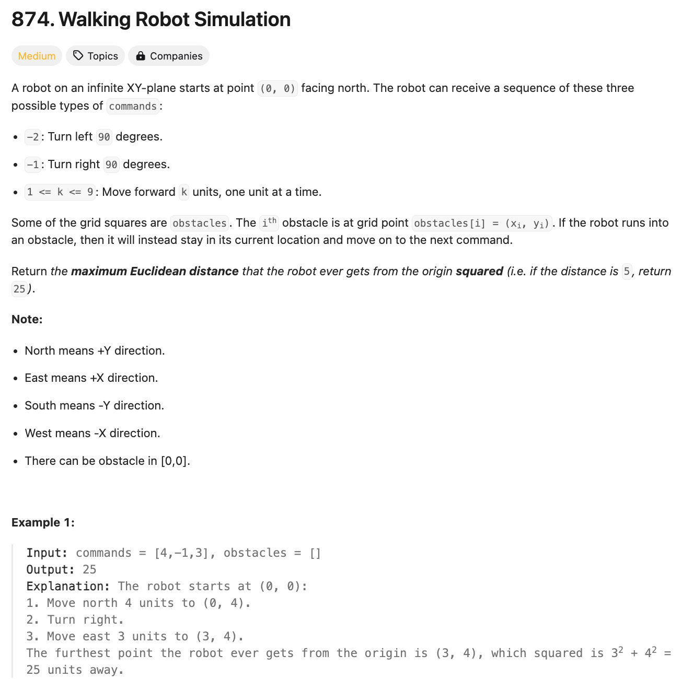
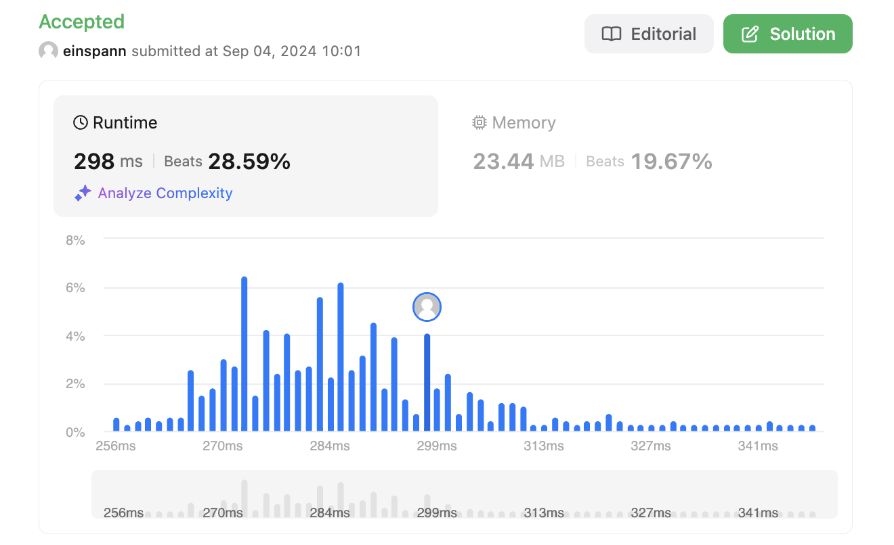

# 문제 설명
이 문제는 로봇을 조작하는 여러 명령어가 주어졌을 때, 최종적으로 로봇이 움직인 거리를 구하는 문제다.

이 문제를 풀기 위해서는 문제에서 주어진 명령어들을 하나씩 읽고, 경우에 맞게 처리를 해야 한다.  
이때, 로봇이 움직이는 경우에는 장애물이 있을 수 있으므로, 길을 방해한다면 로봇은 그 방향으로 움직이지 않는다.

튜플 처리와 방향 처리를 하는데 도움이 되는 문제다.



## 풀이 및 해설

## 풀이
```python
def robotSim(self, commands: List[int], obstacles: List[List[int]]) -> int:
    dirs = [(0,1), (1,0), (0,-1), (-1,0)] #north,east,south,west
    curr_dir = 0
    curr_loc = ((0,0))
    max_dist = 0

    obstacle_set = set(map(tuple, obstacles))

    for command in commands:
        if command > 0: # move
            # check if any obstacles between route
            for _ in range(command):
                next_pos = (curr_loc[0] + dirs[curr_dir][0], curr_loc[1] + dirs[curr_dir][1])

                if next_pos not in obstacle_set:
                    curr_loc = next_pos
                    curr_dist = curr_loc[0]*curr_loc[0] + curr_loc[1]*curr_loc[1]
                    max_dist = max(max_dist, curr_dist)
                else:
                    break
                
        elif command == -1: # turn right
            curr_dir = (curr_dir + 1) % 4
        else: # turn left
            curr_dir = (curr_dir - 1) % 4
    return max_dist
```
- 초기화:
    - 방향을 나타내는 dirs를 튜플으로 (0,1), (1,0), (0,-1), (-1,0)으로 정의한다.
    - 현재 방향을 나타내는 curr_dir을 0으로 초기화한다.
    - 현재 위치를 나타내는 curr_loc을 (0,0)으로 초기화한다.
    - 최대 거리를 나타내는 max_dist를 0으로 초기화한다.
- 중복을 피하기 위해 장애물을 set으로 변환한다.
- 명령어 처리:
    - 명령어를 순회하면서 처리한다.
    - 명령어가 0보다 크면, 이동 명령어이다.
        - 명령어만큼 이동하면서 장애물이 있는지 확인한다.
        - 장애물이 없다면, 이동하고, 현재 위치의 거리를 계산한다.
        - 최대 거리를 갱신한다.
    - 명령어가 -1이면, 오른쪽으로 회전한다.
    - 명령어가 -2이면, 왼쪽으로 회전한다.
- 최대 거리를 반환한다.


## Complexity Analysis


### 시간 복잡도
O(N*max_command) ; N은 commands의 길이, max_command는 commands의 최대 값이다.

### 공간 복잡도
O(N) ; N은 commands의 길이다.

## Constraint Analysis
```
Constraints:
1 <= commands.length <= 10^4
commands[i] is either -2, -1, or an integer in the range [1, 9].
0 <= obstacles.length <= 10^4
-3 * 10^4 <= xi, yi <= 3 * 10^4
The answer is guaranteed to be less than 2^31.
```

# References
- [874. Walking Robot Simulation](https://leetcode.com/problems/walking-robot-simulation/)