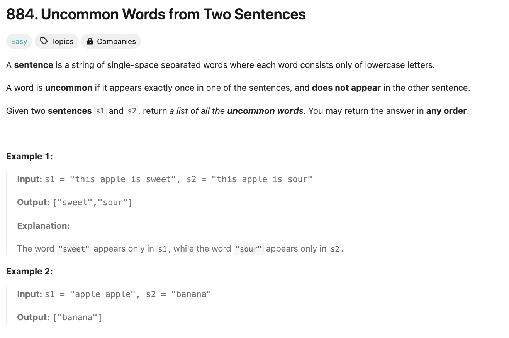

# 문제 설명
두 개의 문장 `s1`, `s2`가 주어진다. 두 문장에서 한번만 등장하는 단어를 찾아서 반환하는 문제다.



## 풀이 및 해설
- 문장을 단어로 나누고, 각 단어의 등장 횟수를 센다.
- 두 문장을 비교하면서 한 문장에만 등장하는 단어를 찾는다.

## 풀이
```python
def uncommonFromSentences(self, s1: str, s2: str) -> List[str]:
    s1count = Counter(s1.split())
    s2count = Counter(s2.split())
    out = []
    # check s1
    for word in s1count:
        if word not in s2count and s1count[word] == 1:
            out.append(word)
    # check s2
    for word in s2count:
        if word not in s1count and s2count[word] == 1:
            out.append(word)
    
    return out
```

## Complexity Analysis


### 시간 복잡도
- O(N+M) : 두 문장의 단어를 세는데 O(N+M)이 소요된다. N, M은 각 문장의 단어 수다.

### 공간 복잡도
- O(N+M) : 두 문장의 단어를 세는데 O(N+M)이 소요된다. N, M은 각 문장의 단어 수다.

## Constraint Analysis
```
Constraints:
1 <= s1.length, s2.length <= 200
s1 and s2 consist of lowercase English letters and spaces.
s1 and s2 do not have leading or trailing spaces.
All the words in s1 and s2 are separated by a single space.
```

# 최적화
근데 생각해보니까, 어차피 count가 1이어야 하면, 전체로 합쳐도 1이 되어야 한다. 그러면 두 dict를 합쳐서 한번에 하면 더 빠를것 같다.

## 풀이
```python
def uncommonFromSentences(self, s1: str, s2: str) -> List[str]:
    counts = Counter(s1.split() + s2.split())
    return [word for word,count in counts.items() if count == 1]
```

조금은 빨라진다. Counter도 하나만 만들고, 순회도 한번만 해서 더 빠를것이다.


# References
- [884. Uncommon Words from Two Sentences](https://leetcode.com/problems/uncommon-words-from-two-sentences/)