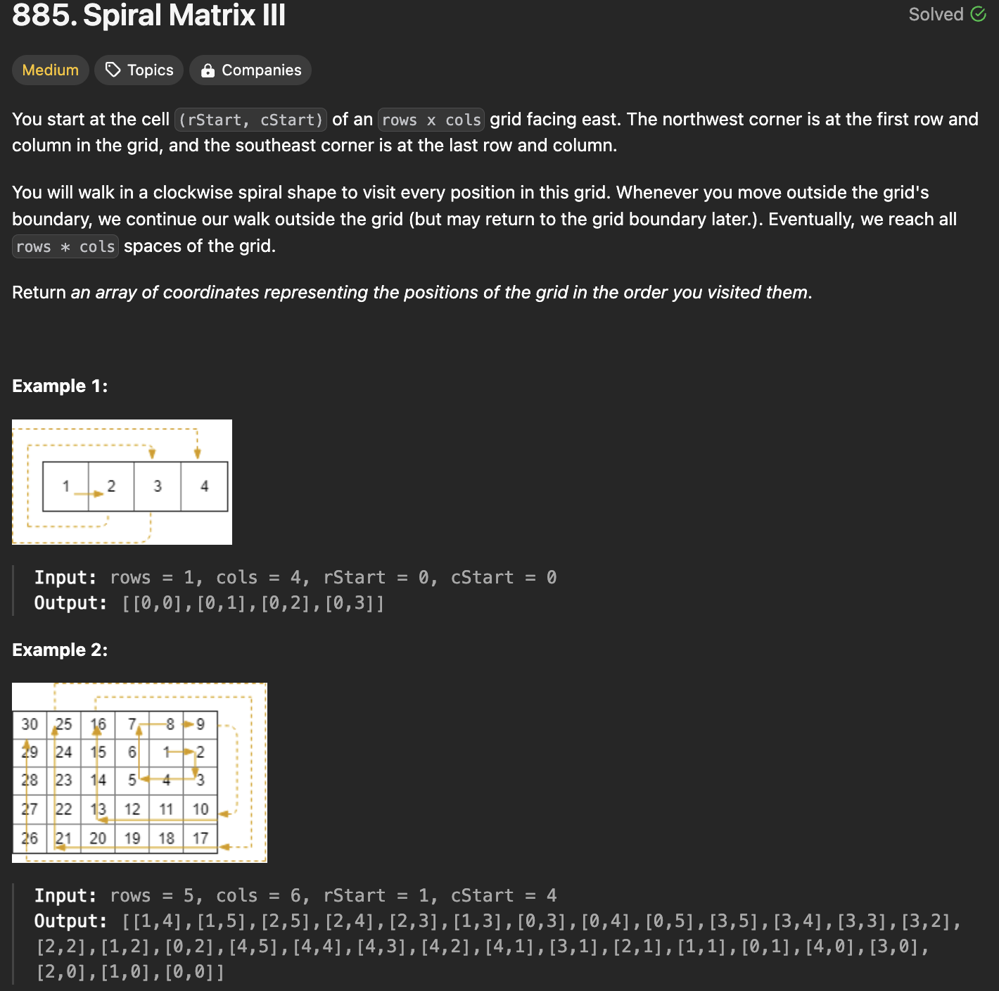
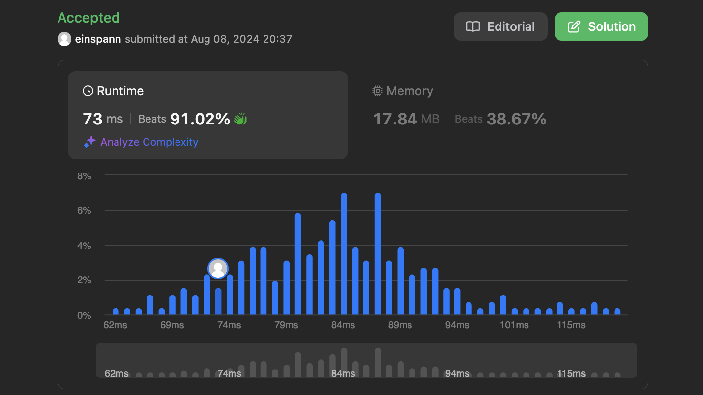

# 문제 설명
행렬을 나선형으로 순회하는 문제다.



## 풀이 및 해설

## 풀이
```python
def spiralMatrixIII(self, rows: int, cols: int, rStart: int, cStart: int) -> List[List[int]]:
        output = []
        x, y = rStart, cStart
        output.append([x, y])
        total_cells = rows * cols

        directions = [(0, 1), (1, 0), (0, -1), (-1, 0)]  # east, south, west, north
        steps = 1

        while len(output) < total_cells:
            for i in range(4):
                direction = directions[i]
                for _ in range(steps):
                    x += direction[0]
                    y += direction[1]

                    if 0 <= x < rows and 0 <= y < cols:
                        output.append([x, y])

                    if len(output) == total_cells:
                        return output

                # Increase steps after moving in east and west directions
                if i % 2 == 1:
                    steps += 1

        return output
```
- output 배열에 시작 위치를 추가한다.
- directions 배열에 동, 남, 서, 북 방향을 추가한다.
- steps를 1로 초기화한다.
- output 배열의 길이가 total_cells보다 작을 때까지 반복한다.
- 4방향으로 이동하며 steps만큼 이동한다.
- 이동한 위치가 rows와 cols 범위 내에 있으면 output 배열에 추가한다.
- output 배열의 길이가 total_cells와 같으면 output 배열을 반환한다.
- 동, 서 방향으로 이동한 후 steps를 증가시킨다.
- output 배열을 반환한다.

## Complexity Analysis


### 시간 복잡도
- while과 for문을 사용하므로 시간복잡도는 O(n)이다.

### 공간 복잡도
- 공간복잡도는 O(n)이며, 이유는 output 배열에 모든 위치를 저장하기 때문이다.

## Constraint Analysis
```
Constraints:
1 <= rows, cols <= 100
0 <= rStart < rows
0 <= cStart < cols
```

# References
- [885. Spiral Matrix III](https://leetcode.com/problems/spiral-matrix-iii/)