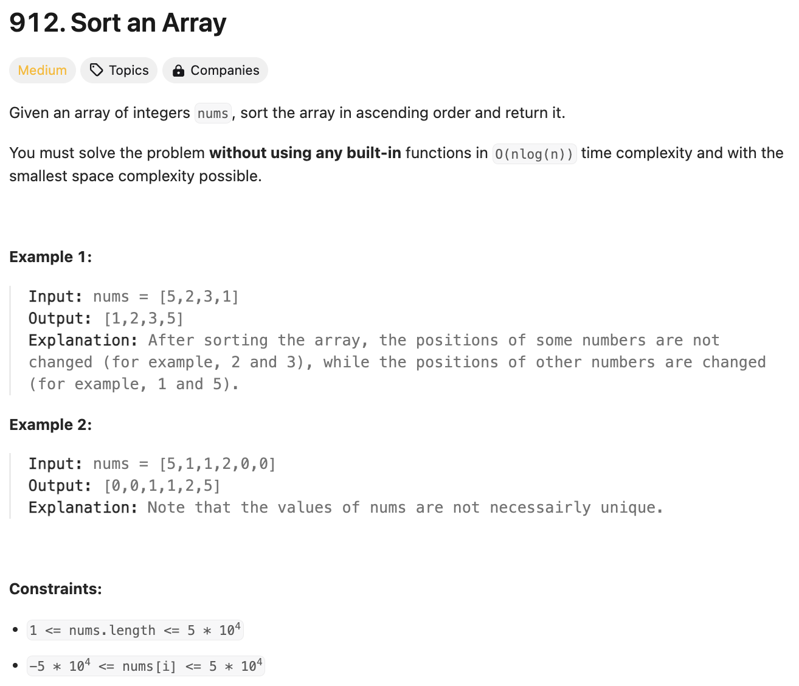
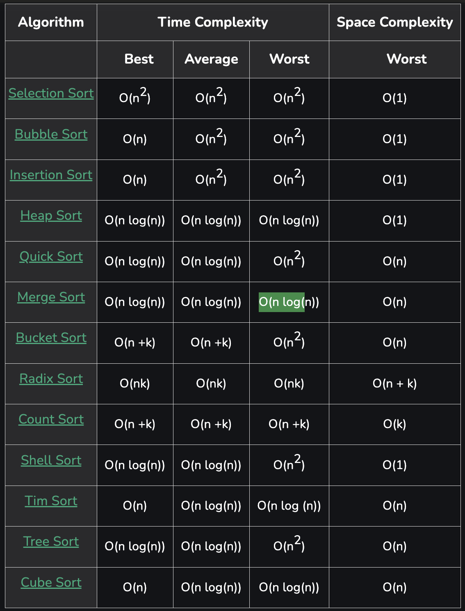
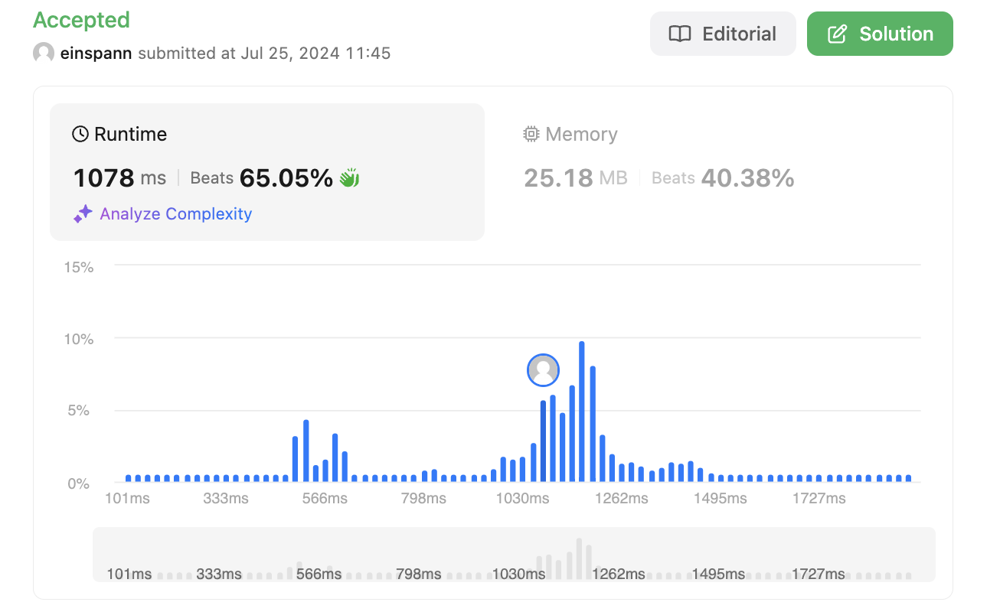

# 문제 설명
sorted이나 sort 함수 없이 nlogn 시간 복잡도로 정렬된 배열을 반환하는 문제다. 그러기 위해서는 merge sort, quick sort, heap sort 등을 사용해야 한다.





## 풀이 및 해설
여러 정렬 알고리즘 중에서 merge sort를 사용해보자.

이를 사용하는 이유는 간단하고, 빠르며, 안정적이기 때문이다. 또한, merge sort는 divide and conquer 방식으로 구현되어 있어서, 재귀적으로 구현하기 쉽다.

## 풀이
```python
def sortArray(self, nums: List[int]) -> List[int]:
        def merge_sort(arr):
            if len(arr) <= 1:
                return arr

            mid = len(arr) //2
            left = merge_sort(arr[:mid])
            right = merge_sort(arr[mid:])

            return merge(left, right)

        def merge(left, right):
            result = []
            i, j = 0,0

            while i < len(left) and j < len(right):
                if left[i] <= right[j]:
                    result.append(left[i])
                    i += 1
                else:
                    result.append(right[j])
                    j += 1

            result.extend(left[i:])
            result.extend(right[j:])

            return result

        return merge_sort(nums)
```
- merge_sort 함수는 재귀적으로 merge 함수를 호출한다.
- merge 함수는 두 배열을 비교하여 작은 값을 result에 추가한다.
- 두 배열 중 하나가 끝나면, 남은 배열을 result에 추가한다.
- 최종적으로 result를 반환한다.

## Complexity Analysis


### 시간 복잡도
- O(nlogn); n개의 요소를 logn번 비교한다.

### 공간 복잡도
- O(n); merge 함수에서 n개의 요소를 저장한다.

## Constraint Analysis
```
Constraints:
1 <= nums.length <= 5 * 10^4
-5 * 104 <= nums[i] <= 5 * 10^4
```

# References
- [Time Complexities of all Sorting Algorithms](https://www.geeksforgeeks.org/time-complexities-of-all-sorting-algorithms/)