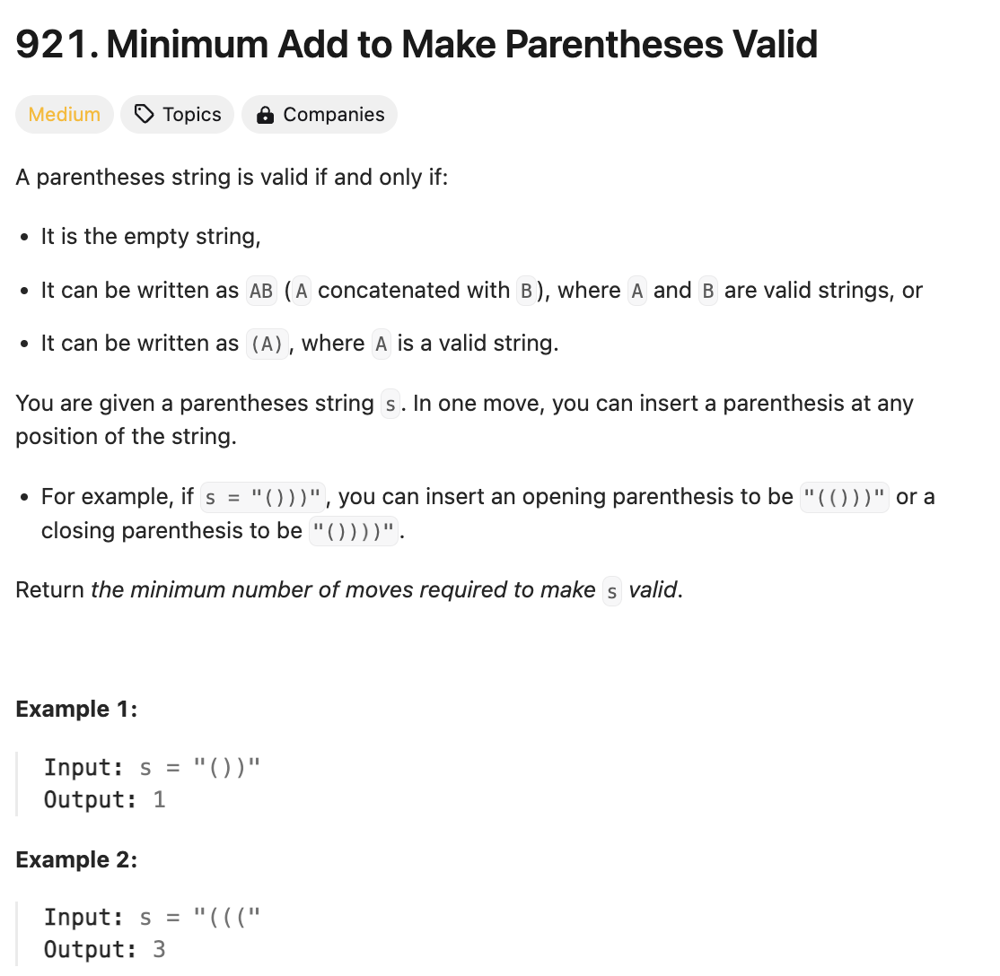

# 문제 설명
이 문제는 괄호 문자열이 주어졌을 때, 이 괄호 문자열을 유효한 괄호 문자열로 만들기 위해 추가해야 하는 최소 괄호 개수를 구하는 문제이다.



## 풀이 및 해설
스택을 유지하면서 현재 괄호가 '('인 경우에는 스택에 추가하고, ')'인 경우에는 스택에서 pop을 하면서 진행한다. 만약 스택이 비어있는데 ')'가 나온다면, 이는 괄호가 맞지 않는 경우이므로 mismatch를 1 증가시킨다. 이후에는 mismatch와 스택의 길이를 더한 값을 반환하면 된다.

## 풀이
```python
def minAddToMakeValid(self, s: str) -> int:
        stack = []
        mismatch = 0

        for bracket in s:
            if bracket == '(':
                stack.append(bracket)
            else:
                if stack:
                    stack.pop()
                else:
                    mismatch += 1
        
        return mismatch + len(stack)
```

## Complexity Analysis


### 시간 복잡도
- 입력 문자열의 길이를 N이라고 할 때, O(N)의 시간 복잡도를 가진다.

### 공간 복잡도
- 스택을 사용하므로 O(N)의 공간 복잡도를 가진다.

## Constraint Analysis
```
Constraints:
1 <= s.length <= 1000
s[i] is either '(' or ')'.
```

# References
- [921. Minimum Add to Make Parentheses Valid](https://leetcode.com/problems/minimum-add-to-make-parentheses-valid/)