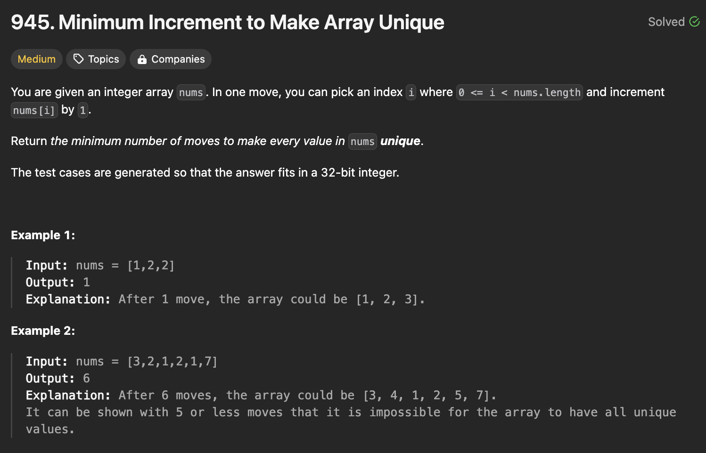
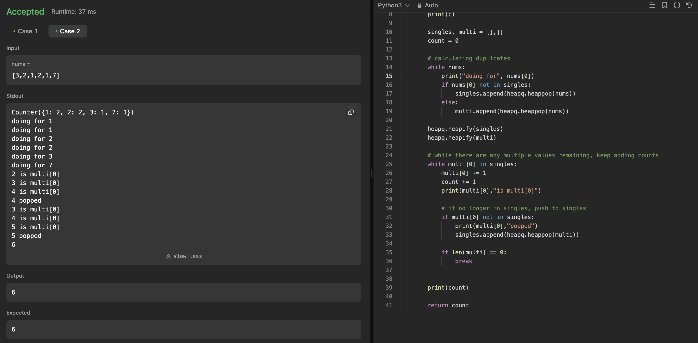
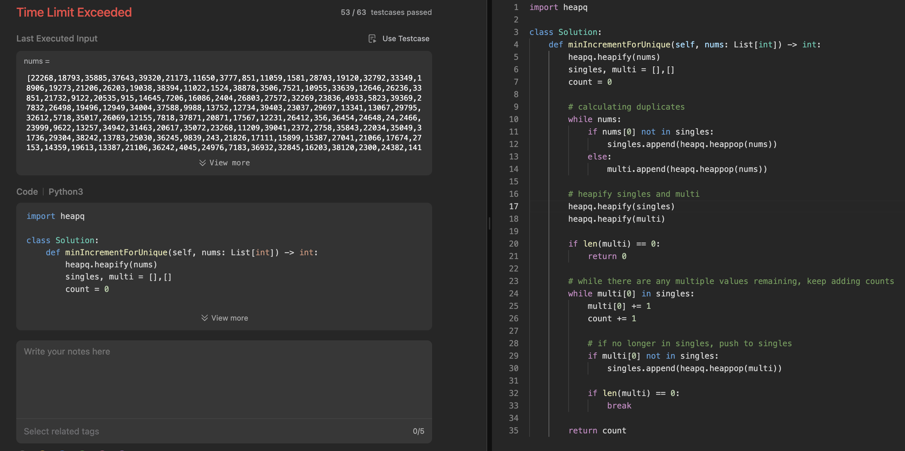
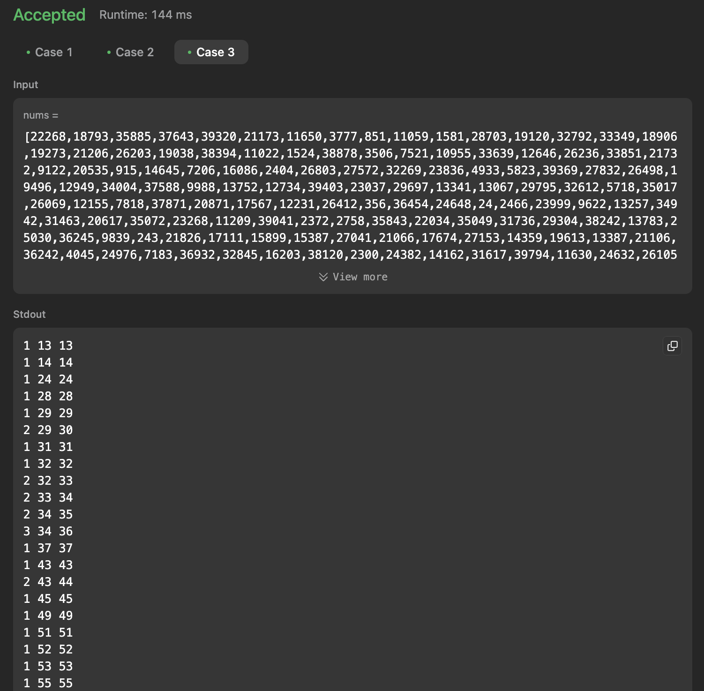

# 문제 설명
배열이 주어진다. 배열의 요소를 증가시켜서 중복되지 않게 만드는 문제다.



## 1차 시도



일단 한번 더럽게 풀어봤는데 몇몇 테스트 케이스에서 틀렸다. 시간복잡도가 너무 높아서 그렇다. heapify를 너무 많이 사용해서 오히려 시간복잡도가 엄청 높아졌다.

## 2차 시도
오히려 더 간단하게 풀 수 있다. 정렬했으면 그냥 이전 값과 비교해서 더해주면 된다. 차이만큼 계산해서 더해주면 답이 나온다.

```python
class Solution:
    def minIncrementForUnique(self, nums: List[int]) -> int:
        nums.sort()  # Sort the list first, O(n log n)
        print(nums)
        count = 0
        
        for i in range(1, len(nums)):
            if nums[i] <= nums[i - 1]:  # If the current number is not greater than the previous one
                increment = nums[i - 1] - nums[i] + 1
                print(increment, nums[i], nums[i-1])
                nums[i] += increment
                count += increment  # Increment the count by the number of steps taken to make it unique
        
        return count
```


앞서 실패했던 케이스에 대하여 살펴보면, increment가 계속 점차 오른다. 그런데 어차피 정렬이 되어 있는 상태에서 올리는거라 그 차이만 계산하면 이게 훨씬 효율적이다.


## Complexity Analysis


### Time Complexity
- Sorting the list: O(NlogN) ; N is the length of the nums array

최종적으로 O(NlogN)이다.

### Space Complexity
- O(1) ; no extra space is used

## Constraint Analysis
```
Constraints:

1 <= nums.length <= 10^5
0 <= nums[i] <= 10^5
```

# References
- [LeetCode](https://leetcode.com/problems/minimum-increment-to-make-array-unique)