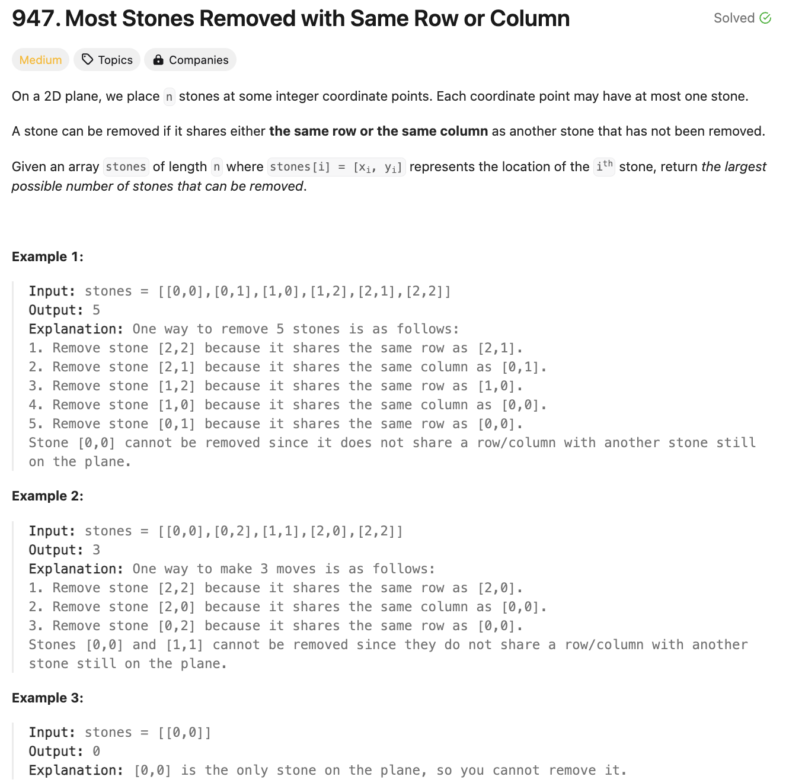
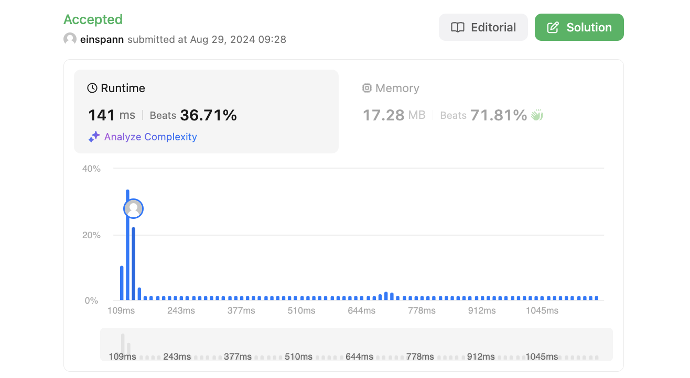

# 문제 설명
같은 행 또는 열에 있는 돌을 제거하여 남은 돌의 개수를 구하는 문제이다.



## 풀이 및 해설

이 문제를 풀기 위해서는 Union Find를 사용하면 된다. 같은 행 또는 열을 공유하는 돌들을 하나의 집합으로 연결하면 된다. 이렇게 이어진 돌들에서 계속하여 돌을 제거해도 연결된 상태를 유지하면 된다.  

이를 하기 위해 다음 순서를 따르면 된다:  
1. Disjoint Set을 초기화한다.
2. 돌들을 순회하면서 같은 행 또는 열에 있는 돌들을 연결한다.
3. Unique Sets(Islands)의 개수를 센다.
4. 답은 모든 돌으로부터 Unique Sets의 개수를 뺀 값이다.

## 풀이
```python
def removeStones(self, stones: List[List[int]]) -> int:
        def find(x):
            if x != parent[x]:
                parent[x] = find(parent[x])
            return parent[x]
        
        def union(x,y):
            root_x,root_y = find(x),find(y)
            if root_x != root_y:
                parent[root_x] = root_y
        
        parent = {}
        for i,j in stones:
            x_key = f'x_{i}'
            y_key = f'y_{j}'

            if x_key not in parent:
                parent[x_key] = x_key
            if y_key not in parent:
                parent[y_key] = y_key
            
            union(x_key, y_key)
        
        roots = set(find(x) for x in parent)
        
        return len(stones) - len(roots)
```
- def find(x):  
    - x의 root를 찾는 함수이다.  
    - x의 root가 x와 같지 않다면, x의 root의 root를 찾아서 x의 root로 설정한다.  
    - 이렇게 하면 x의 root를 찾을 때마다 parent를 업데이트할 필요가 없다.
- def union(x,y):  
    - x와 y의 root를 찾아서 같지 않다면, x의 root를 y의 root로 설정한다.
- parent를 초기화한다.
- stones를 순회하면서 x와 y의 root를 찾아서 연결한다.
- parent에서 root를 찾아서 set에 저장한다.
- 답은 모든 돌의 개수에서 root의 개수를 뺀 값이다.

## Complexity Analysis


### 시간 복잡도
- 초시화: O(N)
- Union Find: O(alpha(N)) ; alpha(N)은 inverse Ackermann function이다.

총: O(N*alpha(N))이며, 이는 사실상 O(N)에 수렴한다.

### 공간 복잡도
- O(N) : parent를 저장하기 위한 공간이다.

## Constraint Analysis
```
Constraints:
1 <= stones.length <= 1000
0 <= xi, yi <= 10^4
No two stones are at the same coordinate point.
```

# References
- [LeetCode](https://leetcode.com/problems/most-stones-removed-with-same-row-or-column/)