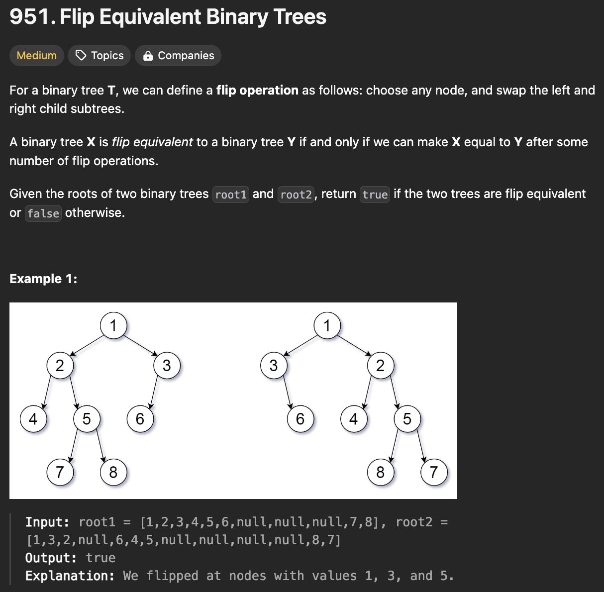
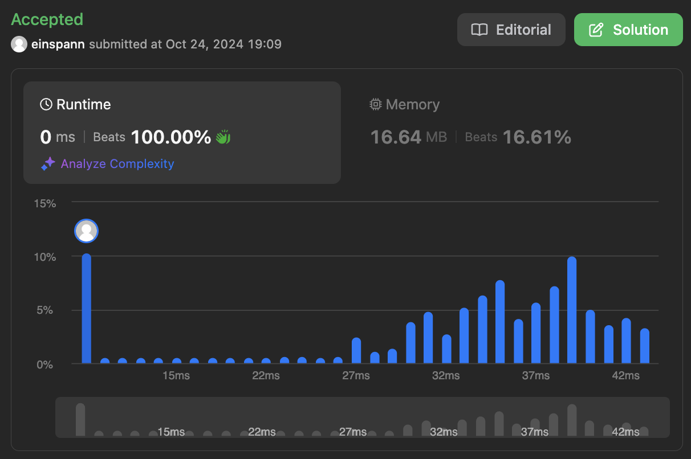

# 문제 설명
이 문제는 트리가 두개가 주어졌을때, 하나의 트리를 뒤집어서 같은 트리가 되는지 확인하는 문제이다.



## 풀이 및 해설

## 풀이
```python
# Definition for a binary tree node.
# class TreeNode:
#     def __init__(self, val=0, left=None, right=None):
#         self.val = val
#         self.left = left
#         self.right = right
class Solution:
    def flipEquiv(self, root1: Optional[TreeNode], root2: Optional[TreeNode]) -> bool:
        def dfs(node1, node2):
            if not node1 and not node2:
                return True
            if not node1 or not node2 or node1.val != node2.val:
                return False
            
            return (dfs(node1.left, node2.left) and dfs(node1.right, node2.right) or dfs(node1.left, node2.right) and dfs(node1.right, node2.left))
            
        return dfs(root1, root2)
```
- DFS를 이용하여 두 트리가 같은지 확인한다.
- 두 트리가 같은지 확인하는 방법은 다음과 같다.
  1. 두 트리가 모두 None이면 True를 반환한다.
  2. 두 트리 중 하나만 None이거나 두 트리의 값이 다르면 False를 반환한다.
  3. 두 트리의 왼쪽 자식과 오른쪽 자식을 비교한다.
  4. 두 트리의 왼쪽 자식과 오른쪽 자식을 서로 비교한다.
  5. 두 트리의 왼쪽 자식과 오른쪽 자식을 서로 비교한다.
  6. 두 트리의 왼쪽 자식과 오른쪽 자식을 서로 비교한다.

## Complexity Analysis


놀랍게도 100% 성능이 떴다. Editorial 답이랑 같지 않을까 싶다.

### 시간 복잡도
- O(N) : 트리의 모든 노드를 방문해야 하므로 O(N)이다.

### 공간 복잡도
- O(N) : 재귀 호출을 하므로 O(N)이다.

## Constraint Analysis
```
Constraints:
The number of nodes in each tree is in the range [0, 100].
Each tree will have unique node values in the range [0, 99].
```

# References
- [951. Flip Equivalent Binary Trees](https://leetcode.com/problems/flip-equivalent-binary-trees/)