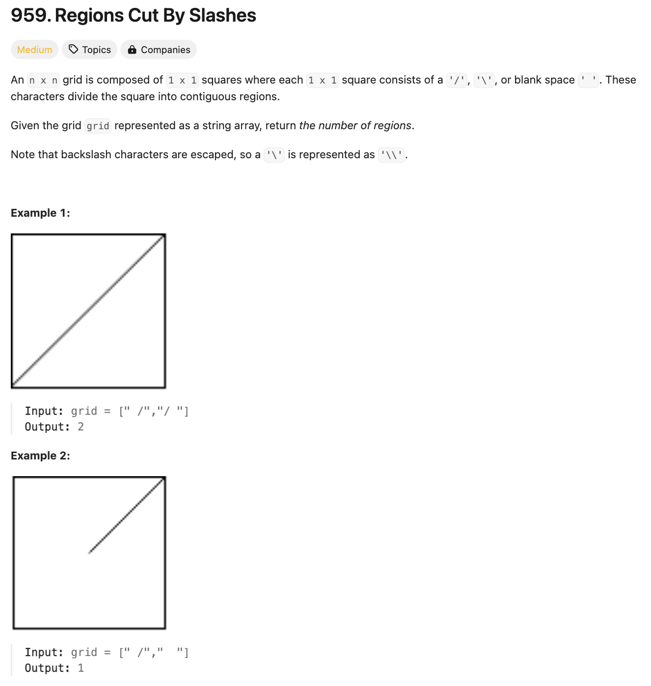
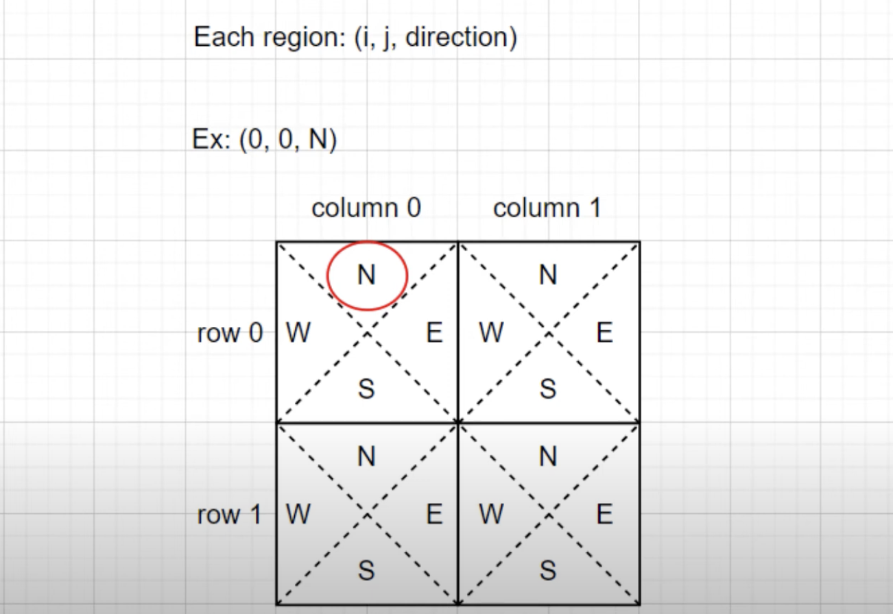

# 문제 설명
1x1 격자를 대각선으로 자르면 생기는 영역의 개수를 구하는 문제이다.



## 풀이 및 해설
어떻게 푸는지 감도 안 잡혀서 결국에 다른 사람의 풀이를 참고했다. 대각선으로 자르는 것을 어떻게 표현할지가 관건이었는데, 다음과 같이 표현할 수 있다.

[LeetCode 959. Regions Cut By Slashes | Union-find AlgoMonster](https://www.youtube.com/watch?v=LKHE5AVTmTk)



또한, 이런 표현에서 union-find를 사용하여 풀 수 있다. 이 문제는 1x1 격자를 대각선으로 자르면 생기는 영역의 개수를 구하는 문제이다. 이 문제를 풀기 위해서는 격자를 3x3으로 확장하여 풀면 된다. 이때, 각 격자를 위와 같이 표현할 수 있다.

## 풀이
```python
def regionsBySlashes(self, grid: List[str]) -> int:
        # union find
        roots = {}
        def find(x):
            if x not in roots:
                roots[x] = x
            while (x != roots[x]):
                x = roots[x]
            return x
        def union(x,y):
            roots[find(x)] = find(y)
        
        length = len(grid)
        for i in range(length):
            for j in range(length):
                if grid[i][j] == '/':
                    union((i,j,'N'), (i,j,'W'))
                    union((i,j,'S'), (i,j,'E'))
                elif grid[i][j] == '\\':
                    union((i,j,'N'), (i,j,'E'))
                    union((i,j,'S'), (i,j,'W'))
                elif grid[i][j] == ' ':
                    union((i,j,'N'), (i,j,'E'))
                    union((i,j,'S'), (i,j,'W'))
                    union((i,j,'N'), (i,j,'W'))
                
                # two horizontally adjacent squares
                if j > 0:
                    union((i,j-1,'E'),(i,j,'W'))
                # two vertically adjacent squares
                if i > 0:
                    union((i-1,j,'S'),(i,j,'N'))
        
        return len(set(map(find, roots)))
```
- `roots`는 각 격자의 루트를 저장하는 딕셔너리이다.
- `find` 함수는 루트를 찾는 함수이다.
- `union` 함수는 두 노드를 합치는 함수이다.
- `length`는 격자의 길이이다.
- 격자를 탐색하면서 대각선에 따라 union을 해준다.
- 대각선에 따라 union을 해주고, 가로와 세로에 대해서도 union을 해준다.
- `set(map(find, roots)`를 통해 루트의 개수를 구한다.
- 이때, `find` 함수를 통해 루트를 찾아주고, `set`을 통해 중복을 제거한다.
- 이를 통해 루트의 개수를 구할 수 있다. 이렇게 구한 루트의 개수가 영역의 개수가 된다.

## Complexity Analysis


### 시간 복잡도
- 격자의 길이가 `n`이라고 할 때, 격자를 탐색하는 시간 복잡도는 `O(n^2)`이다.

### 공간 복잡도
- `roots` 딕셔너리를 사용하여 루트를 저장하므로, 공간 복잡도는 `O(n^2)`이다.

## Constraint Analysis
```
Constraints:
n == grid.length == grid[i].length
1 <= n <= 30
grid[i][j] is either '/', '\', or ' '.
```

# References
- [LeetCode 959. Regions Cut By Slashes](https://leetcode.com/problems/regions-cut-by-slashes/)
- [Union-Find Algorithm](https://en.wikipedia.org/wiki/Disjoint-set_data_structure)