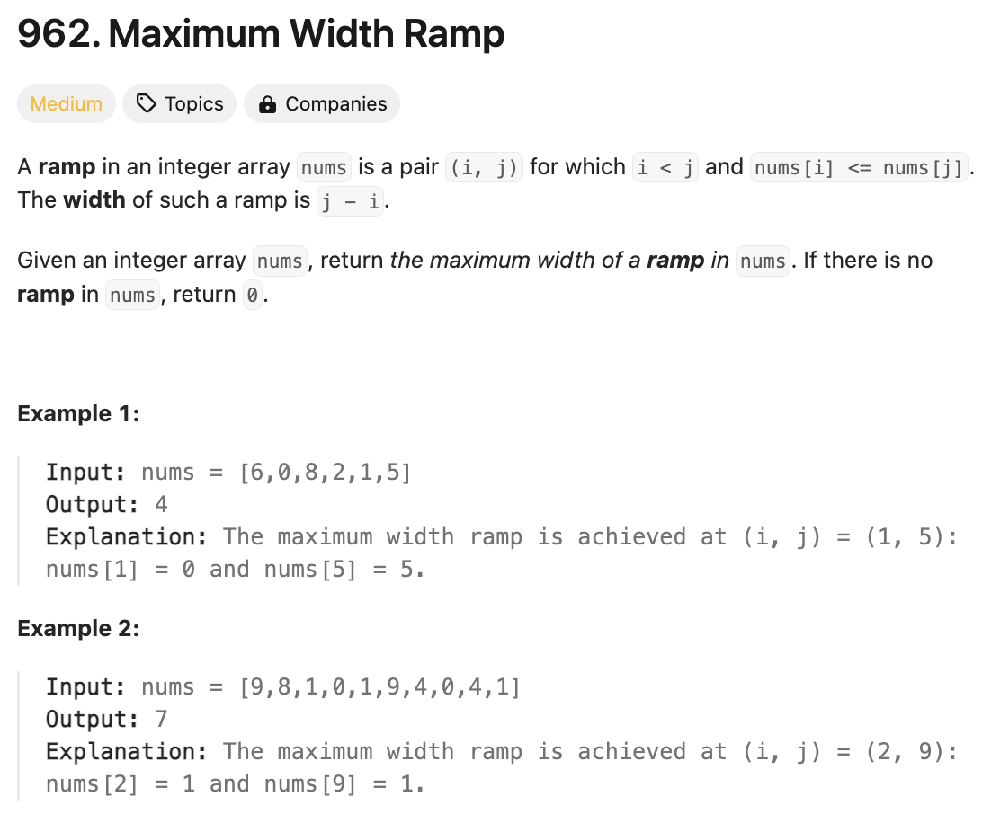
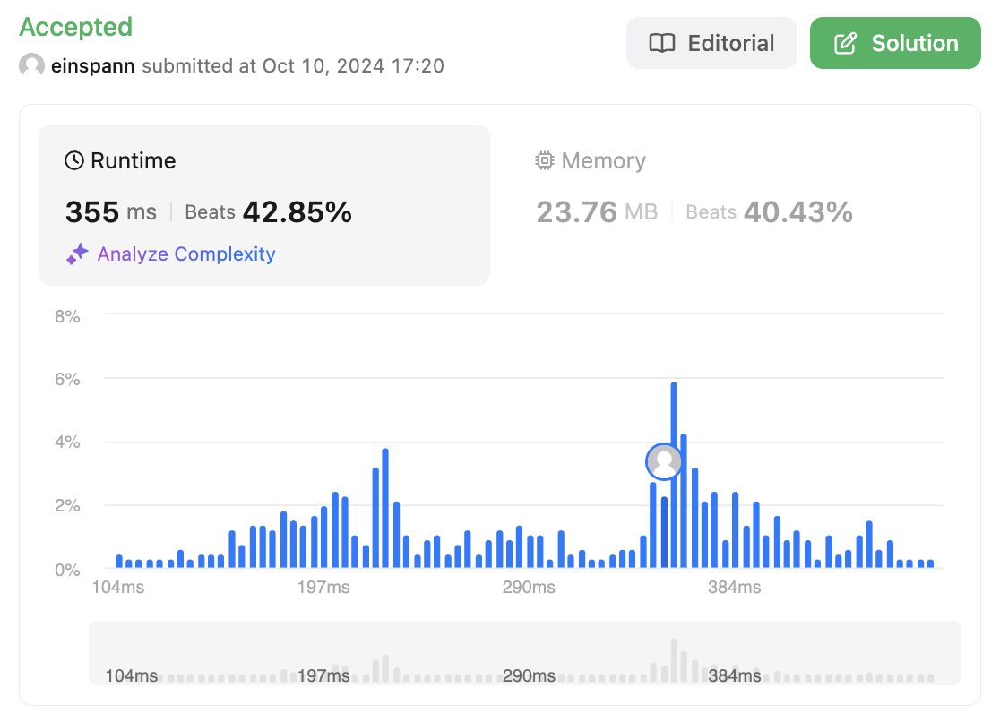

# 문제 설명
해당 문제는 배열이 주어졌을 때, 배열의 두 인덱스 i, j가 i < j이고, nums[i] <= nums[j]일 때, j-i의 최대값을 구하는 문제이다.



# 풀이 1
## 풀이 및 해설
for loop 두개 해서 비교 연산을 진행하고 max_ramp를 업데이트하는 방식으로 풀어봤는데, 시간 초과가 발생했다.

## 풀이
```python
class Solution:
    def maxWidthRamp(self, nums: List[int]) -> int:
        max_ramp = 0
        for i in range(len(nums)):
            for j in range(i, len(nums)):
                if nums[i] <= nums[j]:
                    max_ramp = max(max_ramp, j-i)
        
        return max_ramp
```

## Complexity Analysis
- 시간 복잡도: O(N^2)


# 풀이 2
## 풀이 및 해설
- 스택을 사용하여 풀이한다.
- 스택에는 인덱스를 저장한다.
- 스택에는 값이 감소하는 순서로 저장된다.
- 오른쪽에서 왼쪽으로 순회하면서 스택의 top이 현재 값보다 작거나 같을 때까지 pop을 하면서 max_width를 업데이트한다.
- max_width를 반환한다.

## 풀이
```python
class Solution:
    def maxWidthRamp(self, nums: List[int]) -> int:
        n = len(nums)
        stack = []

        # create a stack of indices in decreasing order of values
        for i in range(n):
            if not stack or nums[stack[-1]] > nums[i]:
                stack.append(i)
        
        max_width = 0

        # iterate from right to left
        for i in range(n-1, -1, -1):
            while stack and nums[stack[-1]] <= nums[i]:
                max_width = max(max_width, i-stack.pop())
        
        return max_width
```

## Complexity Analysis



### 시간 복잡도
O(NlogN) : 스택에 최대 N개의 값이 들어가므로 O(N)이고, 스택에 값을 넣을 때마다 최대 N번의 비교가 발생하므로 O(NlogN)이다.

### 공간 복잡도
O(N) : 스택에 최대 N개의 값이 들어가므로 O(N)이다.

## Constraint Analysis
```
Constraints:
2 <= nums.length <= 5 * 10^4
0 <= nums[i] <= 5 * 10^4
```

# References
- [962. Maximum Width Ramp](https://leetcode.com/problems/maximum-width-ramp/)