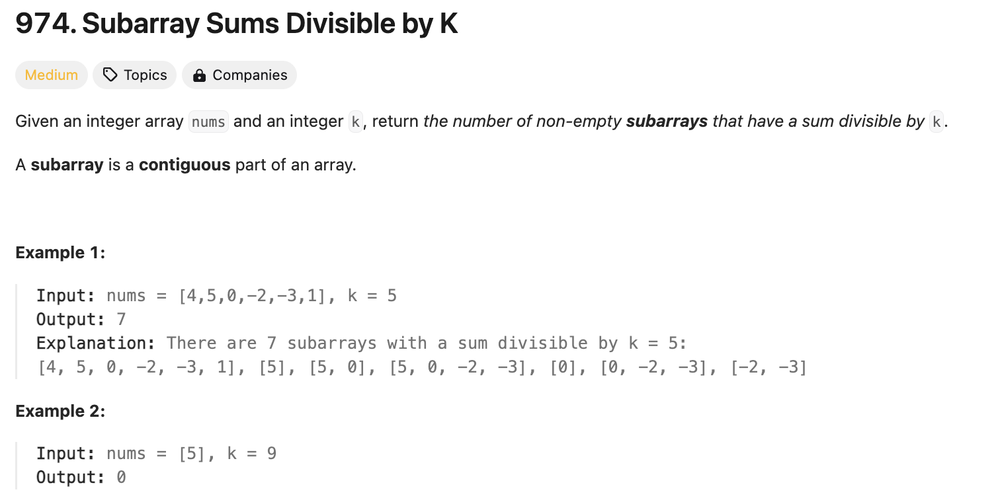
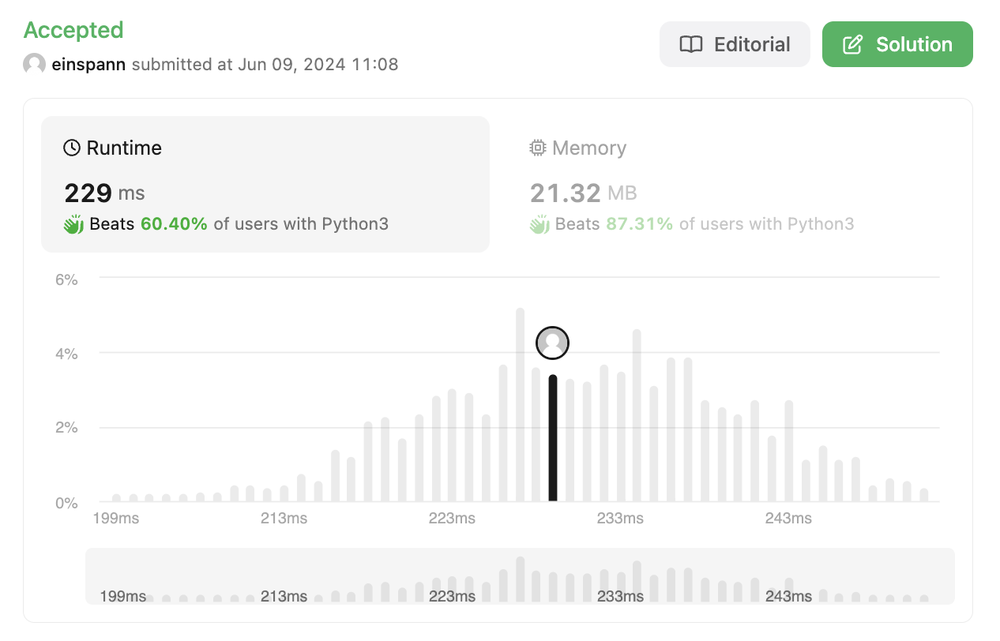

## 문제 설명
주어진 배열에서 연속된 부분배열의 합이 k의 배수인 부분배열의 수를 확인하는 문제다.



## 1차 시도
어제 풀었던 부분배열 문제랑 비슷한것 같다. 다만 어제는 부분배열의 합이 k의 배수인지만 확인했는데, 이번에는 부분배열의 수를 확인해야한다. 

또한, 제약조건이 `1 <= nums.length <= 3 * 10^4`이므로 해시맵을 써야 하긴 하겠다. 일단 풀면서 생각해보자.

전에는 나머지들을 계산해서 다시 등장하면, k만큼의 차이가 있어서 무조건 배수라는 논리를 사용했었다. 그러나, 이제는 그 이후도 생각을 해야한다. 즉, 테케에서 연달아 [5, 5, 5] 이렇게 나오는 경우에 어떻게 [[5], [5], [5], [5, 5], [5, 5], [5, 5], [5, 5, 5]] 이렇게 나오는지 생각해봐야한다.


## 풀이 및 해설
## Hashmap
- 파이썬이다보니 dictionary로 해시맵 구현. 처음 선언할때 {0:1}으로 선언한다. 이유는 전체가 k의 배수인 경우를 고려하기 위함이다.
- 누적합을 저장할 변수를 선언하고, 전체의 갯수를 저장할 변수를 선언한다.
- nums의 각 요소를 순회하면서 누적합을 계산한다.
    - 누적합을 구하고 k로 나눈 나머지를 구한다.
    - 음수가 나올 수 있으므로, 나머지를 구할 때 음수가 나오면 k를 더해준다.
    - 해당 나머지가 해시맵에 존재한다면, 해당 나머지의 갯수 dic[remainder]를 더해준다.
    - 해당 나머지가 존재한다면 해시맵에 1을 추가하고, 존재하지 않았다면 1로 초기화한다.
- 최종적으로, 전체의 갯수를 반환한다.

해시맵을 사용해서 풀어봤다.


## 풀이
```python
class Solution:
    def subarraysDivByK(self, nums: List[int], k: int) -> int:
        dic = {0: 1} # initialize dictionary for cases where the sum itself is %k
        prefix_sum = 0
        count = 0

        for num in nums:
            prefix_sum += num
            rem = prefix_sum % k

            # Adjust for negative remainders
            if rem < 0:
                rem += k

            # If remainder has been seen before, add the frequency to count
            if rem in dic:
                count += dic[rem]

            # Update the frequency of the current remainder
            if rem in dic:
                dic[rem] += 1
            else:
                dic[rem] = 1
        
        return count
```

## Complexity Analysis


해시맵이라 확실히 빠른것을 확인할 수 있다. 그러나, 확실히 이해가 잘 되지 않기 때문에 추후에 다시 풀어봐야겠다.

### Time Complexity
- for loop: O(N) ; N은 nums 배열의 길이
- dictionary lookup: O(1) ; dictionary의 길이는 k이다.

최종적으로 O(N)이다.

### Space Complexity
- O(N) ; N은 nums 배열의 길이

## Constraint Analysis
```
Constraints:

1 <= nums.length <= 3 * 10^4
-10^4 <= nums[i] <= 10^4
2 <= k <= 10^4
```

- 시간복잡도는 O(10^4). 하나의 operation은 10^-6이 걸린다 생각하면 10^4 * 10^-6 = 0.01초이다. 충분히 빠르다.
- 공간복잡도는 O(10^4).

# References
- [LeetCode](https://leetcode.com/problems/subarray-sums-divisible-by-k)
- [Python Hashmaps - Datacamp](https://www.datacamp.com/tutorial/guide-to-python-hashmaps)
