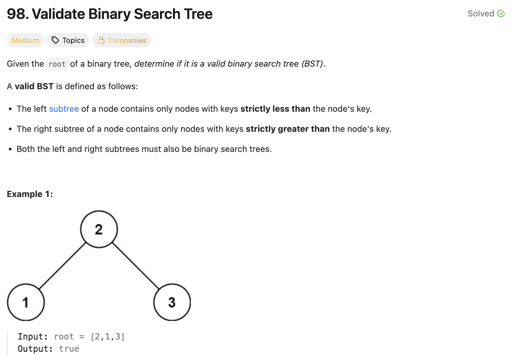

# 문제 설명
이진 탐색 트리가 유효한지 확인하는 문제다.



## 풀이 및 해설
이 문제 같은 경우에는 이진 탐색 트리의 특성을 이용해서 풀 수 있다. 이진 탐색 트리의 특성상 왼쪽 자식 노드는 부모 노드보다 작고, 오른쪽 자식 노드는 부모 노드보다 크다. 따라서 중위 순회를 통해서 노드 값을 오름차순으로 정렬된 리스트를 얻을 수 있다. 이 리스트가 오름차순으로 정렬되어 있는지 확인하면 된다.

## 풀이
```python
# Definition for a binary tree node.
# class TreeNode:
#     def __init__(self, val=0, left=None, right=None):
#         self.val = val
#         self.left = left
#         self.right = right
class Solution:
    def isValidBST(self, root: Optional[TreeNode]) -> bool:
        stack = []
        prev = None
        curr = root

        while stack or curr:
            # find leftmost
            while curr:
                stack.append(curr)
                curr = curr.left
            
            # leftmost node
            curr = stack.pop()
            if prev is not None and curr.val <= prev:
                return False

            # compare with right
            prev = curr.val
            curr = curr.right
        
        return True
```

## Complexity Analysis


### 시간 복잡도
- O(N)

### 공간 복잡도
- O(H); H는 트리의 높이

## Constraint Analysis
```
Constraints:

The number of nodes in the tree is in the range [1, 10^4].
-2^31 <= Node.val <= 2^31 - 1
```

# References
- [98. Validate Binary Search Tree - LeetCode](https://leetcode.com/problems/validate-binary-search-tree/)