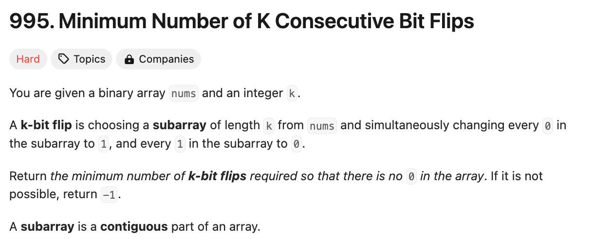
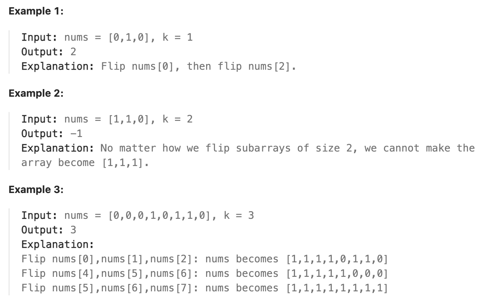

# 문제 설명
0과 1으로 구성되어 있는 하나의 배열이 주어진다. 이때, 한 번의 flip으로 연속된 K길이의 subarray의 값들을 0을 1로, 1을 0으로 바꿀 수 있다. 이때, 최소한의 flip으로 모든 0을 1로 바꾸는데 필요한 최소한의 flip 횟수를 구하라.



처음 문제를 보고, 이 문제는 재밌긴 한데 뭔가 어떻게 접근해야 할지 감이 안 잡혔다. 



무조건 K길이의 subarray를 뒤집어야 한다. 그리고, 뒤집어야 하는 subarray의 길이가 K 길이로 뒤집어서 해결이 안되면 -1을 반환하면 된다.

일단, 불가능한 조건들이 있을거다. 예를 들어, 배열의 길이가 3이라면, K가 2일 경우 절대로 정답이 나올 수 없다. 그리고, 이는 더 큰 경우들에서도 성립한다. 예를 들어, [0, 1, 1, 0, 1, 1, 0, 1, 0, 0]이라면, K가 7일 경우 불가능하다. 즉, 뭔가 홀수 짝수 관련해서 불필요한 계산을 줄일 수 있을 것 같다.

풀이 방법을 알것 같다. 어차피 K길이의 subarray를 뒤집어야 한다면, 그냥 처음부터 끝까지 연속된 값들을 가능한 왼쪽으로부터 1으로만들면 그만 아닌가? 예를 들어 아까의 예시를 풀어보면 [0, 1, 1, 0, 1, 1, 0, 1, 0, 0]이니, 왼쪽부터 무조건 1이 되게 하는거다. 그러면 다음과 같이 될거다.

```
[0, 1, 1, 0, 1, 1, 0, 1, 0, 0]
[1, 0, 0, 0, 1, 1, 0, 1, 0, 0]
[1, 1, 1, 1, 1, 1, 1, 1, 1, 0]
```

여기까지 이렇게 왔는데 안 풀리면 -1을 반환하면 될것 같다. 이제 이걸 코드로 구현해보자.

### 시도 1
한번 해보려고 했는데 생각보다 어려운것 같다. 개선사항을 찾아보자.

```python
def minKBitFlips(self, nums: List[int], k: int) -> int:
        def flipK(sub: List[int], k: int):
            for i in sub:
                if sub[i] == 0:
                    sub[i] = 1
                else:
                    sub[i] = 0
            return sub


        count = 0        
        for i in range(len(nums)-k+1):
            if nums[i] == 1:
                continue
            else:
                count += 1
                if (len(nums)-i >= k):
                    nums[i:i+k] = flipK(nums[i:i+k], k)
                else:
                    nums[i:len(nums)] = flipK(nums[i:len(nums)], k)
        print(nums)
        
        if sum(nums) == len(nums):
            return count
        else:
            return -1
```

- subK에 대해서 index를 잘못 사용하고 있다. Index 기반으로 사용해야 하는데, sub[i]를 사용하고 있다.
- flip을 할 때마다 불필요하게 새로운 subarray를 만들고 있다.
- 남은 값보다 K가 큰 경우에 대해서 대비를 하고 있지 않다.


### 시도 2
더 짧게 다듬어서 한번 순회하면서 통과가 되면 반환하도록 했다. 그러나 이번에는 시간초과가 발생했다.

- 일단 처음에 배열의 길이 n을 구한다.
- flip_count를 0으로 초기화한다.
- 배열을 순회하면서, 만약 0이라면 flip을 시작한다.
- flip을 시작하면, 만약 K길이가 남아있지 않다면 -1을 반환한다.
- K길이만큼 flip을 하고, flip_count를 1 증가시킨다.
- 모든 배열을 순회하고 나면 flip_count를 반환한다.

**시간 복잡도**
- 배열을 순회하는 데 O(N)이다.
- 각 서브배열을 뒤집는 작업은 최대 k개의 요소를 뒤집으므로, 각 요소는 최대 한 번씩만 뒤집힌다. 따라서 전체 뒤집기 작업은 O(N) 시간이 걸린다.
- 따라서 총 시간 복잡도는 O(N)이다.

```python
class Solution:
    def minKBitFlips(self, nums: List[int], k: int) -> int:
        n = len(nums)
        flip_count = 0

        for i in range(n):
            if nums[i] == 0: # we start flipping
                if i + k > n:
                    return -1 # not enough elements to flilp
                for j in range(i, i+k):
                    nums[j] = 1 - nums[j] # flip bits (1 to 0, 0 to 1)
                flip_count += 1
        
        return flip_count
```

## 풀이 및 해설
```python
class Solution:
    def minKBitFlips(self, nums: List[int], k: int) -> int:
        n = len(nums)
        flip_count = 0
        flips = [0] * n  # This array will track where flips start
        current_flips = 0  # To keep track of the number of flips affecting the current position

        for i in range(n):
            if i >= k:
                current_flips ^= flips[i - k]  # Remove the effect of the flip that is out of the window

            if nums[i] == current_flips % 2:  # If the current bit is 0 and needs flipping
                if i + k > n:
                    return -1  # Not enough elements to flip
                flips[i] = 1  # Mark the start of a new flip
                current_flips ^= 1  # Update the current flip status
                flip_count += 1  # Count this flip

        return flip_count
```
- 배열의 길이 n을 구한다.
- flip_count를 0으로 초기화한다.
- flips라는 배열을 만들어서 flip이 시작되는 지점을 표시한다.
- current_flips를 0으로 초기화한다. 이는 현재 위치에 영향을 주는 flip의 수를 나타낸다.
- 배열을 순회하면서, 만약 i가 k보다 크다면, flips[i-k]의 영향을 제거한다.
- 만약 nums[i]가 current_flips % 2와 같다면, 현재 비트가 0이고 뒤집어야 한다는 것이다.
- 만약 i + k가 n보다 크다면, -1을 반환한다.
- flips[i]를 1로 표시한다.
- current_flips를 1로 업데이트한다.
- flip_count를 1 증가시킨다.
- 모든 배열을 순회하고 나면 flip_count를 반환한다.

## Complexity Analysis


### 시간 복잡도
- 배열을 순회하는 데 O(N)이다.
- 뒤집기 작업을 효율적으로 추적하므로, 전체 시간 복잡도는 O(N)이다.

### 공간 복잡도
- O(N); 추가 공간은 flips 배열로, 배열의 길이에 비례한다.


## Constraint Analysis
```
Constraints:

1 <= nums.length <= 10^5
1 <= k <= nums.length
```

길이가 최대 10^5인 경우에도 O(N)이므로 충분히 풀 수 있다.

첫 풀이가 안된 이유로는 불필요한 k개 요소를 바로 뒤집어서 시간복잡도가 높아졌다. 반면에, 두번째 방법에서는 flips 배열을 사용해서 뒤집어야 하는 요소를 추적하고, 이를 통해 뒤집어야 하는 요소를 효율적으로 추적했다. XOR (^ operator)를 사용해야 하다보니 상당히 어려웠다.

# References
- [LeetCode](https://leetcode.com/problems/minimum-number-of-k-consecutive-bit-flips)
- [GeeksforGeeks - XOR](https://www.geeksforgeeks.org/python-bitwise-operators/#bitwise-xor-operator)
