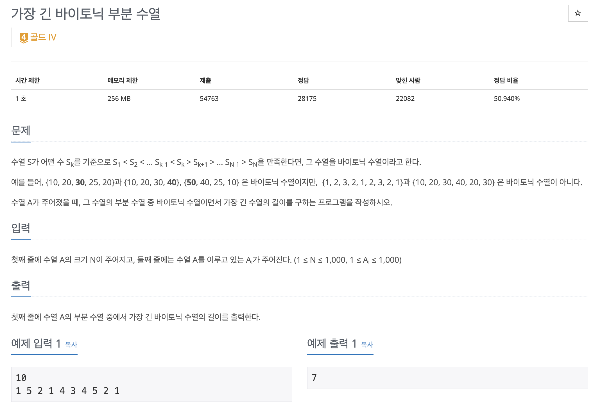
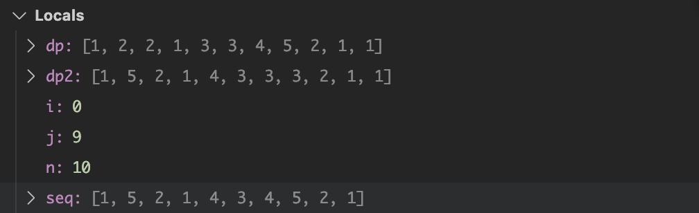
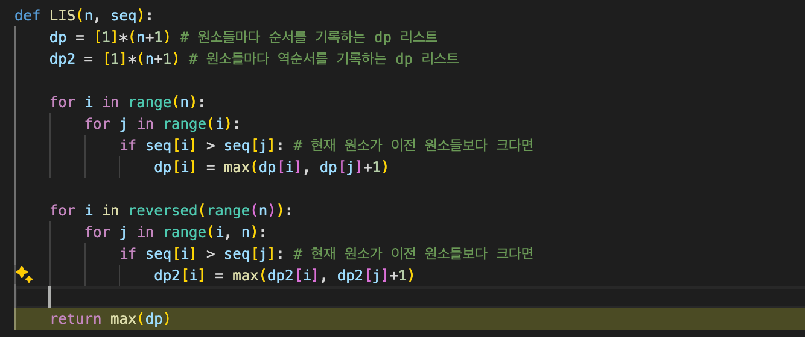
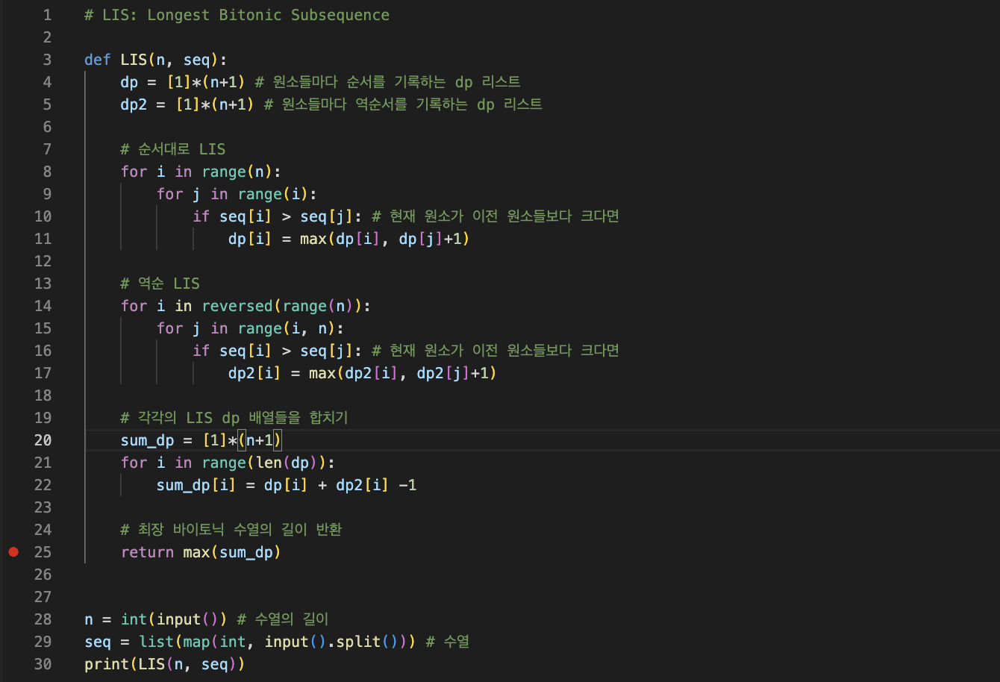
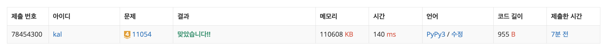

Longest Bitonic Subsequence는 LIS를 활용한 DP문제로, 주어진 배열에서 가장 긴 바이토닉 수열을 찾는 문제다.
---

이를 활용한 백준 11504 문제를 살펴보자.


수열 S가 어떤 수 Sk를 기준으로 S1 < S2 < ... Sk-1 < Sk > Sk+1 > ... SN-1 > SN을 만족한다면, 그 수열을 바이토닉 수열이라고 한다.

**쉽게 말해, 커졌다 작아지면 바이토닉 수열이다.**

예제의 경우 {1 5 2 1 4 3 4 5 2 1} 수열에서 가장 긴 바이토닉 부분 수열을 찾아야 하는데, 이때 {**1** 5 **2** 1 4 **3 4 5 2 1**} 가장 긴 바이토닉 부분 수열이다.

해당하지 않는 숫자들을 없애면 {1 2 3 4 5 2 1}이 된다.

---

### 첫인상
이 문제를 풀 때는 LIS 문제와 비슷한 방식으로 풀면 될 것 같다. 그러나, 가장 큰 숫자를 기준으로 나눠야 할지 고민이 되긴 한다.

따라서, 이 문제는 **DP**로 풀어야 한다.

일단은 앞뒤로 LIS를 하나씩 해봤다:



그런데 지금 보니까 굳이 두개를 할 필요가 있나? 그냥 가장 큰 숫자를 기준으로 그 다음에 얼마나 많은 작은 숫자들이 있는지 파악해도 되지 않나? 그런데 그걸 구현할 방법이 생각이 안나서 일단은 두개로 나눠서 풀어보자.

---

보니까 두개의 배열의 인덱스 값에 대해서 합이 가장 큰 경우가 가장 긴 바이토닉 수열이다. 그래서 두개의 배열을 만들어서 각각 LIS를 구하고, 그 두개의 합이 가장 큰 경우를 찾으면 될 것 같다.


## Solution
이 문제를 풀기 위해서 LIS를 앞뒤로 두개 사용했다.
1. n+1만큼의 dp 수열을 두개 만든다.
2. 앞으로 LIS를 구하는 dp를 구현한다.  
2-1. 첫번째 for loop은 현재 원소를 기준으로 이전 원소들을 비교한다.  
2-2. 두번째 for loop은 이전 원소들을 비교한다.  
2-3. 현재 원소가 이전 원소보다 크다면, dp[i] = max(dp[i], dp[j]+1)을 통해 dp[i]를 갱신한다. 즉, 이전의 원소들보다 더 크면 dp[i]를 갱신한다.
3. 뒤로 LIS를 구하는 dp를 구현한다.  
3-1. 첫번째 for loop은 reversed(range(n))로 반대로 순회한다.  
3-2. 두번째 for loop에서는 range(i, n)를 하여 i부터 마지막 값까지 비교한다.  
3-3. 현재 값이 이후 값보다 크다면, dp2[i] = max(dp2[i], dp2[j]+1)을 통해 dp2[i]를 갱신한다. 즉, 이후의 원소들보다 더 크면 dp2[i]를 갱신한다.
4. dp와 dp2들의 각각 원소들을 더한다.
5. 이 중 가장 큰 값을 반환한다.

```python
# LIS: Longest Bitonic Subsequence

def LIS(n, seq):
    dp = [1]*(n+1) # 원소들마다 순서를 기록하는 dp 리스트
    dp2 = [1]*(n+1) # 원소들마다 역순서를 기록하는 dp 리스트

    # 순서대로 LIS
    for i in range(n):
        for j in range(i):
            if seq[i] > seq[j]: # 현재 원소가 이전 원소들보다 크다면
                dp[i] = max(dp[i], dp[j]+1)
    
    # 역순 LIS
    for i in reversed(range(n)):
        for j in range(i, n):
            if seq[i] > seq[j]: # 현재 원소가 이전 원소들보다 크다면
                dp2[i] = max(dp2[i], dp2[j]+1)
    
    # 각각의 LIS dp 배열들을 합치기
    sum_dp = [1]*(n+1)
    for i in range(len(dp)):
        sum_dp[i] = dp[i] + dp2[i] -1
    
    # 최장 바이토닉 수열의 길이 반환
    return max(sum_dp)
            

n = int(input()) # 수열의 길이
seq = list(map(int, input().split())) # 수열
print(LIS(n, seq))

```





## Topics
- DP
- LIS
