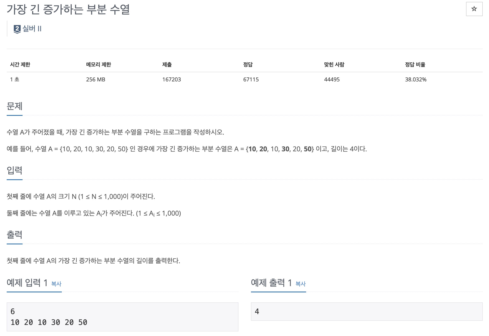
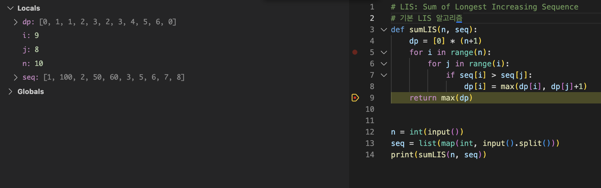
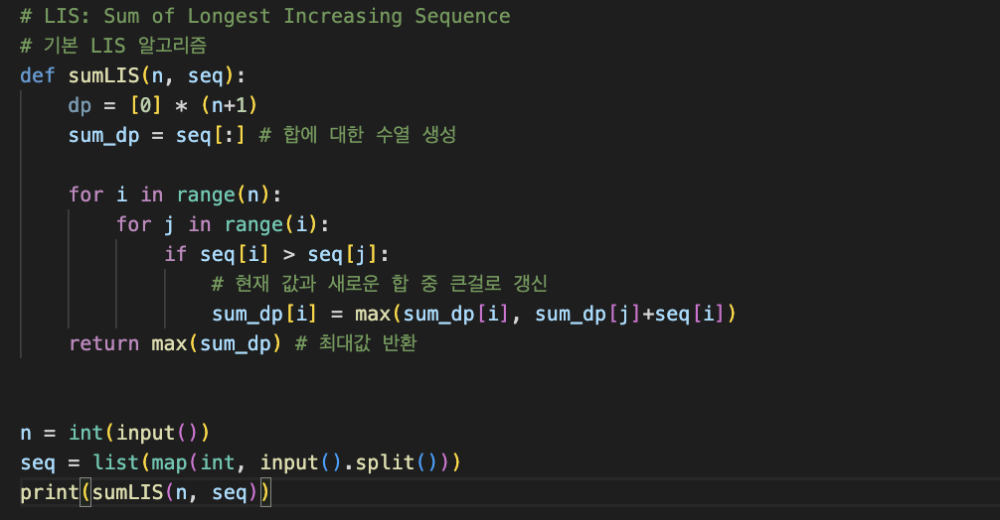
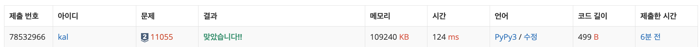

Largest Sum of Longest Increasing Subsequence는 DP LIS의 한 유형으로, 주어진 배열에서 증가하는 부분 수열의 합 중 **가장 큰 합**을 찾는 문제 유형이다.

---

예를 들어, 백준 11055 문제를 살펴보자.



긴 부분 수열들 중 합이 가장 큰 경우를 찾는 문제다. 이 문제를 풀기 위해서는 LIS를 활용해야 한다.

예를 들어, 수열 A = {1, 100, 2, 50, 60, 3, 5, 6, 7, 8} 인 경우에 합이 가장 큰 증가하는 부분 수열은 A = {**1**, 100, **2, 50, 60**, 3, 5, 6, 7, 8} 이고, 합은 113이다.

해당하지 않는 숫자들을 없애면 {1 2 50 60}이 된다. 즉, 1+2+50+60 = 113이다.

---

### 첫인상
이 문제를 풀 때는 LIS 문제와 비슷한 방식으로 풀면 될 것 같다. 그러나, 가장 큰 숫자를 기준으로 나눠야 할지 고민이 되긴 한다.

일단 기본적인 LIS를 구현하고 아이디어를 생각해봤다.



---

아이디어 1:  
이때, 하나씩 증가할때마다 애초에 max값보다 크면 max값을 갱신하고, 그렇지 않다면 그냥 넘어가는 방식으로 구현하면 되지 않을까 생각했다.

아이디어 2:  
sum_dp 배열을 하나 더 구축해서, 그 시점에 나올 수 있는 가장 큰 합을 계산하여, 마지막에 그 중 가장 큰 값을 반환하면 되지 않을까 생각했다.


---

## Solution
이 문제를 풀기 위해서 for loop을 두개 사용했다.
1. n+1만큼의 dp 수열을 만든다.
2. sum_dp 수열을 주어진 수열으로 초기 설정한다. ([:])
3. 첫번째 for loop은 현재 원소를 기준으로 이전 원소들을 비교한다.
4. 두번째 for loop은 이전 원소들을 비교한다.
5. 현재 원소가 이전 원소보다 크다면, sum_dp[i] = max(sum_dp[i], sum_dp[j]+seq[i])을 통해 sum_dp[i]를 갱신한다. 즉, 이전의 원소들보다 더 크면 sum_dp[i]를 갱신한다.
6. sum_dp의 최대값을 반환한다.

```python
# LIS: Sum of Longest Increasing Sequence
# 기본 LIS 알고리즘
def sumLIS(n, seq):
    dp = [0] * (n+1)
    sum_dp = seq[:] # 합에 대한 수열 생성
    
    for i in range(n):
        for j in range(i):
            if seq[i] > seq[j]:
                # 현재 값과 새로운 합 중 큰걸로 갱신
                sum_dp[i] = max(sum_dp[i], sum_dp[j]+seq[i]) 
    return max(sum_dp) # 최대값 반환
    

n = int(input())
seq = list(map(int, input().split()))
print(sumLIS(n, seq))

```




## Topics
- DP
- LIS
