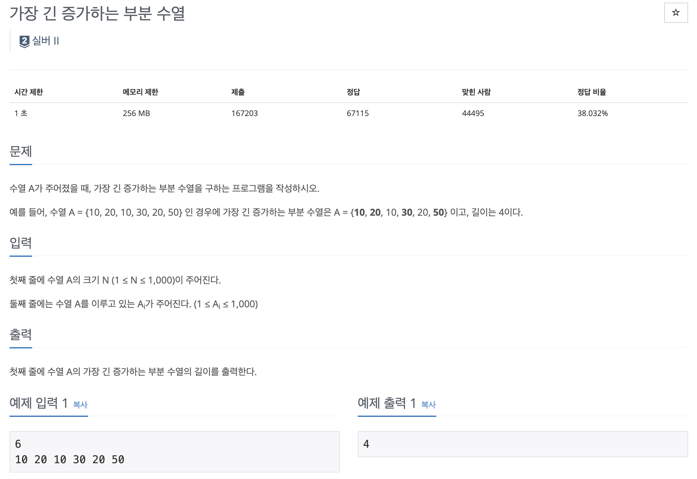

Longest Increasing Subsequence는 DP의 한 유형으로, 주어진 배열에서 **가장 긴 증가하는 부분 수열**을 찾는 문제 유형이다.

---

예를 들어, 백준 11503 문제를 살펴보자.



수열 A = {10, 20, 10, 30, 20, 50} 인 경우에 가장 긴 증가하는 부분 수열은 A = {**10**, **20**, 10, **30**, 20, **50**} 이고, 길이는 4다.

---

처음 이 문제를 봤을때는 일반 정렬 문제랑 무슨 차이인지 잘 이해를 못했다. 하지만, 이 문제는 **순서를 유지**해야 한다는 점이 중요하다.

따라서, 이 문제는 **DP**로 풀어야 한다.

한 눈에 봤을때는 마지막 숫자를 계속 유지하면서 다음 숫자보다 클 경우 바꾸는 형식으로 풀면 될 것 같다.

특히 처음에 이해하는데 다음 자료가 도움이 되었다:
<a href="https://velog.io/@doorbals_512/%EC%95%8C%EA%B3%A0%EB%A6%AC%EC%A6%98-LIS-%EC%95%8C%EA%B3%A0%EB%A6%AC%EC%A6%98%EC%9D%B8%EB%8D%B0-DP%EB%A5%BC-%EC%9D%B4%EC%9A%A9%ED%95%9C" title="LIS">[알고리즘] LIS 알고리즘인데 DP를 이용한</a>


---

## Solution
이 문제를 풀기 위해서 for loop을 두개 사용했다.
1. n+1만큼의 dp 수열을 만든다.
2. 첫번째 for loop은 현재 원소를 기준으로 이전 원소들을 비교한다.
3. 두번째 for loop은 이전 원소들을 비교한다.
4. 현재 원소가 이전 원소보다 크다면, dp[i] = max(dp[i], dp[j]+1)을 통해 dp[i]를 갱신한다. 즉, 이전의 원소들보다 더 크면 dp[i]를 갱신한다.
5. 마지막으로 dp 리스트에서 가장 큰 값을 반환한다.

```python
#LIS: Longest Increasing Subsequence

def LIS(n, seq):
    dp = [1]*(n+1) # 원소들마다의 순서를 기록하는 dp 리스트
    for i in range(n):
        for j in range(i):
            if seq[i] > seq[j]: # 현재 원소가 이전 원소보다 크다면
                dp[i] = max(dp[i], dp[j]+1)
    return max(dp)


n = int(input()) # 수열의 길이
seq = list(map(int, input().split())) # 수열
print(LIS(n, seq))

```


## Topics
- DP
- LIS
