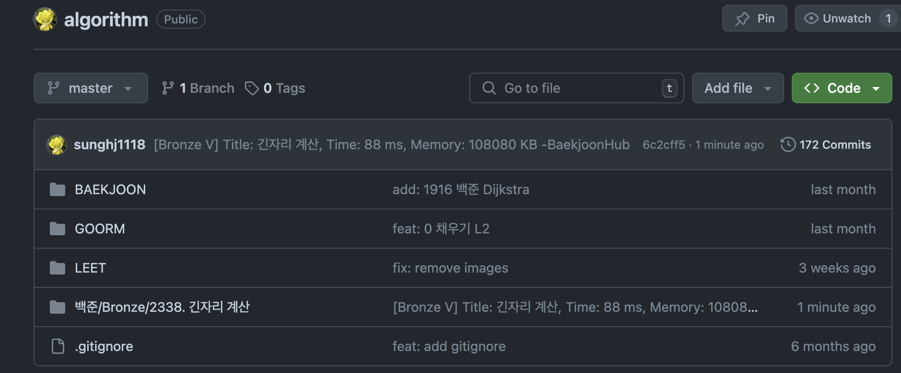
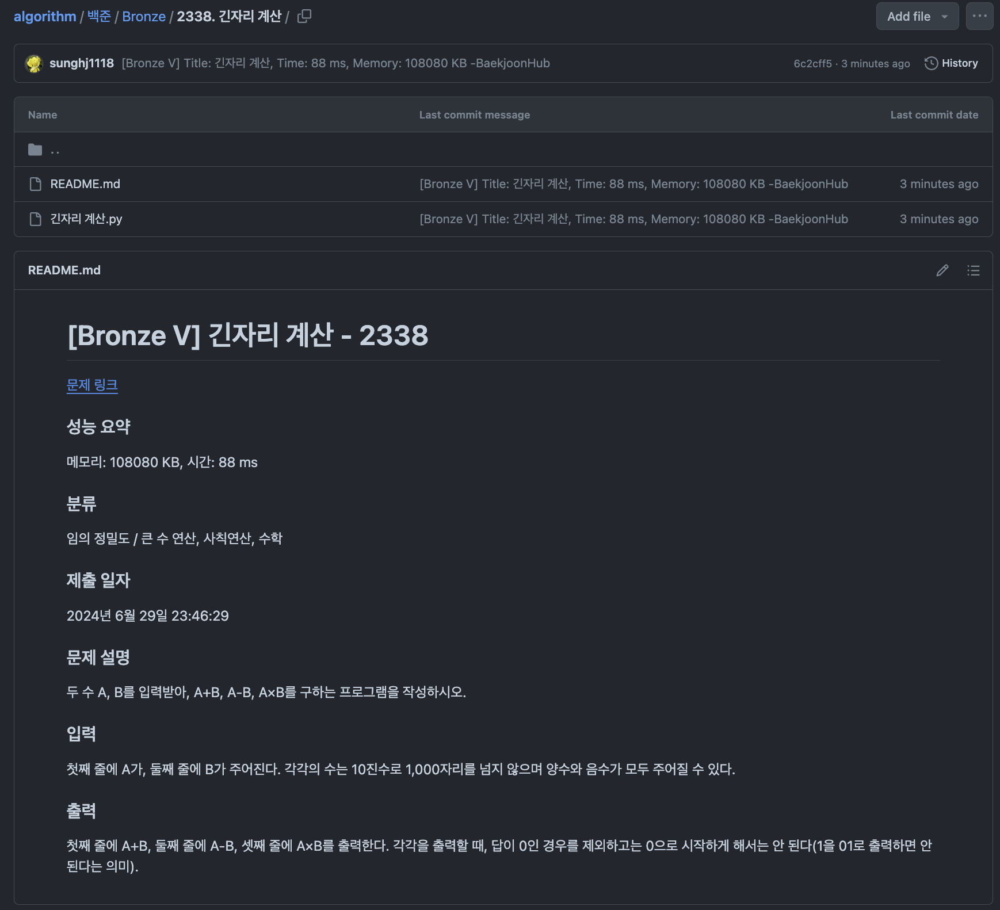

# 깃허브 연동
지금까지는 계속 문제를 리트코드에서 풀고, 풀때마다 문제에 대한 회고 글을 정리해서 올렸습니다. 이게 도움이 되긴 했으나, 오히려 회고하느라 문제를 푸는 시간이 많이 줄어들었다고 생각했습니다. 이 때문에, 리트코드에서도 문제를 풀되, 백준에서는 쉬운 문제들을 위주로 많이 풀어보면서 정리는 안하려고 합니다. 그럼에도 불구하고 백준에서 또한 문제를 풀때마다 해당 작업에 대한 기록이 있다면 좋을 것 같아서, 이를 자동화시켜보기로 했습니다.

# 자동화
- [올리비아님의 블로그](https://oliviakim.tistory.com/34)를 참고하여 자동화를 시도해보았습니다.

해당 블로그에서 Baekjoonhub를 연동해서 사용해보기로 했습니다.

아래와 같이 무사히 잘 작동하는 것을 확인할 수 있었습니다.

매우 마음에 든다.