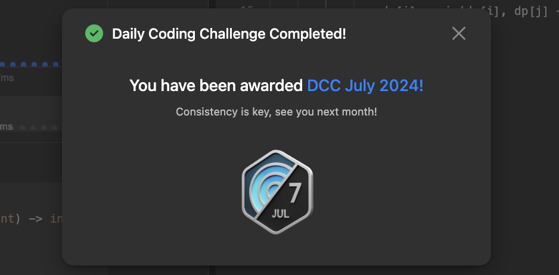

어느덧 알고리즘을 매일 풀기 시작한지 40일 정도가 되었다. 아직도 많이 부족하다. 그래도 처음에 브론즈5 문제를 봐도 어떻게 풀어야 할지는 알것 같은데 기본적인 문법이나 구현능력이 생각이 안나서 못 풀었을 때보다는 많이 늘었다. 

현 상황에서는 배열은 어느 정도 평범한 문제는 자신감이 붙었고, 아직 더 연습해야 하는 부분은 Hash/Dictionary이며, 본격적인 알고리즘을 외워서 응용하는 문제들도 아직 연습이 더 필요하다. DP의 경우에도 여전히 연습이 더 필요하지만 조금씩 늘고 있다는게 실감나서 꾸준히 푸는 데에 즐거움과 만족감을 느끼고 있다.

