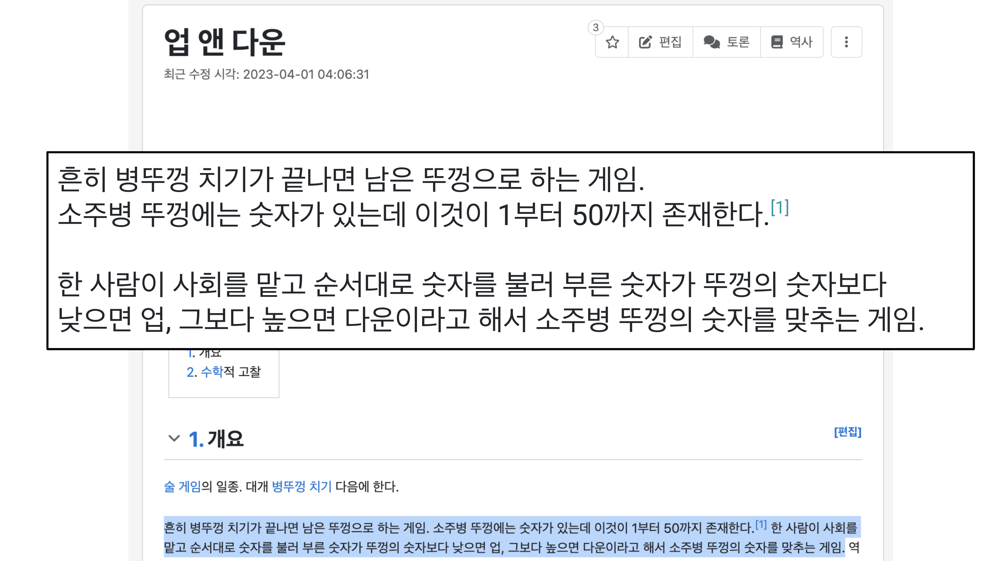

업다운 게임을 해본 적이 있나요?

업다운 게임은 술게임 중 하나로, 병뚜껑을 사용하는 게임입니다.  
규칙은 다음과 같습니다.





대학생이라면 한번쯤은 들어보거나 해봤을 이 게임은 이진 탐색과 매우 유사합니다.  
이진 탐색은 원하는 값을 찾기 위해 중간값을 찾아가는 과정을 반복하는 알고리즘입니다.


이 알고리즘은 다음과 같은 과정을 거칩니다.

1. 중간값을 찾는다.
2. 중간값이 찾고자 하는 값과 같다면 종료한다.
3. 중간값이 찾고자 하는 값보다 크다면, 중간값보다 작은 범위에서 다시 중간값을 찾는다.

즉, 이진 탐색은 업다운 게임과 같다고 볼 수 있습니다.

# 이진 탐색의 장점

1. 시간 복잡도가 O(log N)이다.
    - 이는 매우 효율적인 알고리즘으로, 데이터의 크기가 증가해도 검색 시간이 크게 늘어나지 않습니다.
    - 예를 들어, 1,000,000개의 항목을 검색할 때 최대 20번의 비교만으로 원하는 항목을 찾을 수 있습니다.

2. 대규모 데이터셋에서 특히 유용하다.
    - 데이터의 양이 많을수록 선형 검색과 비교해 이진 탐색의 효율성이 두드러집니다.
3. 메모리 사용이 효율적이다.
    - 추가적인 자료구조를 필요로 하지 않아 메모리 사용이 최소화됩니다.
4. 구현이 비교적 간단하다.
    - 재귀적 또는 반복적 방법으로 쉽게 구현할 수 있습니다.


# 이진 탐색의 단점

1. 정렬된 배열에서만 사용할 수 있다.
    - 정렬되지 않은 데이터에 대해서는 먼저 정렬 과정이 필요하며, 이는 추가적인 시간과 공간을 요구합니다.
2. 동적 데이터셋에는 비효율적일 수 있다.
    - 데이터가 자주 삽입되거나 삭제되는 경우, 배열을 계속 정렬된 상태로 유지하는 것이 어려울 수 있습니다.
3. 랜덤 접근이 가능한 자료구조에서만 효과적이다.
    - 연결 리스트와 같은 순차적 접근 자료구조에서는 이진 탐색을 효과적으로 사용할 수 없습니다.
4. 중간 값을 계산할 때 오버플로우가 발생할 수 있다.
    - 매우 큰 배열에서 (low + high) / 2를 계산할 때 정수 오버플로우가 발생할 수 있으므로 주의가 필요합니다.

이진 탐색은 많은 장점을 가지고 있지만, 적용할 수 있는 상황이 제한적이라는 점을 고려해야 합니다. 따라서 문제의 특성과 데이터의 구조를 잘 파악하여 적절히 사용하는 것이 중요합니다.

# 결론
linear search와 binary search는 각각 O(N)과 O(logN)의 시간 복잡도를 가지고 있습니다. 찾아야 하는 데이터가 엄청나게 많다면, 이 차이가 크게 나타날 것입니다. 따라서, 이진 탐색을 사용하여 데이터를 찾는 것이 더욱 효율적일 것이지만, 문제의 특성과 데이터의 구조를 잘 파악하여 적절히 사용하는 것이 중요합니다.

# 기본적인 파이썬 구현
```python
def binary_search(arr, target):
    low, high = 0, len(arr) - 1

    while low <= high:
        mid = (low + high) // 2

        if arr[mid] == target:
            return mid
        elif arr[mid] < target:
            low = mid + 1
        else:
            high = mid - 1

    return -1
```

# References
- [[코들리] 알고리즘 - 이진검색](https://youtu.be/IfIuG95RH0o?t=75)
- [How Binary Search Makes Computers Much, Much Faster](https://youtu.be/KXJSjte_OAI)