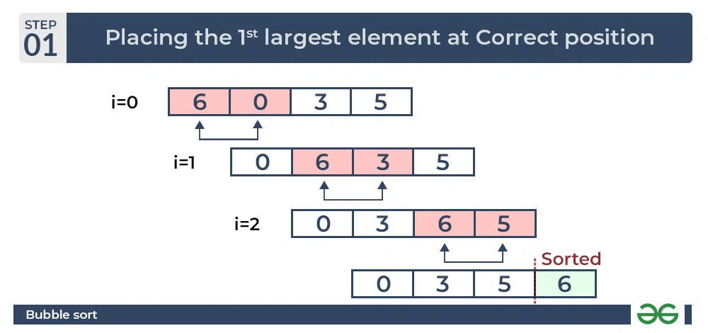
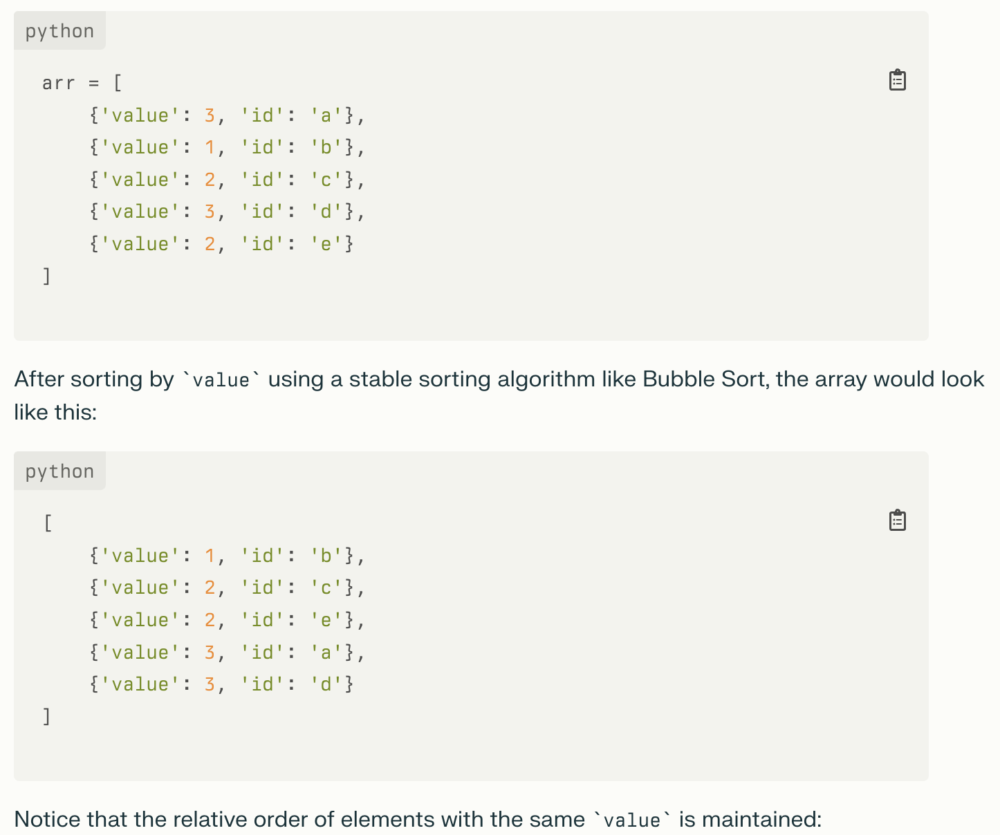

# Bubble Sort
Works by repeatedly swapping the adjacent elements if they are in wrong order.

## Algorithm
1. Start from the first element, compare the current element with the next element of the array.
2. If the current element is greater than the next element of the array, swap them.
3. If the current element is less than the next element, move to the next element.
4. Repeat step 1.

### Python Implementation
```python
def bubble_sort(arr):
    n = len(arr)
    for i in range(n):
        for j in range(0, n-i-1):
            if arr[j] > arr[j+1]:
                arr[j], arr[j+1] = arr[j+1], arr[j]
    return arr
```



## Complexity
- Time Complexity: O(n^2)
- Space Complexity: O(1)

## Disadvantages - Why it sucks
- It is not suitable for large datasets as its average and worst-case complexity are of O(n^2) where n is the number of items.
- It is a comparison-based algorithm, which might limit its performance for large datasets. This is because it uses nested loops to iterate over the array, which can be slow for large datasets.

## Advantages - Why we still learn it
- Easy to understand and implement
- Stable. It does not change the relative order of elements with equal keys.
- Can be very efficient when
    -  The input is almost sorted, as it takes O(n) time in the best case.
    - Small datasets, as it has a low memory overhead.
- Understanding why it is inefficient can help you understand the importance of other sorting algorithms.

**Stable visualization:**


# References
- [GeeksforGeeks - Bubble Sort](https://www.geeksforgeeks.org/bubble-sort-algorithm/)
