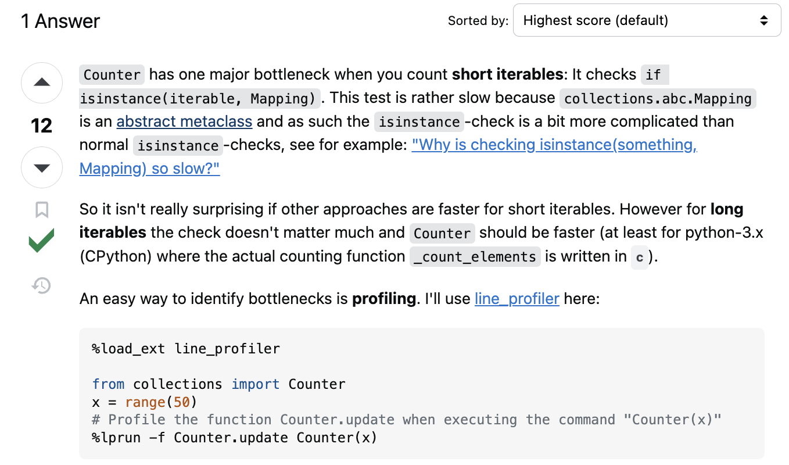

# Dictionary가 Counter보다 빠르고 효율적인가?

Counter은 파이썬 dictionary의 subclass로, 더 많은 기능을 제공한다. 그러나, 이를 불러서 사용하게 되는 경우에 불필요한 오버헤드가 발생할 수 있다. Dictionary를 직접 구현해서 사용하는 경우에는 오버헤드가 더 적게 조절할 수 있다.

# Flexibility

Counter는 Dictionary보다 더 제한적인 경우에 쓰인다. Counter는 빈도를 찾는 경우에 대해서만 만들어졌기 때문에, 그 외의 경우에는 dictionary가 더 유연하게 대처하기 좋다.

# Counter's Bottleneck
작은 수의 iterable을 세는 경우에 Counter가 상당히 느려지는 경우가 존재한다. `isinstance(iterable, Mapping)` 테스트를 하기 때문이다. `collections.abc.Mapping`은 [abstract metaclass](https://docs.python.org/3/library/abc.html)이기 때문에 일반 클래스보다 isinstance가 상당히 느려진다.

그러나, Iterable가 길어지는 경우에는 이런 차이가 크지 않다고 한다.

# Summary
    Counter might be slower than a dictionary for small datasets due to initial overhead. However, for large datasets, Counter is likely to be as fast or even faster than a manual dictionary implementation, especially in Python 3.x, due to its optimized C implementation.

1. For small iterables:  

- Counter might be slower due to the overhead of checking if the input is an instance of Mapping.
- This `isinstance` check is relatively expensive for small datasets.
- In these cases, a simple dictionary approach could be faster.

2. For large iterables:

- The initial overhead of the isinstance check becomes negligible.
- Counter's internal implementation (especially in Python 3.x with CPython) is highly optimized.
- The _count_elements function in C provides significant performance benefits for large datasets.

## Sources
- [Python's Counter: The Pythonic Way to Count Objects](https://realpython.com/python-counter/)
- [What’s the difference between a Python dictionary and a Python Counter?](https://discuss.codecademy.com/t/whats-the-difference-between-a-python-dictionary-and-a-python-counter/379548)
- [Why does a dictionary count in some cases faster than collections.Counter?
](https://stackoverflow.com/questions/43956930/why-does-a-dictionary-count-in-some-cases-faster-than-collections-counter)