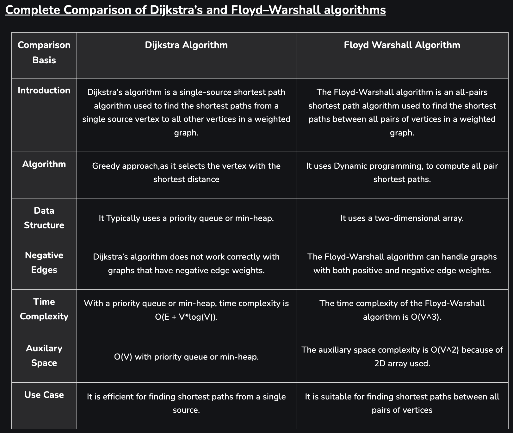

# 플로이드-워셜 알고리즘과 다익스트라 알고리즘

## 플로이드-워셜 알고리즘

- 모든 정점에서 모든 정점으로의 최단 경로를 구하는 알고리즘
- 음수 가중치를 가진 간선이 있어도 사용 가능
- DP 알고리즘의 일종. 모든 정점을 거쳐가는 경우를 고려
- 3중 반복문을 사용하여 구현
- 시간 복잡도: $O(V^3)$

## 다익스트라 알고리즘

- 하나의 정점에서 다른 모든 정점으로의 최단 경로를 구하는 알고리즘
- 음수 가중치를 가진 간선이 있으면 사용 불가
- 그리디 알고리즘의 일종. 매 단계에서 가장 가까운 정점을 선택
- 우선순위 큐 또는 minheap을 사용하여 구현
- 시간 복잡도: $O(V^2)$

## 비교

- 플로이드-워셜 알고리즘은 모든 정점에서 모든 정점으로의 최단 경로를 구하는 경우 사용
- 다익스트라 알고리즘은 하나의 정점에서 다른 모든 정점으로의 최단 경로를 구하는 경우 사용
- 플로이드-워셜 알고리즘은 음수 가중치를 가진 간선이 있어도 사용 가능
- 다익스트라 알고리즘은 음수 가중치를 가진 간선이 있으면 사용 불가

# Complexity Analysis

## 시간 복잡도

- 플로이드-워셜 알고리즘: $O(V^3)$
- 다익스트라 알고리즘: $O(V^2)$

## 공간 복잡도

- 플로이드-워셜 알고리즘: $O(V^2)$
- 다익스트라 알고리즘: $O(V)$

# References

- [플로이드-워셜 알고리즘](https://en.wikipedia.org/wiki/Floyd%E2%80%93Warshall_algorithm)
- [다익스트라 알고리즘](https://en.wikipedia.org/wiki/Dijkstra%27s_algorithm)
- [플로이드-워셜 알고리즘 vs 다익스트라 알고리즘](https://www.geeksforgeeks.org/comparison-dijkstras-floyd-warshall-algorithms/)
