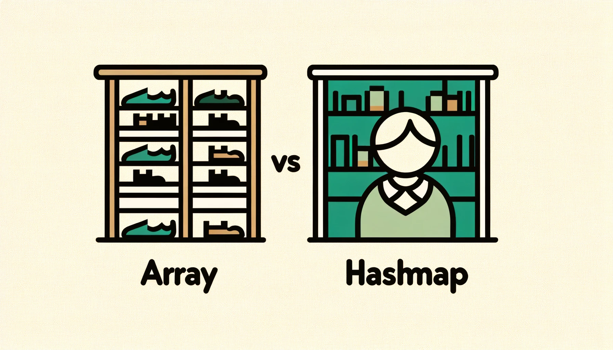

# Hashmap
해시맵이 뭘까? 해시맵은 키-값 쌍을 저장하는 자료구조로, 키를 해시 함수를 통해 인덱스로 변환하여 값을 저장한다. 해시맵은 다양한 언어에서 지원되며, 파이썬에서는 딕셔너리로 구현되어 있다.

그런데 이렇게 말하면 좀 뭔 소리인지 바로 안 와닿을 가능성이 크다. 조금 더 이해하기 쉽게 설명해보자.

배열과 비교해서 한번 살펴보자. 배열은 신발장과도 같다. 신발장에 신발을 넣어두면, 나중에 그 신발을 찾을 때 어떤 신발이 어디에 있는지 알 수 있다. 이 신발장을 배열로 비유하면, 신발장의 번호가 인덱스이고, 신발이 값이다.

하지만, 신발장에 신발을 넣을 때, 신발장의 번호를 잘 기억해두지 않으면, 나중에 신발을 찾을 때 어려움이 생긴다. 이때, 해시맵이 등장한다. 해시맵은 신발장의 번호를 잘 기억해두는 역할을 한다. 신발장의 번호를 잘 기억해두면, 나중에 신발을 찾을 때 빠르게 찾을 수 있다.

따라서, 해시맵은 도서관에 사서 같은 역할을 한다. 도서관에 책을 넣을 때, 책의 위치를 잘 기억해두면, 나중에 책을 찾을 때 빠르게 찾을 수 있다. 이렇게 해시맵은 키-값 쌍을 저장하는 자료구조로, 키를 해시 함수를 통해 인덱스로 변환하여 값을 저장한다.

## 해시맵의 특징

해시맵은 다음과 같은 특징을 가진다.

- 키-값 쌍을 저장하는 자료구조
- 키를 해시 함수를 통해 인덱스로 변환하여 값을 저장
- 키는 중복될 수 없음
- 값은 중복될 수 있음
- 키를 통해 값을 빠르게 찾을 수 있음

따라서 대표적인 함수로는 다음과 같은 함수가 있다.
- `set(key, value)`: 키-값 쌍을 추가. O(1)
- `get(key)`: 키를 통해 값을 찾음. O(1)
- `remove(key)`: 키를 통해 값을 삭제. O(1)

최악의 경우, 같은 해시값을 가지는 모든 키가 같은 버킷에 저장되어 있을 때, 해시맵의 시간복잡도는 O(N)이 된다. 하지만, 이 경우는 매우 드물다. 일반적으로 해시맵의 시간복잡도는 O(1)이다.

### 참고문헌:

- [Hash Map in Python](https://www.geeksforgeeks.org/hash-map-in-python/)