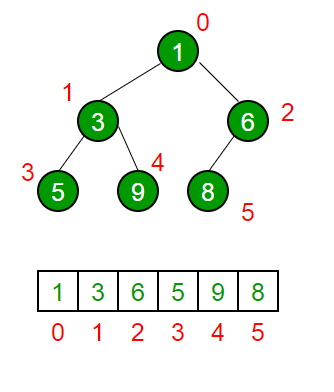

# Heap
A Heap is a complete binary tree data structure that satisfies the heap property: for every node, the value of its children is less than or equal to its own value. Heaps are usually used to implement priority queues, where the smallest (or largest) element is always at the root of the tree.

## Types of Heaps
There are two main types of heaps:

**Max Heap**: The root node contains the maximum value, and the values decrease as you move down the tree.  
**Min Heap**: The root node contains the minimum value, and the values increase as you move down the tree.

## Heap Operations
Common heap operations are:

**Insert:** Adds a new element to the heap while maintaining the heap property.  
**Extract Max/Min:** Removes the maximum or minimum element from the heap and returns it.  
**Heapify:** Converts an arbitrary binary tree into a heap.  

## Python Implementation
Heapify occurs in linear time, and the heapq module in Python provides a heap queue algorithm. It transforms a list into a heap in-place.  

When we say that heapq.heapify(x) transforms a list x into a heap "in-place," it means that the transformation is done directly on the original list x without creating a new list or using significant additional memory.

## Common Uses
Heaps are commonly used in the following scenarios:
- Priority Queues
- Dijkstra's Shortest Path Algorithm

# References
- [Python Docs - Heap Queue](https://docs.python.org/3/library/heapq.html)
- [GeeksforGeeks - Heap](https://www.geeksforgeeks.org/heap-data-structure/)
