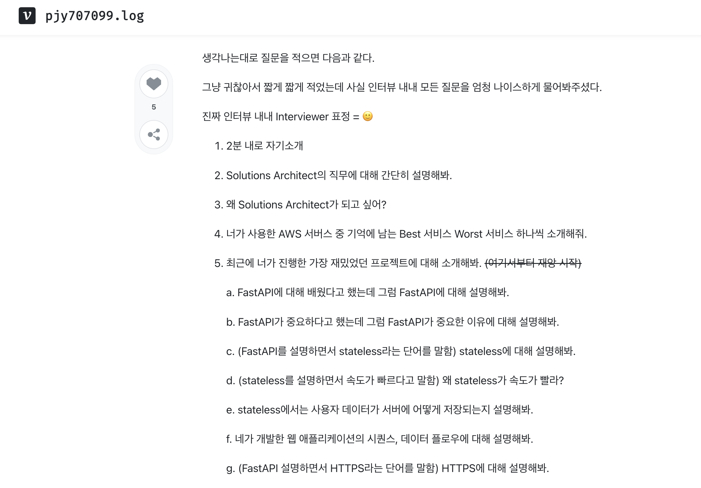

# 안내

어제 아침 8시쯤에 아마존의 Online Assessment에서 Job Simulation와 Culture Fit 관련된 객관식 시험을 두개 봤다. 다 보고 나서는 합격 또는 불합격 문자가 두달 뒤에 와서 phone interview를 잡는다고 했는데, 갑자기 12시간도 안 지나서 갑자기 일정 조율 메일이 왔다. 

한편으로는 1주일 내내 준비하고 있던 시험들을 합격해서 너무 기분이 좋았지만 그것도 잠시, phone interview를 준비해야 한다는 생각에 급급했다.

# Phone Interview 절차

아마존은 아마존 chime이라는걸 써서 면접을 진행한다고 한다. 가능한 선호 시간대를 1~5순위까지 적어서 다음과 같이 보내달라고 한다.

그러나 어제 엄청 고민이 된 부분이 이런 시간대에 대한 내용이다. 흰 부분의 일정들만 가능해서 당장 다음주 또는 10월 내로 봐야 하는데, 21~25일은 중간고사 기간이며, 10/4는 퀴즈 날이다. 그러면 수업이 없는 날 위주로 최대한 해봐야 할 때, 10/7(월), 10/11(금), 그리고 10/14(월)이 가능한데, 이 중에서 10/7(월)이 가장 좋을 것 같다. 월요일에는 수업이 한 시간 밖에 없을 뿐더러, 주말동안 집중해서 준비할 수 있을 것 같다.

# 준비할 것
찾아보니까 1시간 동안 휘몰아치는 꼬리에 꼬리를 무는 질문들을 한다고 한다. 예시로는 다음 [감자돌돌님의 블로그](https://velog.io/@pjy707099/AWS-Solutions-Architect-%EC%9D%B8%ED%84%B4-%EC%A7%80%EC%9B%90-%ED%9B%84%EA%B8%B0)가 있다. 1시간 동안 외국인 면접관과 영어로 기술적인 내용 위주로 면접을 본다고 한다. 심지어, 내용이 상당히 방대해서 네트워킹만 준비하면 될것 뿐만 아니라, OS, DB, 보안, 기술 스택에 대한 디테일 등 다양하게 준비해야 될것 같아서 걱정이다. 마치 4년에 걸쳐 배운 모든 CS 기초 지식을 다 물어보는 것 같다. 하나씩 일단 해보기로 했다.

