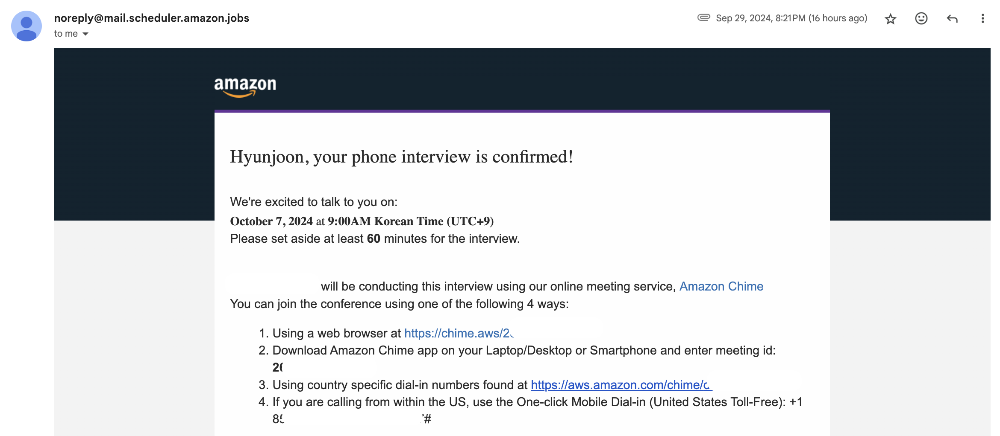
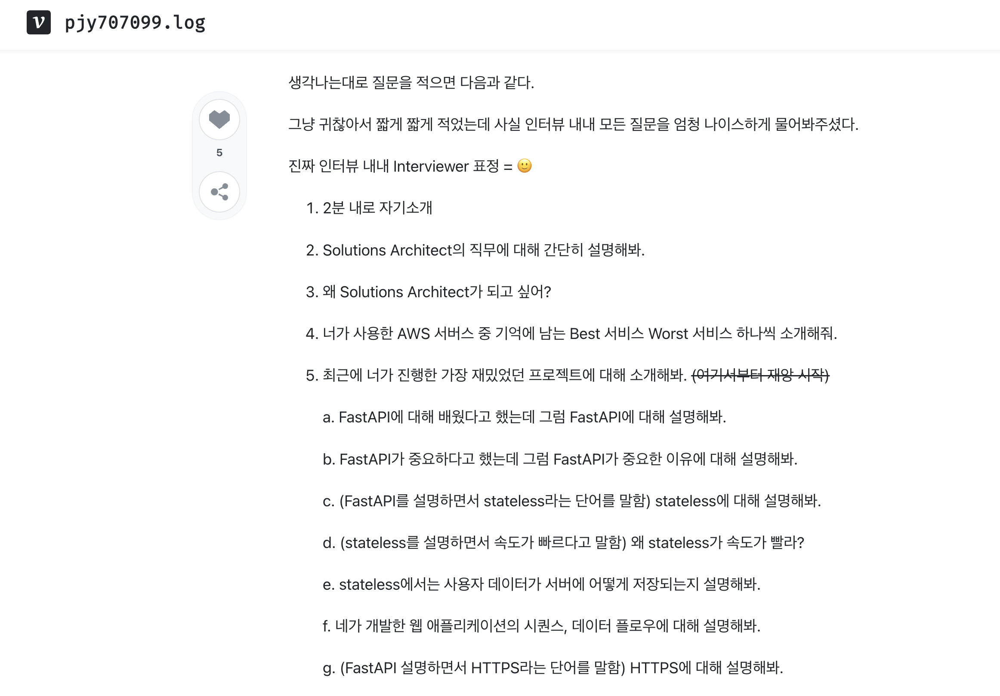

## 일정 확정 <!-- omit from toc --> 

일단 1순위 후보로 시간이 배정되었다. 이제부터 열심히 준비만 하면 된다.

# 예상 질문 <!-- omit from toc --> 

**Table of Contents**
- [1. 2분 내로 자기소개](#1-2분-내로-자기소개)
- [2. Cloud Support에 대해 간단히 설명해보세요.](#2-cloud-support에-대해-간단히-설명해보세요)
- [3. 왜 Cloud Support Intern에 지원하셨나요?](#3-왜-cloud-support-intern에-지원하셨나요)
- [4. 사용한 AWS 서비스 중 가장 좋았던 서비스와 가장 싫었던 서비스 하나씩 소개해주세요.](#4-사용한-aws-서비스-중-가장-좋았던-서비스와-가장-싫었던-서비스-하나씩-소개해주세요)

---

### 1. 2분 내로 자기소개
안녕하세요, 함께 성장하고 함께 배워서 선한 영향력을 행사하는 것을 목표로 두고 있는 성현준입니다. 저는 새로운 도전에 있어서 언제나 적극적인 자세를 유지하려고 노력하고, 이를 통해 언제나 전에는 몰랐던 것들을 배우고 이후 이를 통해 습득한 지식과 기술으로 남들에게 이로운 방향으로 도움이 되는것을 좋아합니다. 

혼자서보다는 여럿이서 함께하면 보다 나은 결과와 혼자서는 비로소 닿을 수 없던 경지에 오를 수 있다고 믿는 편입니다. 이를 실천하기 위해 좋은 기회가 있다면 언제나 제 주변 사람들과 공유하려고 하며 가능하면 공통의 목표를 위해 같이 노력하려고 합니다. 이를 대변하는 최근 활동으로는 지난 2년 동안 스터디를 언제나 꾸준히 개설하고 인원들을 모집하여 다양한 분야의 카프카, 도커, gRPC 등의 다양한 기술 스택들을 함께 공부했습니다.

이에 그치지 않고, 저는 언제나 배운 내용을 기록 및 응용을 하려고 노력합니다. 이론 뿐인 학습은 오래 기억에 남지 않기 때문에 다양한 프로젝트들에 이런 기술을 응용하면서 필요에 맞게 기술들을 더 공부하곤 했습니다. 대표적으로는 gRPC를 응용한 '시각장애인을 위한 캔 분류 앱 iCANSee'와 카프카를 활용한 '실시간 명장면 생성 파이프라인 Highlighter'이 있습니다.

### 2. Cloud Support에 대해 간단히 설명해보세요.
AWS를 사용하고 있는 고객들에게 기술적인 지원을 하는걸로 알고 있습니다. 네트워크, OS, 애플리케이션, 빅데이터 등의 다양한 도메인에 대하여 트러블슈팅을 하며, 고객들에게 간단한 셋업부터 더욱 복잡한 문제들을 해결하는 것까지 도움을 주는 것으로 알고 있습니다. 즉, 기술 지원 및 유관 부서 커뮤니케이션이 핵심 기능입니다. 

### 3. 왜 Cloud Support Intern에 지원하셨나요?
제가 알기로는 Cloud Support에서 일하게 되면 하루에도 정말 다양하고 많은 문제를 접하게 된다고 알고 있습니다. 다른 곳에서는 겪을 수 없는 다양한 기술문제 스팩트럼을 접하고 해결해보면서 그 어떤 자리보다 성장할 기회가 주어진다는게 가장 매력적으로 다가왔습니다. 이렇게 전문가가 되고 싶어하는 저의 목표에 도달할 수 있게 해주는 최고의 기회라고 생각합니다. 이뿐만 아니라, 저는 결과적으로 제가 하는 일이 사람을 위한 일이었으면 좋겠습니다. 제가 열심히 공부하고 겪은 시행착오와 지식을 바탕으로 누군가에게 도움을 줄 수 있다는 일은 정말 행복하고 저에게는 중요한 가치입니다. 저의 이런 가치를 충족해주며 시너지가 매우 좋다고 판단하여 Cloud Support Intern으로 지원하게 되었습니다.

### 4. 사용한 AWS 서비스 중 가장 좋았던 서비스와 가장 싫었던 서비스 하나씩 소개해주세요.
제가 사용해본 AWS 서비스들으로는 Amplify, EC2, Elastic Beanstalk이 있습니다. 가장 좋았던 서비스는 EC2이며, 가장 싫었던 서비스는 Elastic Beanstalk입니다.

EC2는 언제나 Setup하는 방법도 매우 간편하고 인스턴스를 생성하고 사용하는데 있어서 매우 편리하다고 생각합니다. 필요에 맞게 인스턴스를 생성하고 설정하고 사용하는 것이 용이해서 프로젝트를 진행하면서 유용하게 사용한 경험이 많습니다.

반면에, 가장 최근에 접하고 싫었던 서비스는 Elastic Beanstalk입니다. 프로젝트를 진행하면서 Spring로 구성된 서비스를 jar파일으로 빌드하여 Elastic Beanstalk에 배포했었는데, 이 과정에서 많은 문제들을 겪었습니다. 배포 과정에서는 문제가 많이 생기지는 않았으나, VPC를 설정하는 과정에서 Private Subnet과 Public Subnet을 분리하면서 오류를 많이 겪었습니다. 최근까지만 해도 해당 개념에 대해서 잘 알고 있지 않아서 유저 정보가 담겨있는 인스턴스의 네트워크 설정은 Private VPC에서만 통하게 하려 했으며, 실제 요청이나 정보가 입력이 되어야 할때는 무조건 Load Balancer를 통해서 Public VPC로 요청을 보내는 방식으로 설정을 해야 했습니다. 그러나, 이때 NAT Gateway를 사용하면 너무 많은 요금이 발생하는 문제가 생겨서 Internet Gateway만을 사용하면서 하려 했으나 어려움을 많이 겪어서 미숙했던 저에게는 어렵게 느껴졌던 기억이 있습니다.

### 5. 최근에 하신 프로젝트 중에 가장 재밌었던 프로젝트에 대해 소개해주세요.
제가 최근에 가장 재밌게 한 프로젝트는 실시간 영상의 명장면을 채팅 트래픽 기반으로 자동으로 추출해주는 서비스인 'Highlighter'입니다. 이 서비스는 카프카를 활용하여 실시간 영상 및 채팅을 수집하여, 이를 분석하여 채팅 트래픽이 많은 부분을 자동으로 추출해주는 서비스입니다. 이 서비스를 통해 영상 제작자는 영상의 재미있는 장면을 따로 찾아야 하는 수고를 덜고, 시청자는 영상의 재미있는 부분들만 실시간으로 볼 수 있게 된다는 장점이 있습니다. 

해당 프로젝트를 진행하면서 가장 재미있었던 부분은 채팅 트래픽을 어떻게 분석하고 어떻게 데이터에서 가치를 창출할지에 대한 부분이었습니다. 이를 이루기 위해 다양한 기술들을 적용하고, 이런 과정에서 새로운 기술들을 배우고 적용하는 과정이 정말 재미있었던 것 같습니다. 또한, 이 서비스를 통해 영상 제작자와 시청자 모두에게 도움이 되는 서비스를 만들 수 있었다는 것이 큰 성취감으로 느껴졌습니다.

### 6. Cloud Support Engineer와 Cloud Support Associate의 차이를 설명해보세요. 둘 중 더 선호하는게 있나요?

7. Cloud Support와 Solutions Architect의 차이를 설명해보세요.
8. VPC에 대해 설명해보세요.
9. Public Subnet과 Private Subnet의 차이를 설명해보세요.
10. NAT Gateway와 Internet Gateway의 차이를 설명해보세요.
11. Load Balancer에 대해 설명해보세요.
12. 수직확장과 수평확장의 차이를 설명해보세요.
13. EC2 인스턴스의 종류에 대해 설명해보세요.

# 자료
- [[카카오 스토리] AWS의 클라우드 서비스를 책임지는 Cloud Support Engineer를 만나보세요!](https://pf.kakao.com/_YJUIxj/106909935)