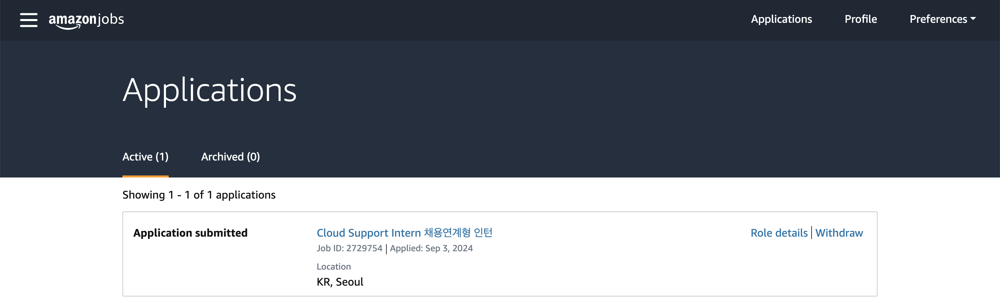

# Amazon Cloud Support Intern

9월 초에 지원했던 Amazon Cloud Support Intern에 대한 답신이 방금 왔다. 지원 당시에 준비를 잘 못하고 지원서도 AWS에 맞게 안 쓴걸 뒤늦게 알게 되어 기대를 안하고 있었지만 메일이 와서 놀랐다. 해당 메일에서는 1주일 내로 30분간 Online Assessment (OA)을 진행해야 한다는 안내를 받았다.

찾아보니까 OA는 2 파트로 이루어져 있다고 한다. 첫 번째는 적성검사 형식으로 'Workplace Simulation'이라는 것이고, 두 번째는 기술적인 문제를 푸는 'Assessment Test'라고 객관식 문제가 나온다고 한다. 물론, 외국 포럼에서 발견한 정보라 AWS Korea도 동일하게 진행되는지는 모르겠다.

# Leadership Principles
조사하면서 다시 한번 느끼게 된 바로는, 아마존은 정말 Leadership Principles(LP)에 열광한다. LP에 대해 간단히 설명하자면, 아마존만의 행동강령철학 같은 것이다. 16개나 되는 LP 중 몇개만 소개하자면 Think Big, Learn and Be Curious, Dive Deep 등이 있다.

이때, LP들이 중요한 이유는, 아마존에서는 이 LP를 기반으로 인재를 채용하고, 인사평가를 진행한다. 적성검사에서도 LP를 기반으로 '정답'이 있으며, 실제로 내가 어떤 사람인지보다 직장에서의 나의 이상적인 태도로 이해하는게 중요하다. [관련자료](https://www.jobtestprep.com/amazon-work-style)

# Workplace Simulation
이어서 Workplace Simulation에 대해서 정리해보려 한다. Workplace Simulation은 아마존의 LP를 기반으로 한 시나리오를 제시하고, 그에 대한 답변을 선택하는 형식이다. 아래는 관련 자료를 참고하여 정리한 Workplace Simulation의 예시이다.

예시:  
*당신의 팀원 중 한명이 커스터머 미팅을 앞두고 당신에게 발표 자료를 검토해달라고 요청했습니다. 이때 당신은 팀원의 자료에 계산 오류가 있음을 발견했습니다. 어떻게 대처하시겠습니까?*

그러면, 아마존 행동강령 LP 중 'Insist on the Highest Standards'을 적용하여 답변을 선택해야 한다. 따라서, 답변은 '팀원에게 오류를 지적하고, 올바른 정보를 제공하여 문제를 해결한다'와 같은 형식으로 나올 것이다.

# Assessment Test
Assessment Test는 기술적인 질문 위주로 객관식으로 나온다고 한다. 이때, AWS 서비스에 대한 기본적인 지식이 필요하다. 예를 들어, EC2 인스턴스의 종류, S3 버킷의 특징, VPC의 구성 등이 나올 수 있다.

몇가지 예시로는 다음이 있다:
- What do you understand by a LAMP stack?
- What is the difference between a public and a private subnet?
- What is the difference between a security group and a network ACL?
- What is the difference between an EC2 instance and an AMI?
- To support seven virtual machines, which subnet provides minimum number of usable IP addresses?

출제 범위는 다음과 같다:
- IPs
- FTP issues
- UNIX commands
- Firewalls
- Understanding response codes
- Linux knowledge
- DNS queries
- Application layer protocols

## 자료:
- [[reddit] AWS cloud support associate intern?](https://www.reddit.com/r/cscareerquestions/comments/y956w6/aws_cloud_support_associate_intern/)
- [[jobtestprep] Amazon Work Style Assessment](https://www.jobtestprep.com/amazon-work-style)
- [[jobtestprep] Amazon Assessment Test](https://www.jobtestprep.com/aws-assessment-test)