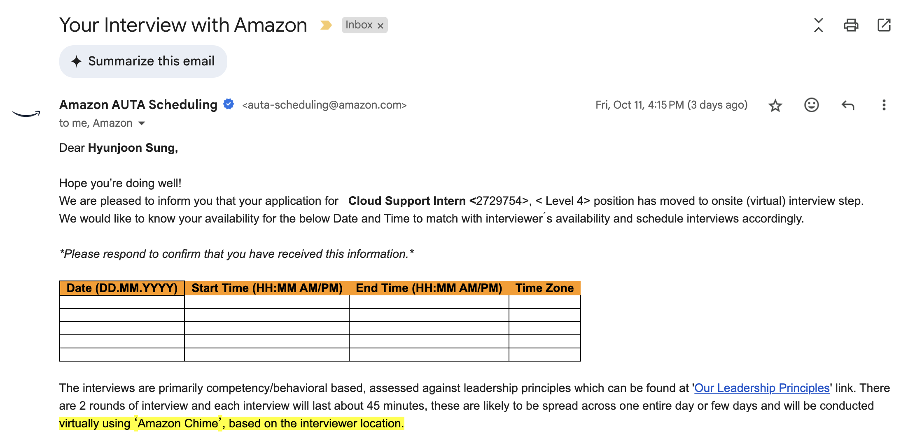

# 면접 후기
면접은 줌 같은 AWS Chime이라는 자체 화상 통화 서비스를 통해 진행되었다. 면접 일정이 잡혔을 때부터 궁금했던 진행 언어는 결국에 **한국어**가 맞았다. 문의를 해도 한국어 또는 영어로 진행된다고 답장이 와서 당황했었는데 아무래도 면접관이 한국 분이셔서 한국어로 진행된 것 같다.

### 진행방식
- 15분: 자기소개 등의 질문
- 5분: 영어/한국어 문단 번역
- 50분: 기술면접
- 5분: 질문

### 질문 복기

#### 자기소개
- 간단한 자기소개 부탁드립니다.
- **(빅데이터 학회 운영 경험에 대해 얘기함)** 빅데이터 동아리에서 무엇을 했는지, 어떻게 전문성을 길렀는지 얘기해주세요.
- 구체적으로 커리큘럼와 산학협력 추진에 대해서 어떻게 참여하셨는지 얘기해주세요. 있던것을 그대로 이어서 했는지 주도적으로 무언가 새로운 것을 만들어낸 것이 있는지 얘기해주세요.

#### 영어/한국어 문단 번역
후기들에서 찾아봤을 때에는 모두 외국에서 전화가 걸려와서 영어로 진행했다고 하지만, 나의 경우에는 면접관도 한국어로 진행해서인지 영어 평가 시간이 있었다. 이때 약 두 문단 정도의 한국 문장을 영어로 번역해보라고 하셨다.

면접을 진행하는 모든 과정에서는 화면공유를 하고 있어서 번역기 사용은 물론 금지되었으며, 5분 안에 갑자기 하라고 해서 당황했지만 어떻게든 잘 마무리했다.

문단은 마이크로소프트의 어떤 스토리지 서비스가 종료하기 때문에 빠른 시일 내로 AWS의 어떤 다른 스토리지 서비스로 이전시켜야 한다는 내용이었다.

#### 기술면접
이때부터 진짜 면접이 시작되었다. 기술면접이 처음인만큼 엄청 긴장했었다. 질문은 기본적으로 꼬리질문 형식이었으며, 한 분야에서 더 이상 대답을 못하거나 틀리면 넘어가는 형식으로 진행되었다. 따라서 어떤 분야는 20분 넘게 얘기하고 어떤 분야는 한마디하고 넘어갔다.

**DB**
- 데이터베이스가 무엇인지 설명해주세요.
- 데이터베이스의 특징.
- NoSQL과 SQL의 차이점.
- SQL 쿼리에 대한 예시.
- **(조인 언급함)** 조인 말고 다른 쿼리 아는게 있나요?
- **(수평 및 수직 확장 언급함)** 수평 확장과 수직 확장에 대해 설명해주세요.
- ACID와 BASE에 대해 설명해주세요.

**네트워크**
- 엄청나게 많은 사용자가 있는 서비스가 존재한다고 가정할 때, 아키텍처를 설계해보세요.
- **(로드밸런싱 언급함)** 스파이키 트래픽과 비용절감에 대해서 말해주셨는데, 왜 비용이 절감되는지 설명해주세요.
- 로드밸런서의 이점으로 속도 말고 또 어떤것이 있을지 설명해주세요.
- 서비스에 로드 밸런서를 설치해야 한다면 어디에다 설치하겠습니까?
- **(API 콜 언급)** 클라이언트 측에서 서버 측으로 API 콜을 보낼 때, 어떤 과정을 거치는지 설명해주세요.
- API 콜을 했을 때 발생할 수 있는 문제점에 대해 설명해주세요.
- 응답이 오지 않거나 느릴 때 어떻게 대처할 것인지 설명해주세요.
- TCP와 3 way handshake에 대해 설명해주세요.
- 서버 측에서 SYN-ACK 응답이 못 오는 경우에 대해 설명해주세요.

**AWS 서비스**
- EC2 서비스에 대해 설명해주세요.
- 선택하는 과정에서 어떤 것을 고려해야 하는지 설명해주세요.

**리눅스**
- 서버를 관리하기 위해 쓰일 수 있는 명령어 아는대로 말해주세요.

## 후기
전반적으로 기가 많이 빨렸고 힘들었지만 그래도 잘 마무리한것 같아서 다행이다. 정말 탈락할줄 알고 마음 접었었는데 합격 문자를 받게 되어 너무 기분이 좋았다.

합격 메일은 다음과 같이 온다.

