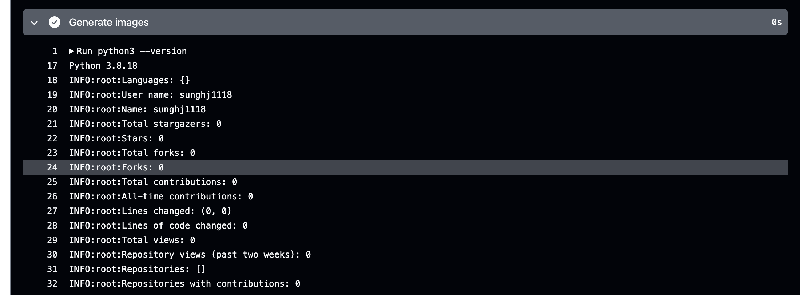

# Setting up Github Stats
I am attempting to create a better profile for my github. To do this, I am using trying to use a tool called [github-stats-transparent](https://github.com/rahul-jha98/github-stats-transparent) from rahul-jha98. However, I am having trouble getting it to work. I will update this post with my progress.

# Process
### 2024-06-05 : Node 20 Dependency Issues
I have attempted to clone the repository and add github-actions to create the stats images. However, github actions has had trouble due to issues in deprecated dependencies of Node 16.

After referencing the [Node 16 deprecation](https://github.blog/changelog/2023-09-22-github-actions-transitioning-from-node-16-to-node-20/), I have attempted to use Node 20. However, this has not resolved the issue.

After searching some more, I decided that I am going to need setup-python to run my programs. However, with Node 20, I need to make sure that it is compatible with the version of setup-python that I am using. Setup-python has to be version 5 and cache has to be version 4.

This fixed the dependency issues but the action still failed.

### 2024-06-06 : Generate Images Problem
Now that I have solved the dependencies, I am having trouble generating the images. I am getting an error that there is an unhandled exception during asyncio.run() shutdown.

Okay so the program is finally compiling after I added some logging to the generate_image.py and github_stats.py files. However, now the stats are not being shown properly in the generated image.

### 2024-06-07 : Calling Github Stats Issue
I have been trying to figure out why the stats are not being shown properly in the generated image. I have been looking at the code and I think the issue is with the way the stats are being called. I am going to try to fix this issue by changing the way the stats are being called.

I have tried adding logs and found out that the Github Actions API isn't being called properly. To fix this, I have attempted to change the token to the classic token instead of the past Fine-Grained token. This has not fixed the issue.

Instead, I am trying to debug using the GraphQL API. I can see that the return is working when hard-coded. 

Eventually I had to fix the github-stats.py to return contributions properly which was able to solve the issue.

## Sources:
- https://github.com/actions/setup-python
- https://github.blog/changelog/2023-09-22-github-actions-transitioning-from-node-16-to-node-20/
- https://github.com/actions/cache