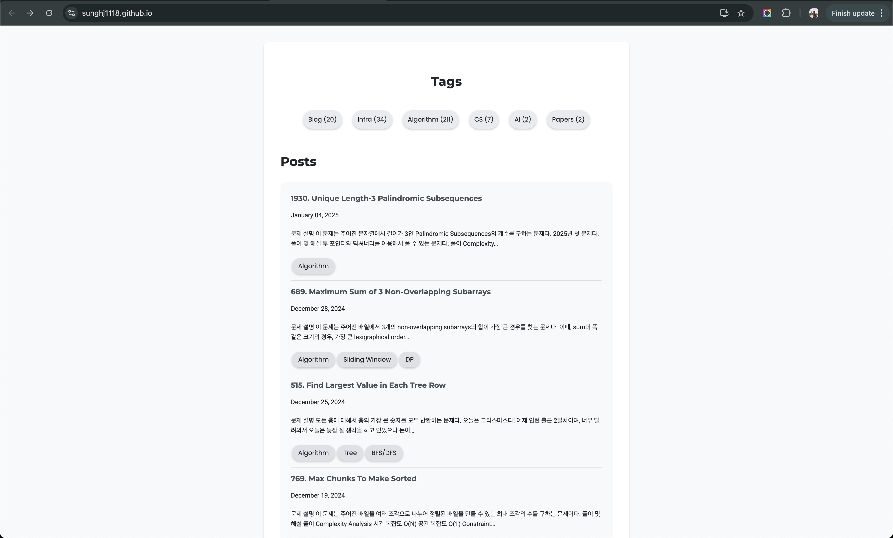
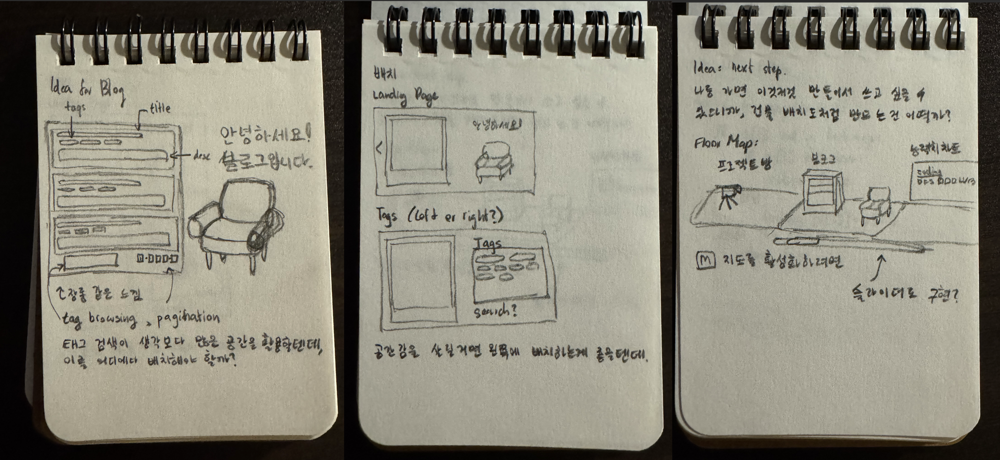
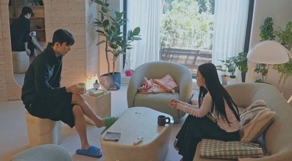
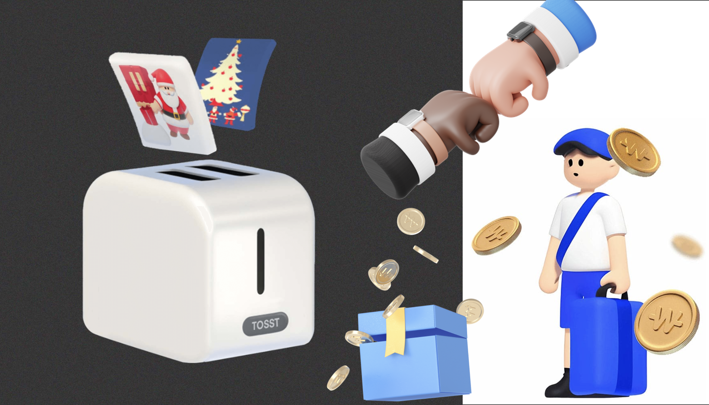
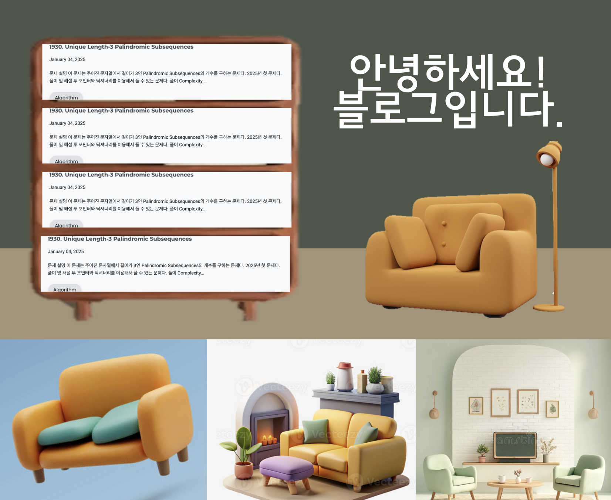

# 구상
애초에 블로그를 처음부터 직접 만들고 싶었던 이유가 높은 자유도인만큼 다시 원하는 내용과 구조로 꾸며보려고 합니다. 지금 블로그의 문제로는 너무 단조롭다는 것을 꼽아볼 수 있습니다. 이렇게 특색이 없으면 사실 보편적으로 제공되는 블로그 사이트에서 하는게 더 좋을 정도라 다음과 같이 바꿔보려고 합니다.

## 랜딩 화면  
처음에는 들어오자마자 한눈에 블로그 내용이 들어오는 것에 가치를 높게 뒀습니다. 그러나, 너무 심심하고 밋밋하고 밝아서, 제가 좋아하는 것들로 가득 채워볼까 합니다. 일단 구상하고 있는 것들으로는 제가 좋아하는 가구들과 색감으로 가득 찼으면 합니다. 저는 참고로 따뜻한 색감의 초록색 2% 정도 섞여있는 색깔들을 좋아합니다. 아이보리, 초록색, 연두색, 베이지 등이 이에 포합됩니다. 또한, 포근하고 따뜻한 느낌을 제공하고 싶은만큼 들어오자마자 오른쪽에 1인 소파 같은게 있으면 참 좋을 것 같습니다.  

그래도 취지가 블로그인만큼 첫 화면에는 가장 최근 작성한 포스트들이 보이기는 한다는 주위라 이를 책장에 있는 책처럼 꾸며보면 우드색으로 무드가 자연스럽게 잘 맞지 않을까 싶습니다. 

**[현재]**
  

* 너무 밝습니다. 다크 모드 도입이 시급합니다. 
* 또한, 너무 특색이 없고 밋밋합니다. 

**[구상]**  

**[레퍼런스]**  
일단 이와 비슷하게 해보려고 레퍼런스로 가장 먼저 떠오른 것은 최근에 재밌게 보고 있는 환승연애4의 제 최애 방입니다. 다음 방에 있는 색감과 톤이 너무 예뻐서 계속 생각이 났습니다. 이런 무드를 웹UI로 어떻게 연출하면 포근한 인상을 줄 수 있을까 고민을 해봤습니다.  

이때, 가장 무난하고 요즘 유행하는 스타일으로는 토스가 생각났습니다. 특유의 솔리드하면서도 아이콘 같은게 힙해서 여러 기업에서 너도나도 참고하는 감이 없지 않아 있습니다. 그래서인지 저만의 특색이 조금은 있도록 만들고 싶었습니다.  

  

최종적으로는 이런 느낌으로 구상해보고 있는데, 실제로 구현해봐야 어떻게 나올지 최종적으로 알 것 같습니다. 지금 봐서는 별로 예쁜 것 같지는 않습니다. 소파가 사선으로 있고 장롱은 글을 담기 위해 길어지고 뚱뚱해져서 그런 것으로 추정되는데 이것도 어떻게 해결해볼지 한번 고민해봐야겠습니다.  

