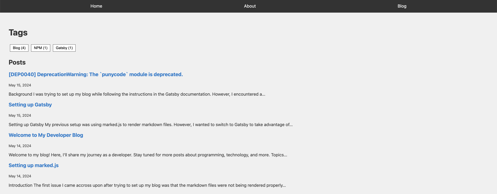
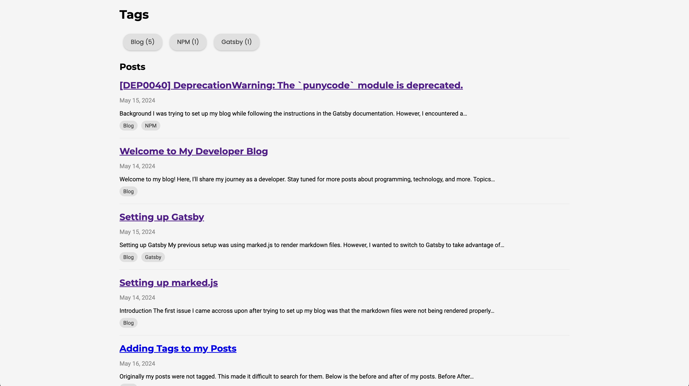

Originally my posts were not tagged. This made it difficult to search for them. Below are the before and after of my posts.

## Before

## After

You can see that the posts are now tagged. This makes it easier to search for them. I implemented the tags so that they work as toggles, being able to toggle several tags at once. This way I can search for posts that have multiple tags.
