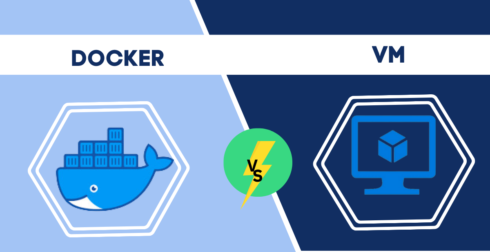
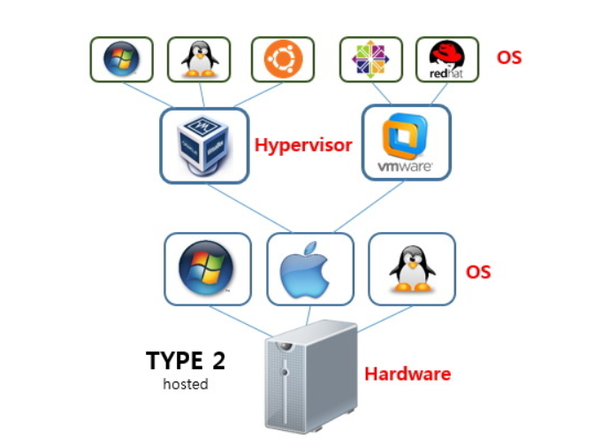
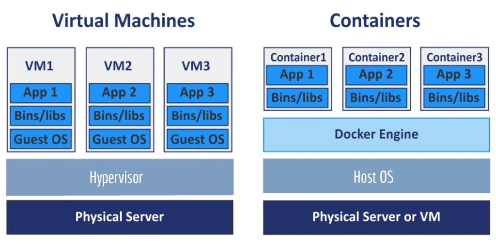
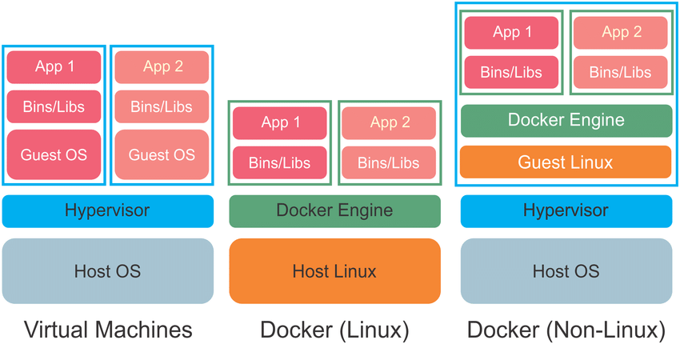

오늘 문득 도커의 컨테이너들과 가상환경의 차이가 무엇인지 궁금해졌다. 도커는 다른 사람의 환경에도 동일한 환경을 제공하기 위해 사용되는데, 이때 Dockerfile을 통해 이미지를 만들고, 이 이미지를 통해 컨테이너를 생성한다. 반면에, 가상환경은 개발 환경을 분리하며, 사용자의 기본 운영체제와는 독립적인 운영체제를 제공할 수 있다. 도커와 가상환경 모두 로컬 환경을 분리하여 사용자에게 편의성을 제공한다. 특히, 도커는 기본적으로 리눅스 컨테이너를 사용하며, 이는 리눅스 커널을 공유하므로, 가상환경보다 더 가볍고 빠르다. 그렇다면, 리눅스 운영체제를 설지한 가상환경과 단일 리눅스 컨테이너의 차이는 무엇일까? 또한, 두가지가 차이가 있다면, 어떤 경우에 어떤 것을 사용하는 것이 좋을까?

## 가상화와 컨테이너
### 가상화
일단 기본적으로 도커는 오픈소스 컨테이너 기술을 기반으로 한 일종의 가상화 플랫폼이다.  

이때 가상화는 하드웨어를 더욱 효율적으로 사용하기 위해, 하나의 물리적 하드웨어 공간 위에 가상의 머신을 만들어내는 기술이다. 반면에 컨테이너는 가상화 기술 중 하나로, 하나의 운영체제 커널을 공유하면서, 격리된 공간을 제공하는 기술이다.  

그러나, 가상머신은 하이퍼바이저를 통해 가상화를 제공하기 때문에 더 무겁고 느리다. 각각의 가상머신은 자체 게스트 운영체제를 가지고 있으며, 이를 구동하기 위해서는 하이퍼바이저가 사용된다. 하이퍼바이저, 또는 가상머신 모니터는 하드웨어를 가상화하고, 각각의 가상머신을 관리하는 소프트웨어이다. 그러나, 이런 과정이 존해하기 때문에 가상머신은 느리고 무겁다.



### 컨테이너
반면에, 컨테이너들은 물리적 호스트 위에서 작동하며, 호스트 운영체제를 공유한다. 독립적으로 완전한 운영체제를 필요로 하지 않으며, 작은 샌드박스만 있어도 작동하기 때문에 경량화되어 있고 5-100MB 정도의 크기를 가진다.



## 도커와 가상환경의 차이점
앞서 언급했듯이 가상머신(VM)은 호스트 운영체제 위에서 게스트 운영체제를 가동하는 반면에, 컨테이너는 호스트 운영체제를 공유한다. 이는 컨테이너가 더 가볍고 빠르다는 것을 의미한다. 반면에, 운영체제를 따로 필요로 하는 환경이라면 가상머신을 사용하는 것이 좋다. 또한, 도커는 하나의 운영체제 커널을 공유하기 때문에 관리자 권한을 사용하는걸 지양한다. 이는 보안적인 측면에서 하나의 도커의 컨테이너가 커널에게 접근을 하게 된다면 모든 컨테이너에게 접근을 할 수 있게 되는 우려가 있기 때문이다.



# 단일 리눅스 컨테이너와 리눅스 가상머신의 차이
단일 리눅스 컨테이너와 가상머신의 경우에도 구조, 아키텍처 등에서 차이를 보인다. 기본적으로 리눅스 컨테이너는 호스트 운영체제의 리눅스 커널을 공유하며, 따라서 더욱 빠를것이다. 그러나, 리눅스 가상머신은 호스트 운영체제와는 완전히 독립적인 운영체제를 가지고 있기 때문에 더욱 무겁고 느릴 것이다. 

따라서, 아무리 리눅스 환경을 기반으로 한 컴퓨터에서 리눅스 가상머신을 사용한다고 하더라도, 이는 어차피 하이퍼바이저를 통해서 가상화를 한번 거쳐야 하기 때문에 오버헤드가 발생하면서 느려지게 된다. 

그렇다면 반대로 윈도우 환경을 기반으로 한 컴퓨터에서 도커 리눅스 컨테이너를 실행한다고 생각해보자. 이때, 컨테이너는 호스트 OS 커널을 공유한다고 하였는데, 윈도우 호스트에서는 리눅스 커널을 돌리는게 불가능하지 않을까? 이런 경우를 대비해서 도커는 HyperV나 WSL2 등의 하이퍼바이저를 활용하여 경량화된 리눅스 가상머신을 사용하게 된다. 해당 리눅스 가상머신에서 리눅스 커널을 실행하며, 이를 통해 리눅스 컨테이너를 실행하게 된다. 

두 경우 모두 리눅스 가상머신을 만들긴 하지만, 도커의 가상머신은 훨씬 가볍고 컨테이너를 실행하는데 최적화되어 있기 때문에 불필요한 리소스를 사용하지 않는다. 

# FROM image 없이 베이스 이미지 생성하기
흔히 도커 이미지를 생성할 때, Dockerfile에 이미 Dockerhub에 게시된 이미지를 FROM를 명령어로 받아서 사용하는 경우가 많다. 그러나, 이미지를 받아오지 않고 최초의 이미지를 생성하는 경우에는 어떻게 만들어졌을까? 예를 들어, 최초의 golang이나 python 이미지는 어떻게 만들어졌을까? 이런 경우에는 Dockerfile에서 Scratch를 사용하여 이미지를 생성할 수 있다. Scratch는 빈 이미지로, 아무것도 없는 이미지이다. 이를 통해, Scratch 이미지를 기반으로 이미지를 생성할 수 있다. 예를 들어, Ubuntu의 Base Image를 만든다고 하면 다음처럼 만들 수 있다:

```Dockerfile
# Start from scratch
FROM scratch

# Add the root filesystem of Ubuntu
ADD ubuntu-focal-core-cloudimg-amd64-root.tar.gz /

# Set environment variables
ENV PATH=/usr/local/sbin:/usr/local/bin:/usr/sbin:/usr/bin:/sbin:/bin

# Define default command
CMD ["/bin/bash"]
```
- [Docker Docs: Create a base image](https://docs.docker.com/build/building/base-images/)


# 자료 출처
- [도커에 대한 어떤 것 : 1. 도커란 무엇인가?](https://velog.io/@markany/%EB%8F%84%EC%BB%A4%EC%97%90-%EB%8C%80%ED%95%9C-%EC%96%B4%EB%96%A4-%EA%B2%83-1.-%EB%8F%84%EC%BB%A4%EB%9E%80-%EB%AC%B4%EC%97%87%EC%9D%B8%EA%B0%80)
- [도커와 가상머신의 차이](https://www.redhat.com/ko/topics/containers/whats-a-linux-container)
- [docker vs VM](https://www.ubackup.com/enterprise-backup/docker-vs-vm.html)
- [docker vs VM - cloudacademy](https://cloudacademy.com/blog/docker-vs-virtual-machines-differences-you-should-know/)