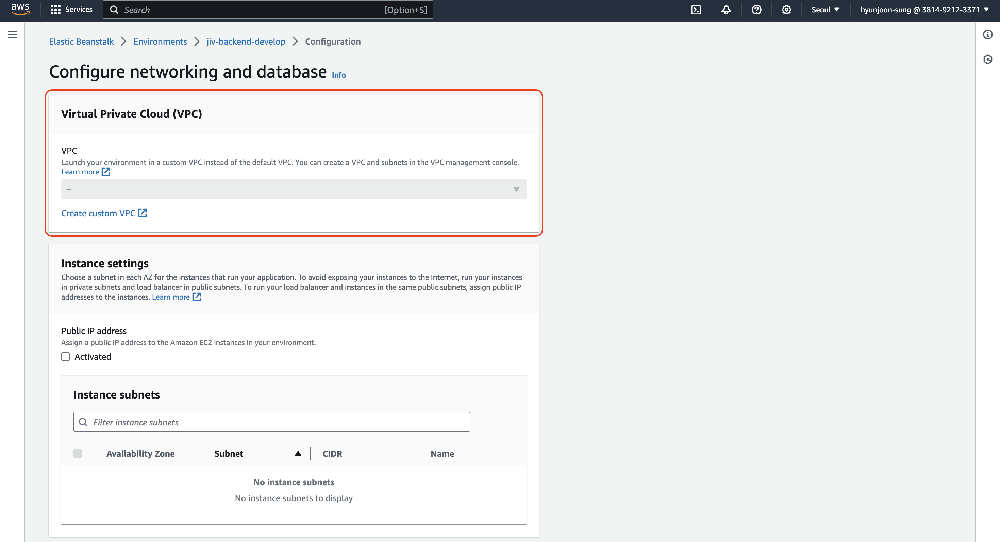
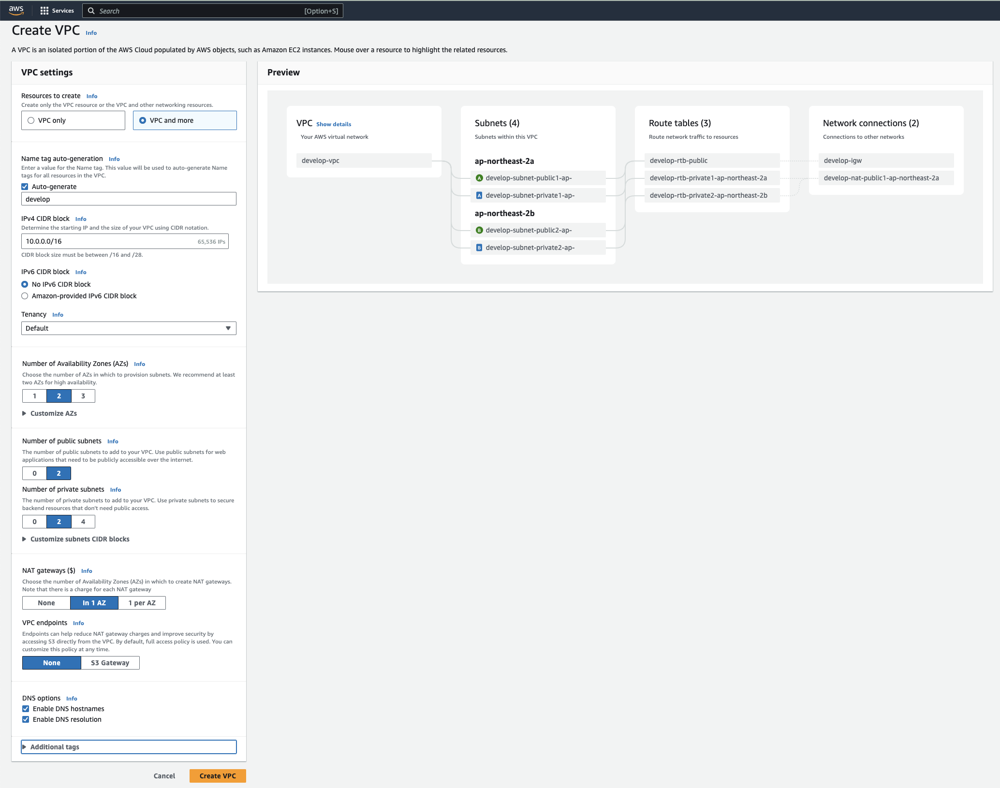
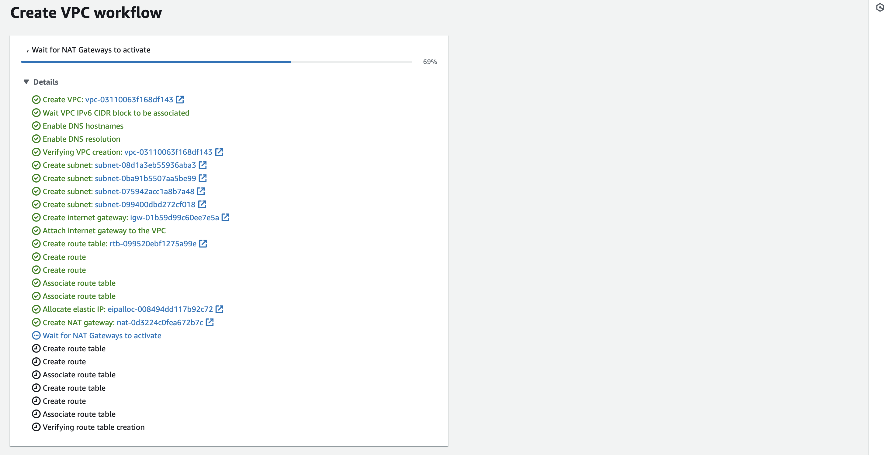
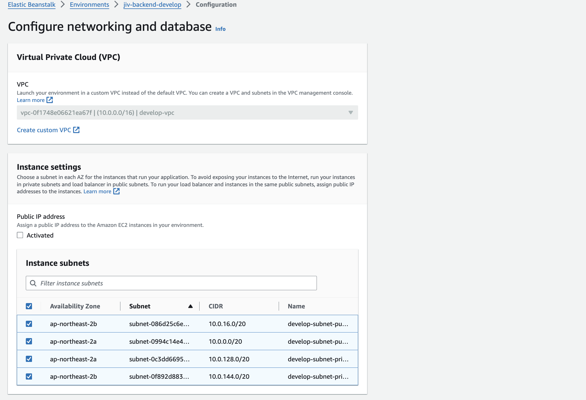

## 개념 질문
- IPv4 vs IPv6
    - IP addresses are what computers use to identify themselves on a network.
    - There are two versions of IP addresses: IPv4 and IPv6.
    - IPv4 addresses are the old ones, and IPv6 addresses are the new ones.
    - IPv4 addresses are 32 bits long, and IPv6 addresses are 128 bits long.
    - IPv4 addresses are written in decimal(10진수) form, and IPv6 addresses are written in hexadecimal(16진수) form.
- CIDR
    - Classless Inter-Domain Routing (CIDR/사이더)는 클래스 없이 도메인 간 라우팅을 위한 IP 주소 할당 방법이다.
    - Class란 CIDR가 나오기 전 IP 주소 할당 방법으로, A, B, C, D, E 클래스로 나뉜다.
    - CIDR는 각 도메인의 Intra-Domain 네트워크 대역을 구분 짓고, Inter-Domain으로 구분되어 있는 네트워크간 통신을 위한 통신체계를 제공한다.
    - CIDR 표기법을 한 IP의 예시로는 다음을 들 수 있다: 192.168.10.0/24. /24로 끝나면 CIDR 표기법이다.
- What is IPv6 traffic and do I need it?  
`(Optional) To support IPv6 traffic, choose IPv6 CIDR block, Amazon-provided IPv6 CIDR block. For more information, see IPv6 traffic over the internet.`
    - IPv6 (Internet Protocol version 6) is the most recent version of the Internet Protocol, designed to eventually replace IPv4.
    - Uses 128-bit addresses, allowing for a vastly larger number of unique IP addresses compared to IPv4's 32-bit addresses.
    - Supports improved security features and more efficient routing compared to IPv4.
- Tenancy
    - This option defines if EC2 instances that you launch into the VPC will run on hardware that's shared with other AWS accounts or on hardware that's dedicated for your use only.
- NAT (Network Address Translation) Gateway
    - A NAT gateway is a Network Address Translation (NAT) service. NAT gateways enable resources in private subnets to reach the internet.

# EB 콘솔 VPC 기본값 변경이 안될 때

EB 콘솔에서 이미 만들어진 환경에서 VPC를 변경하려고 할 때, 변경 버튼이 다음과 같이 회색으로 변경되지 않는 경우가 있다.

회색으로 뜨는 이유는 이미 VPC가 기본값으로 설정되어 있기 때문이다. 이를 해결하기 위해서는 조금 번거롭더라도 아예 새로운 환경을 만들어야 한다.

# 새로운 VPC 만들기  
Create VPC 메뉴로 들어가서 새로운 VPC를 만든다. 이때, Subnet과 NAT Gateway 등을 함께 만들고 싶다면 VPC and more options를 선택한다.

가장 기본적인 Subnet 옵션을 위해서는 다음과 같이 설정했다: 2개의 Private Subnet, 2개의 Public Subnet, 1개의 NAT Gateway.

아래는 VPC가 생성되고 있는 과정입니다.  

# EB 환경에 적용시키기

이렇게 만들어진 VPC와 그에 해당하는 Subnet들을 EB 환경에 적용시키기 위해서는 EB 환경을 새로 만들어야 한다.

새로 만들고 있는 과정 도중에, Network Configuration에서 다음과 같이 VPC와 Subnet을 선택할 수 있다.

## 출처
- [[GeeksforGeeks] Difference Between IPv4 and IPv6](https://www.geeksforgeeks.org/differences-between-ipv4-and-ipv6/)
- [[Juniper Networks] What is the difference between IPv4 and IPv6?](https://www.juniper.net/us/en/research-topics/what-is-ipv4-vs-ipv6.html)
- [[AWS] Example: VPC with servers in private subnets and NAT](https://docs.aws.amazon.com/vpc/latest/userguide/vpc-example-private-subnets-nat.html)
- [[kimdragon tistory] CIDR이란?(사이더 란?)](https://kim-dragon.tistory.com/9)