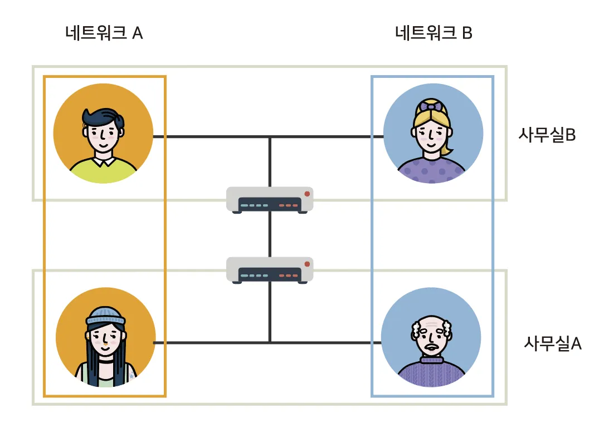
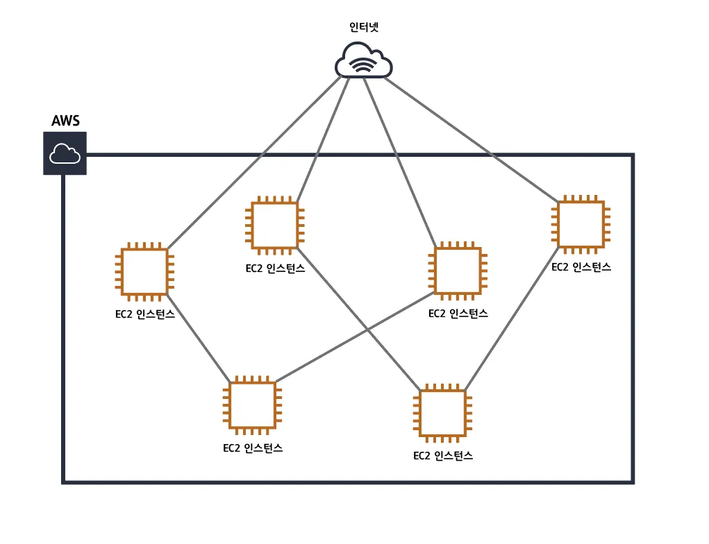
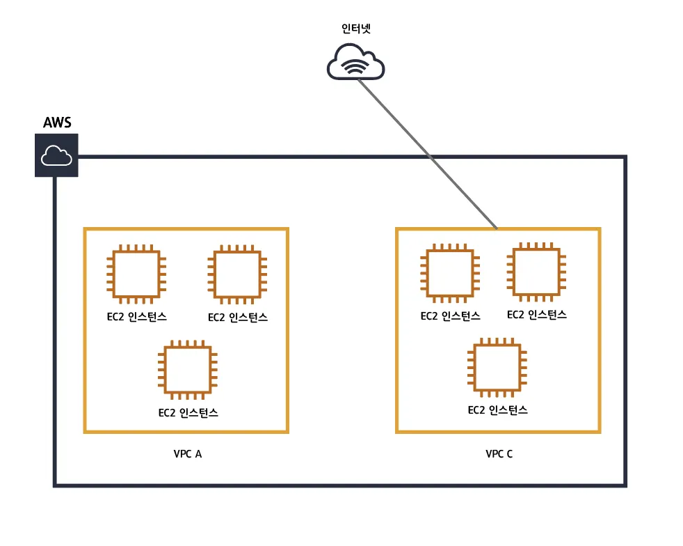
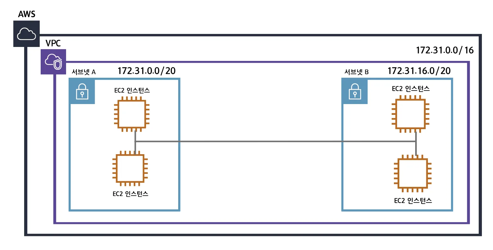

# VPC (Virtual Private Cloud) 개념

## VPC란?
VPC는 AWS 클라우드 내에서 사용자가 정의하는 가상 네트워크이다. VPC를 사용하면 AWS 클라우드 내에서 사용자만의 가상 네트워크를 생성하고, 이 네트워크 내에서 리소스를 실행할 수 있다. 예시를 통해 살펴보자.

## VPC가 없는 경우
아래 그림의 경우, 여러 EC2 인스턴스들이 VPC 없이 존재한다면, 각각의 인스턴스는 모두 서로 연결되어 있어야 하고 인터넷과 연결되어 있어야 한다. 이런 구조는 굉장히 복잡할 뿐더러, 새로운 EC2 인스턴스를 추가할 때마다 모든 인스턴스들을 다시 연결해야 한다.

## VPC가 있는 경우
이때, VPC는 퍼블릭과 프라이빗 클라우드 환경을 논리적으로 격리할 수 있는 네트워크 공간을 제공한다. VPC를 사용하면, 인스턴스들을 서로 연결할 필요가 없어지며, 각각의 VPC들을 개별 네트워크처럼 사용할 수 있다. 

즉, 네트워크의 자체 IP 주소 범위를 선택하고, 서브넷을 생성하고, 라우팅 테이블을 구성하고, 인터넷 게이트웨이를 연결하고, 보안 그룹을 구성할 수 있다. 마치 온프레미스 네트워크를 구성하는 것과 같은 방식으로 AWS 클라우드 내에서 네트워크를 구성할 수 있다.

# 서브넷 (Subnet) 개념

## 서브넷이란?
서브넷은 VPC의 IP 주소 범위를 나눈 것이다. 서브넷을 사용하면 VPC의 IP 주소 범위를 여러 개의 네트워크로 나눌 수 있으며, 각 서브넷은 다른 서브넷과 격리된 네트워크로 간주된다.

IP를 나누는 방식으로는 다음 그림을 참고하자.

VPC (10.0.0.0/16) 내에 퍼블릭 서브넷과 프라이빗 서브넷이 존재한다. 
- VPC의 네트워크 주소 범위는 16bit(10.0)이며, 나머지 16bit로 호스트 주소를 정할 수 있다는 의미이다.
- 퍼블릭 서브넷은 10.0.0.0/24로, 24bit(10.0.0)는 네트워크 주소로 사용되며, 나머지 8bit는 호스트 주소로 사용된다. 즉, 10.0.0.0~10.0.0.255 IP 주소 범위를 사용할 수 있다.
- 프라이빗 서브넷은 10.0.1.0/24로, 24bit(10.0.1)는 네트워크 주소로 사용되며, 나머지 8bit는 호스트 주소로 사용된다. 즉, 10.0.1.0~10.0.1.255 IP 주소 범위를 사용할 수 있다.

이때, 서브넷은 VPC 내에 속해 있어야 한다.

## 출처
- [[AWS] 가장쉽게 VPC 개념잡기 - Harry The Great Medium](https://medium.com/harrythegreat/aws-%EA%B0%80%EC%9E%A5%EC%89%BD%EA%B2%8C-vpc-%EA%B0%9C%EB%85%90%EC%9E%A1%EA%B8%B0-71eef95a7098)
- [VPC의 개념 - 류예린 tistory](https://velog.io/@yenicall/AWS-VPC%EC%9D%98-%EA%B0%9C%EB%85%90)
- [[AWS] 📚 VPC 개념 & 사용 - 인프라 구축 [Subnet / Routing / Internet Gateway] - 인파 tistory](https://inpa.tistory.com/entry/AWS-%F0%9F%93%9A-VPC-%EC%82%AC%EC%9A%A9-%EC%84%9C%EB%B8%8C%EB%84%B7-%EC%9D%B8%ED%84%B0%EB%84%B7-%EA%B2%8C%EC%9D%B4%ED%8A%B8%EC%9B%A8%EC%9D%B4-NAT-%EB%B3%B4%EC%95%88%EA%B7%B8%EB%A3%B9-NACL-Bastion-Host)