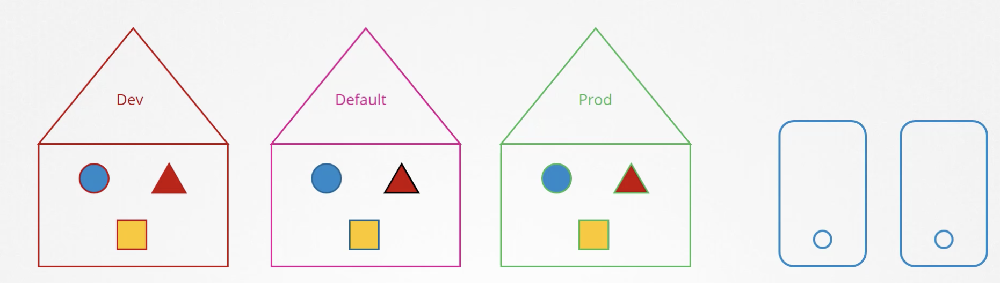
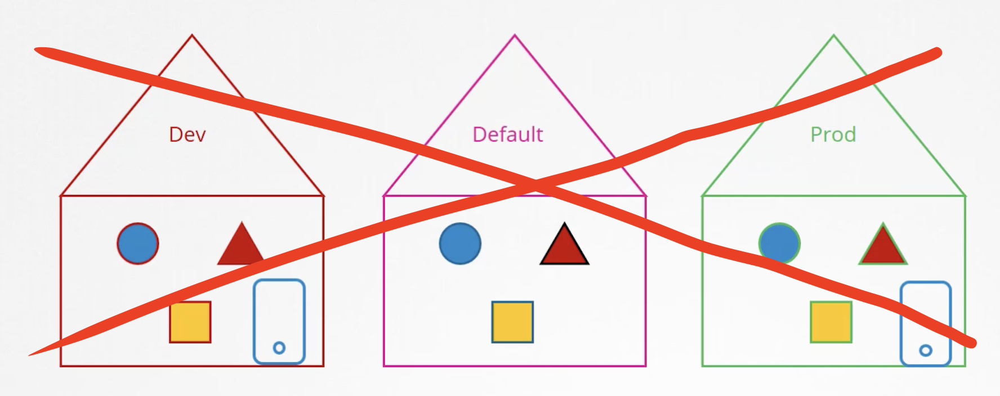
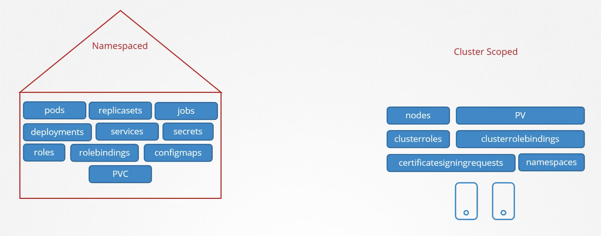
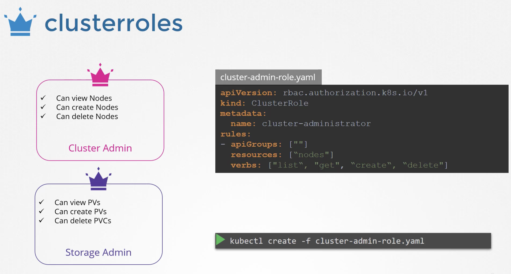
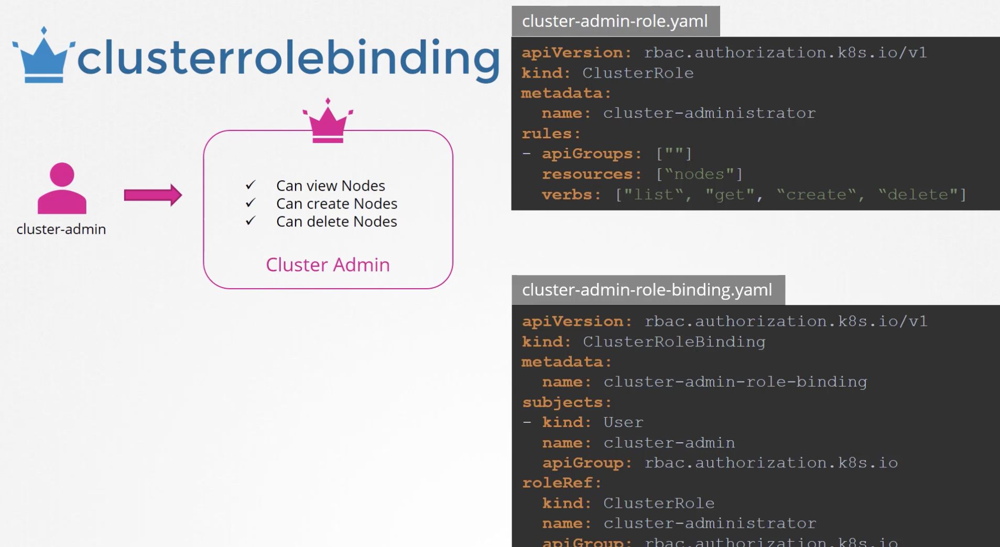
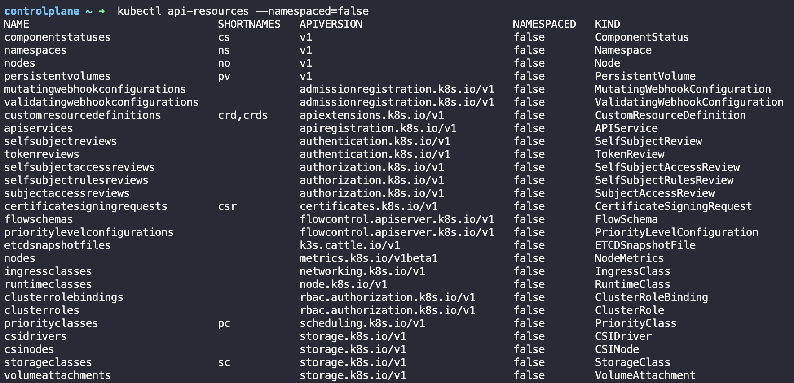
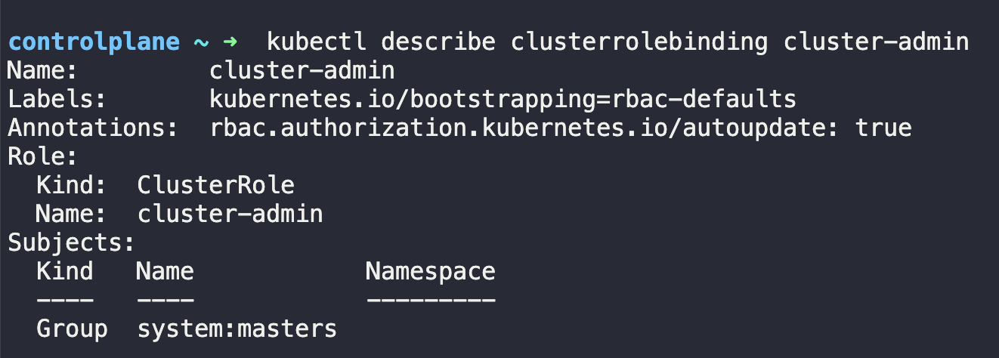
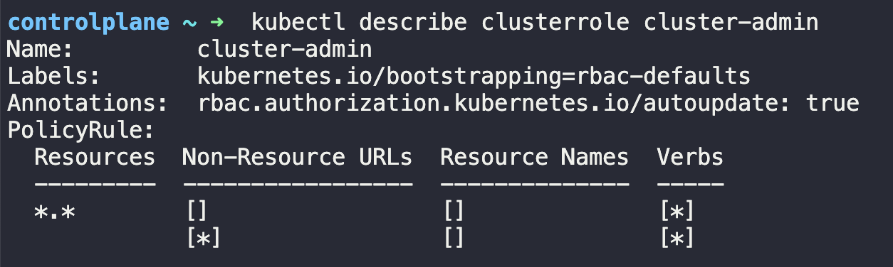

Roles and Role Bindings are namespaced, meaning they are created within namespaces. If a namespace isn't specified, then they are created in the default namespace and control access only within that namespace.

As a reminder, namespaces help grouping or isolating resources like pods, deployments or services.

However, what about resources like nodes (blue squares in the right)? Is it possible for them to be in a namespace?



The answer is no, nodes are not able to be isolated within a namespace. Instead, they are clusted-wide or cluster-scoped resources. This means that they are accessible from any namespace within the cluster.



In other words, resources can be categorized as either namespaced or cluster-scoped.  

Examples of namespaced resources include pods, replicasets, deployments, and services.

Examples of cluster-scoped resources includes nodes, persistent volumes, and namespaces.



## Cluster-Scoped Resources
The cluster-scoped resources are those where you don't specify a namespace when you create them such as nodes.

To enable a user to access namespaced resources, you can use roles and role bindings. Similarly, to enable a user to access cluster-scoped resources, you can use **cluster roles** and **cluster role bindings.**

For example, you can create a Cluster Admin role as below that enables a user to view nodes, create, nodes, or delete nodes.

To create them you can create a yaml file and define the kind as ClusterRole as below.




Then, we can create another object called ClusterRoleBinding to link the ClusterRole to a user or a group.

```
kubectl create -f cluster-admin-role-rolebinding.yaml
```



Lastly, although clusterroles and bindings are usually used for cluster scopes, this is not a hard rule, and you can use them for namespaced resources as well. Once you do that, the user will have access to the resources accross all namespaces.

# Review Quiz
How many ClusterRoles do you see defined in the cluster?
```bash
kubectl get clusterroles --no-headers | wc -l
```

How many ClusterRoleBindings exist on the cluster?
```bash
kubectl get clusterrolebindings --no-headers | wc -l
```

What namespace is the cluster-admin clusterrole part of?
```bash
kubectl api-resources --namespaced=false
```



What user/groups are the cluster-admin role bound to?
The ClusterRoleBinding for the role is with the same name.
```
kubectl describe clusterrolebinding cluster-admin
```


What level of permission does the cluster-admin role grant?  
Inspect the cluster-admin role's privileges.

```
kubectl describe clusterrole cluster-admin
```



A new user michelle joined the team. She will be focusing on the nodes in the cluster. Create the required ClusterRoles and ClusterRoleBindings so she gets access to the nodes.

michelle.yaml
```yaml
---
kind: ClusterRole
apiVersion: rbac.authorization.k8s.io/v1
metadata:
  name: node-admin
rules:
- apiGroups: [""]
  resources: ["nodes"]
  verbs: ["get", "watch", "list", "create", "delete"]

---
kind: ClusterRoleBinding
apiVersion: rbac.authorization.k8s.io/v1
metadata:
  name: michelle-binding
subjects:
- kind: User
  name: michelle
  apiGroup: rbac.authorization.k8s.io
roleRef:
  kind: ClusterRole
  name: node-admin
  apiGroup: rbac.authorization.k8s.io
```

kubectl create -f michelle.yaml

To check if the user has access to the nodes, you can run the following command.
```bash
kubectl auth can-i list nodes --as michelle
```
