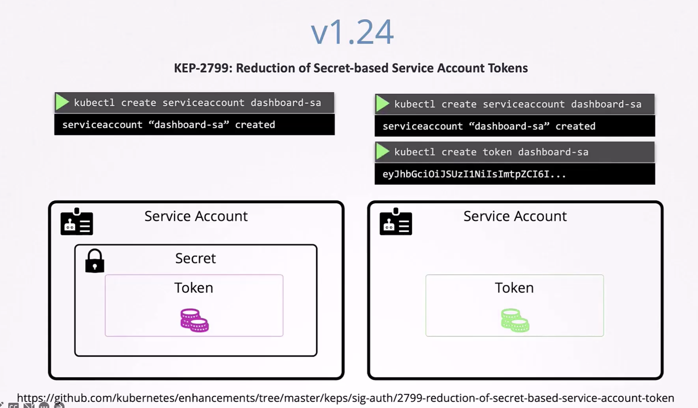

There are two types of accounts in Kubernetes: User Accounts and Service Accounts. User accounts are for humans, while Service Accounts are for applications running in the cluster.

For example, a monitoring application like Prometheus or a logging application like Fluentd would use a Service Account to interact with the Kubernetes API for performance monitoring or log collection.

An automated tool like Jenkins would also use a Service Account to deploy applications on the cluster.

---
### Example

Let's view an example. Here is a simple Kube Dashboard implemented in python that shows the current pods by calling the kube API.

In order for the application to query the kube API, it needs to be authenticated. To do so, it uses a Service Account.

To create a Service Account, we call `kubectl create serviceaccount <name>`. This creates a Service Account in the default namespace.

To view a list of Service Accounts, we call `kubectl get serviceaccounts`.

When a Service Account is created, it automatically creates a token, which is what must be used by an external object to authenticate with the kube API.

To view the token, we call `kubectl describe secret <secret-name>`

As such we can use the token to make a call to the kube API.

## What if the 3rd party application is hosted within the Kube Cluster?
If instead of an external application, if the application is hosted within the kube cluster itself, the authentication can be simply by automatically mounting the Service Account token as a volume inside the pod.

For every namespace in Kubernetes, there is a default Service Account. Whenever a pod is created, the default service account and its token are automatically mounted to that pod as a volume mount.

We can see the the actual token is saved within 'token'.

However, the default service account is very restricted and only has basic permissions to run kube api queries. If you want to give more permissions, you can create a custom service account and modify the pod definition file to include a service accoutn field. However, we cannot edit the service account field of an existing pod. In such case, we need to delete the pod and recreate it.

However, in the case of a deployment, any changes to the pod definition file will automatically trigger a rollout for the deployment.

You may choose not to automatically mount a service account by setting automountServiceAccountToken to false in the pod definition file.

# Service Account Updates V1.22
Previously, tokens didn't have an expiration date as shown below. 

However, this causes problems since the current jwt isn't audience bound or time bound. As such, the Kubernetes 1.22 has the following comments regarding security and scalability issues.

This would mean that as long as the service account exists, the jwt token would be valid. This is a security risk since the token could be used by an attacker to gain access to the kube API.

As such, in version 1.22, the **token request API** was introduced which makes tokens more scalable and secure via an API, making them audience bound, time bound, and object bound.

Therefore, since version 1.22, when a pod is newly created it no longer relies on the service account but rather on the token request API to get a timed token. 

# Service Account Updates V1.24
Enhancement regarding the reduction of secret-based service account tokens. Previously, when a service account was created it would automatically create a secret with a token.

With version 1.24, it would no longer create a secret by default. Therefore, you must run the command `kubectl create token <name>` to create a secret or token access secret.

This token will have an expiry date defined, and if the time limit wasn't specified then it will usually be one hour.

In versions post 1.24, if we still want to create a secret with a nonexpiring token, we can use the type kubernetes.io/service-account-token.

However, this should only be done when creating tokens using the API can't be done.

