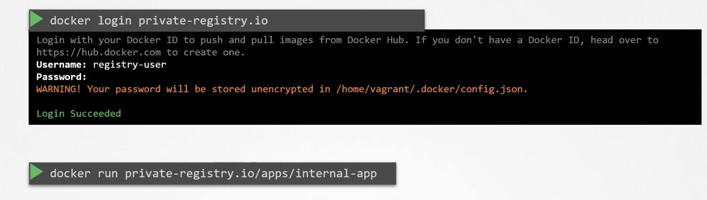
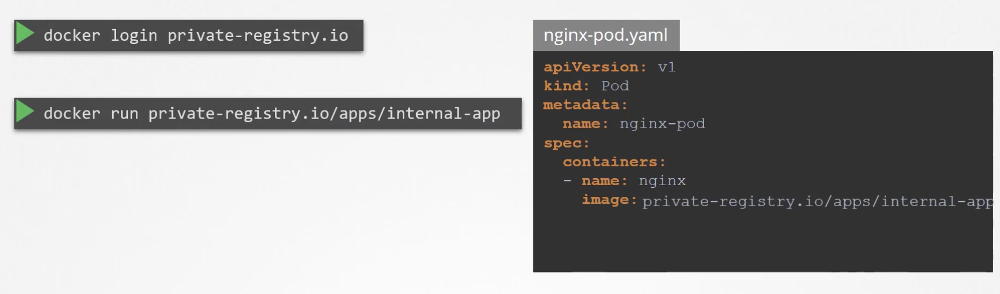
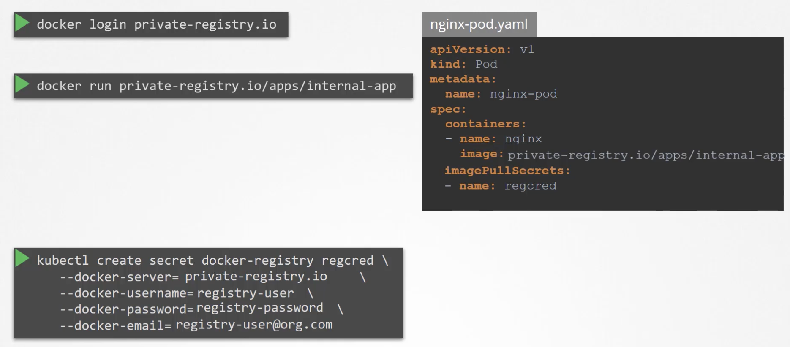

# Image Security

The name is nginx, but what is this image and where is this image pulled from?

nginx is actually the image or the repository name. When you say that the image is nginx, that is actually library/nginx. When the first part, the username is not provided, it is assumed to be library. Library is the default repository in Dockerhub.

## What if we pull the image from our own repository?
So instead of library, it would be your username or your company's username. Where are these images stored and pulled from? Since we have not specified the location of where these images will be pulled from, it is assumed to be Docker's default registry, Dockerhub, whose DNS name is docker.io.

Registries are the places where images are stored. Another commonly used registry is gcr.io which is Google's registry.

When you have application build in-house that shouldn't be public, hosting an internal private registry is a solution.

Many cloud service providers such as GCP, AWS, or Azure provide private registries by default.

In the case of docker, you must first login to the registry to run a private container.

Within kubernetes, we know that the images are pulled by and run by the docker runtime on the worker nodes.

However, how do we pass the credentials to the docker runtimes on the worker nodes? To do this, we first create a secret object with the credentials.

The secret is of type docker-registry and we name it regcred. The secret is then passed to the pod definition file.